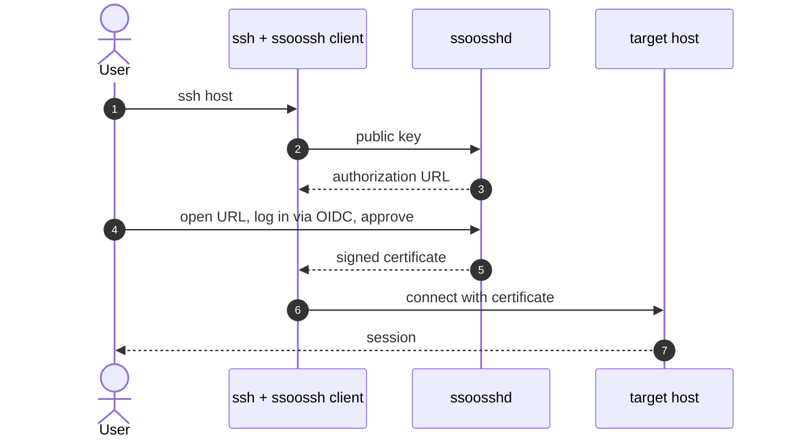

# ssoossh

**SSO for SSH.** Users authenticate through your existing identity provider
via OIDC and receive a short-lived SSH certificate for the session, instead
of provisioning, distributing, and rotating long-lived SSH keys.

Pronounced *sue-sssh*. Self-hosted and homelab-friendly. The reference
configuration uses [pocket-id](https://github.com/pocket-id/pocket-id) as
the OIDC provider.

> **Status: early development.** User, service, and PAM (`sudo`/`su`)
> certificates all work end to end today. ssoosshd deliberately issues no
> host certificates — see [docs/project/decisions.md](docs/project/decisions.md).
> Interfaces and configuration are expected to change.

## Is it AI slop?

Let's get this out of the way: maybe? This idea has been bouncing around
in my head for years, and I've taken a few stabs at writing it. Attempt #1
worked but the codebase disgusted me. Attempt #2 was at work, while I was
learning Go; it came out reasonably well and a small group of us ran it in
production for the last two years. I liked it enough to want it at home,
so I started attempt #3 there, rewriting everything from scratch. It was
a stripped-down version but making progress, and then I switched my home
IdP to [pocket-id](https://github.com/pocket-id/pocket-id). Go with a
frontend, exactly the shape I needed, and I liked their structure. So:
attempt #4.

I was decently into #4 when leadership at work started pushing us to use
AI more. I'd built a few small Go binaries with it and was surprised how
well they came out: same conventions I'd set up, choices I agreed with.
So I threw Claude at #4 once I had a decent structure in place. Now I
have tests I hadn't yet figured out how to write in Go, and every feature
I wanted in the first version is implemented.

Hopefully I've guarded well against the slop. I haven't reviewed
everything, the tests especially, but I've made multiple review passes,
and when my own edits broke things the tests caught it. That's a good
sign they're real.

## The problem

1. SSH keys are bearer credentials with no expiry and no central revocation:
   once a key lands in `authorized_keys`, nothing ties "this key is
   authorized" to "this person still works here." SSH certificates solve the
   mechanics (principals, constraints, expiry); what's usually missing is the
   piece that decides *who* gets one, with which principals, for how long,
   tied to the identity provider you already run.

2. You use hardware-backed SSH keys and disallow `AgentForwarding`. Once
   you're on a remote system, how do you ssh onward to the next one? Your
   key can't follow you.

3. You've gone passwordless, and now you need to `sudo` on a remote
   system. Your hardware token is plugged into the machine in front of
   you, not the one you're logged into.

ssoossh is the missing piece: it decides who gets a certificate, brings
the approval to wherever you are, and works where your hardware token
can't.

## How it works

`ssh` invokes the ssoossh client from `ssh_config`. The client asks the
server for a certificate, you approve the request in a browser while
logged in at your identity provider, and the client loads the signed
certificate into your ssh-agent so `ssh` can connect as normal.

The target host trusts the certificate because its `sshd_config` names the
ssoossh CA in `TrustedUserCAKeys`. A valid certificate is reused until it
expires, so one browser approval can cover a workday. The same approval
flow backs `sudo`/`su` through the `pam_ssoossh` PAM module, where a
certificate is requested, validated once, and discarded.

[docs/guide/flows.md](docs/guide/flows.md) has the full set of diagrams, step by step.

## Components

| Component | What it does |
| --- | --- |
| **ssoossh** (client) | Runs on macOS, Linux, and Windows. Invoked from `ssh_config`; manages its own keypair and talks to the server over HTTPS. Private keys never leave the machine. |
| **ssoosshd** (server) | The trust anchor and policy decision point. Authenticates via OIDC, maps identity to certificate contents, signs with the CA key, and serves the web UI where issuance is approved. |
| **pam_ssoossh** | A Linux PAM module for `sudo`/`su`. Requests a very short-lived certificate, validates it, and discards it. SSH login itself is not in scope here, since that path is already certificate-based. |

## Getting started

Four pieces make a working login:

1. Run `ssoosshd` with a CA key, a public URL, and an OIDC client:
   [docs/operations/configuration.md](docs/operations/configuration.md#server-ssoosshdyaml)
2. Point the client at the server in `ssoossh.yaml`:
   [docs/operations/configuration.md](docs/operations/configuration.md#client-ssoosshyaml)
3. Add a `Match exec "ssoossh ssh login"` line to your `ssh_config`:
   [docs/operations/configuration.md](docs/operations/configuration.md#ssh_config)
4. Trust the CA on each target host with `TrustedUserCAKeys`:
   [docs/operations/configuration.md](docs/operations/configuration.md#sshd-on-target-hosts)

[docs/guide/getting-started.md](docs/guide/getting-started.md) walks through them in
order; [docs/operations/deployment.md](docs/operations/deployment.md) is the operator runbook
behind each step.

## Documentation

| Document | What it covers |
| --- | --- |
| [docs/guide/getting-started.md](docs/guide/getting-started.md) | The shortest path to a working `ssh login` |
| [docs/guide/features.md](docs/guide/features.md) | What ssoossh solves, and everything it does today |
| [docs/guide/flows.md](docs/guide/flows.md) | Sequence diagrams for every flow |
| [docs/guide/faq.md](docs/guide/faq.md) | Common questions: users, sshd host admins, server operators |
| [docs/operations/configuration.md](docs/operations/configuration.md) | Every configuration surface: server, client, `ssh_config`, `sshd`, PAM |
| [docs/operations/deployment.md](docs/operations/deployment.md) | Operator runbook: CA key, systemd, OIDC provider, reverse proxy, multi-instance, PAM |
| [docs/project/decisions.md](docs/project/decisions.md) | What ssoossh deliberately does not do, and why |

The full index, including internals and design documents, is at
[docs/README.md](docs/README.md).

## License

[MIT](LICENSE)

## References

- SSH certificate format: [draft-ietf-sshm-cert](https://datatracker.ietf.org/doc/draft-ietf-sshm-cert/)
- SSH Transport Layer Protocol: [RFC 4253](https://www.rfc-editor.org/info/rfc4253/), for public key algorithm names, key blob and signature wire formats
- PAM specification: [RFC 86.0](https://github.com/linux-pam/linux-pam/blob/master/doc/specs/rfc86.0.txt)
- [pocket-id](https://github.com/pocket-id/pocket-id): OIDC provider used in the reference configuration
- [lldap](https://github.com/lldap/lldap): LDAP directory used in the reference configuration
