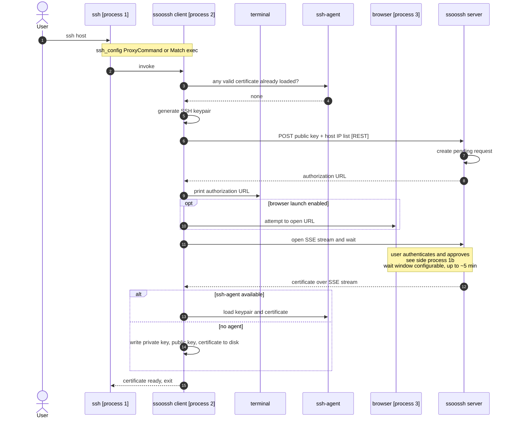
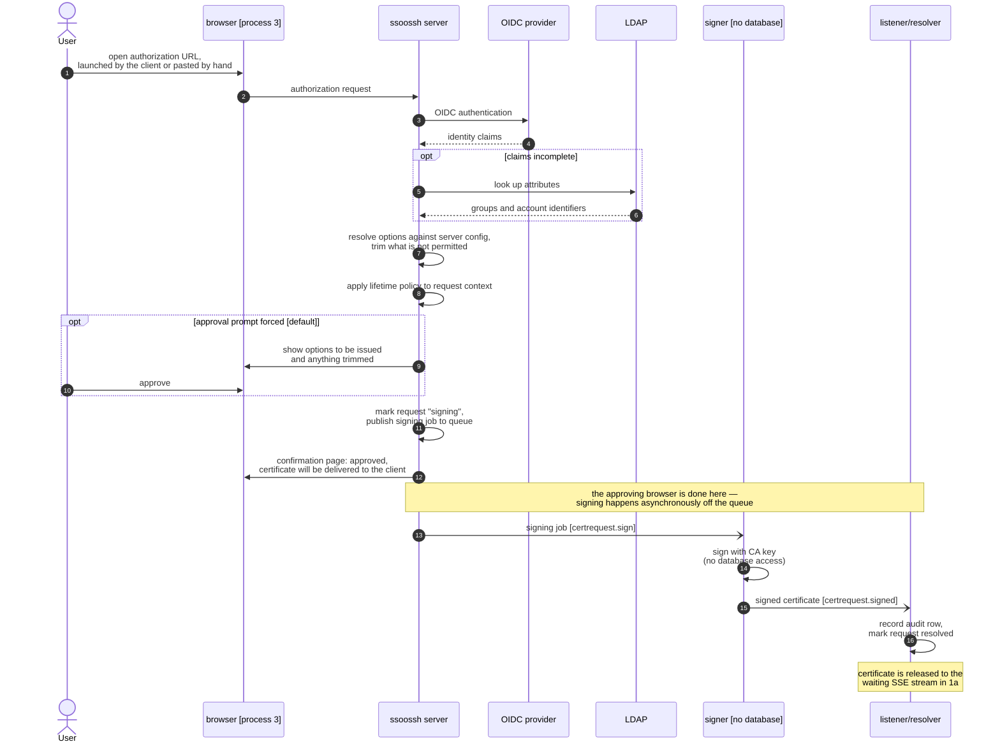
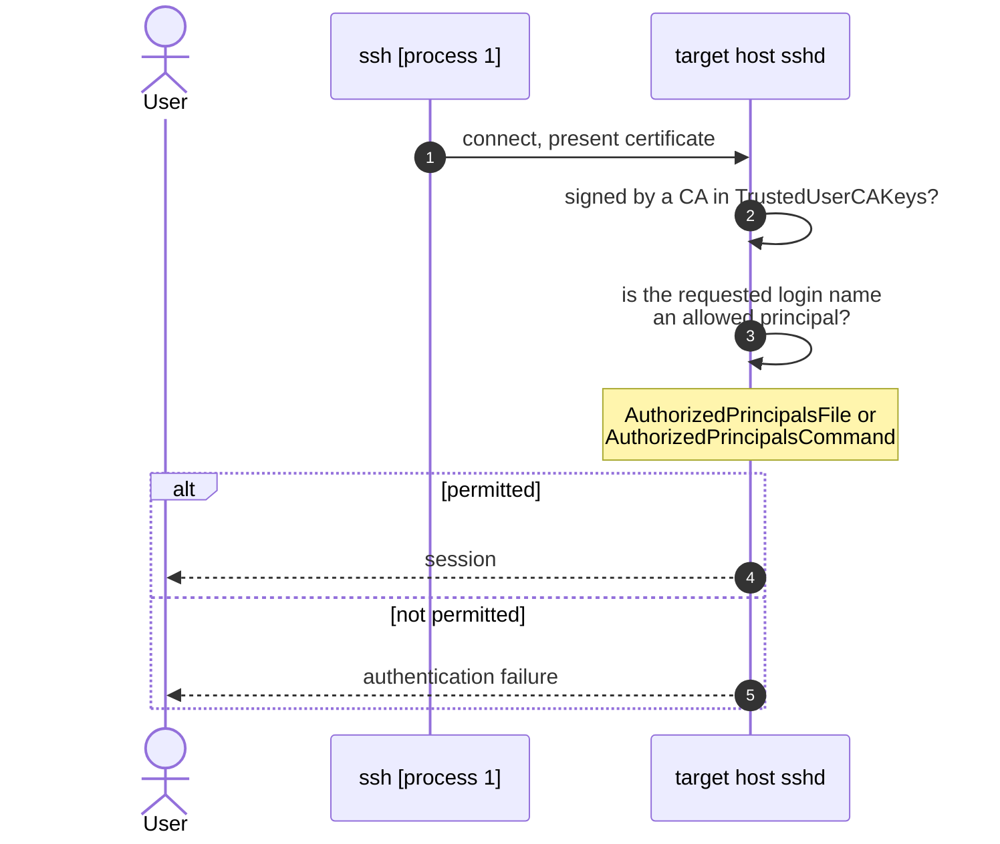
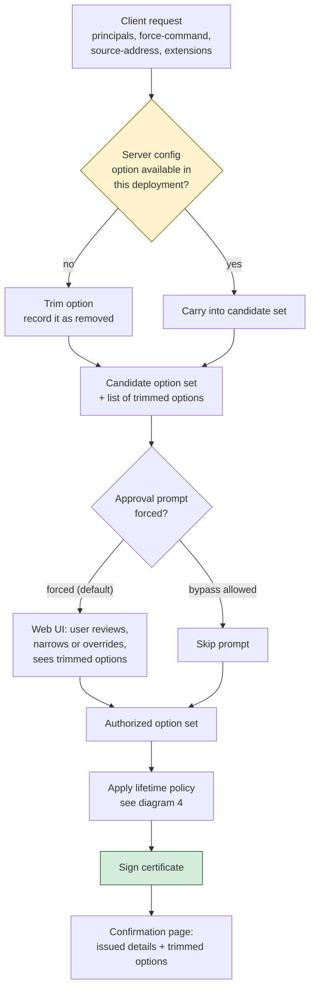
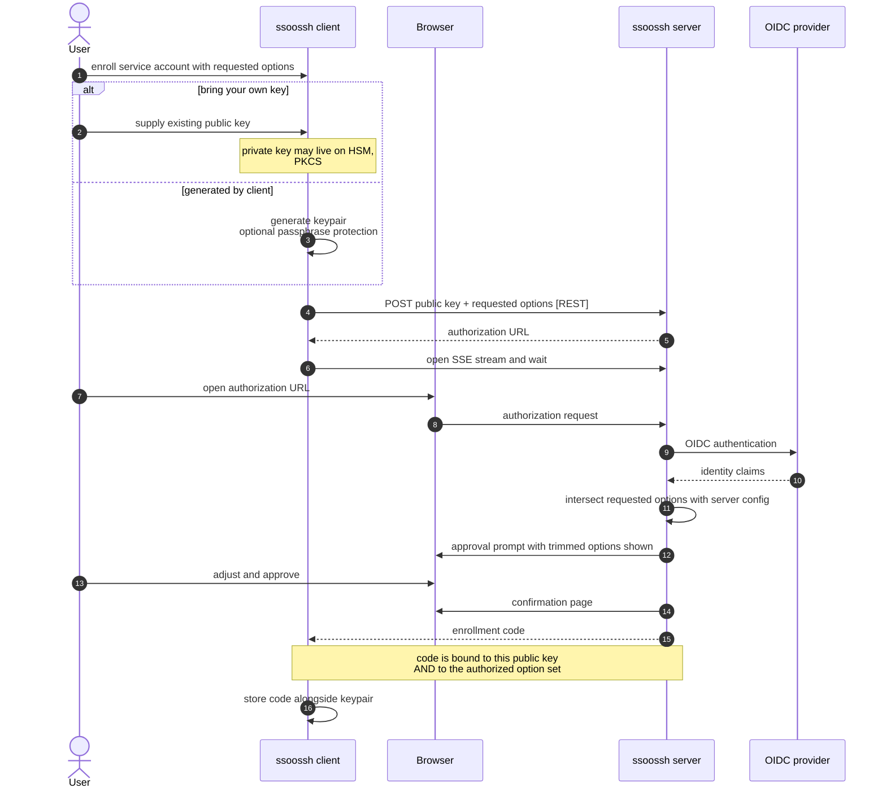
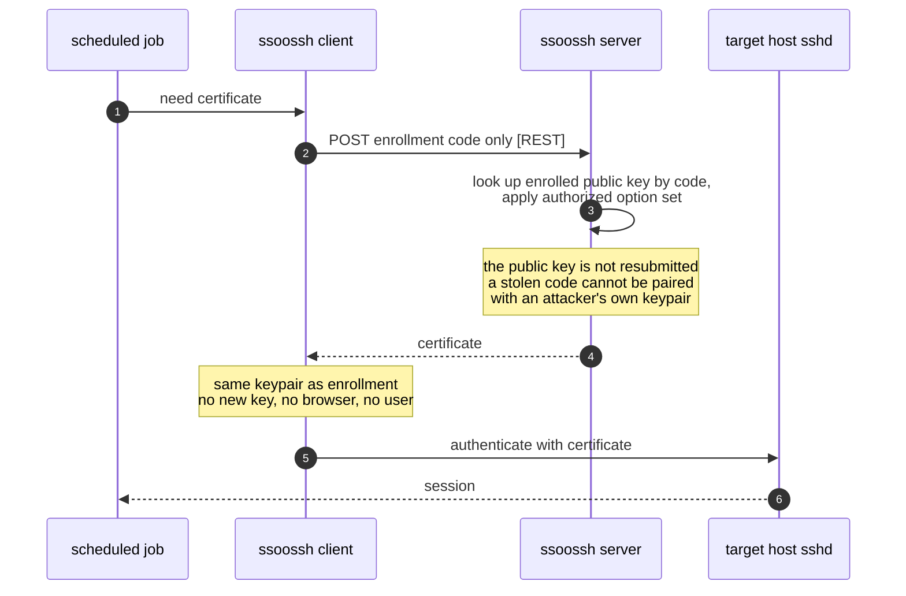
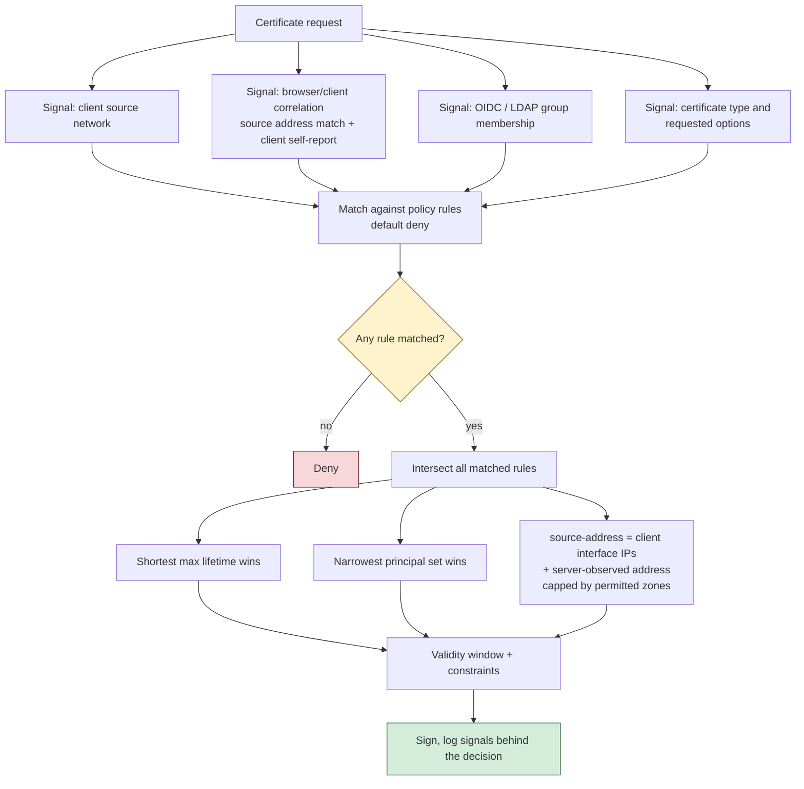
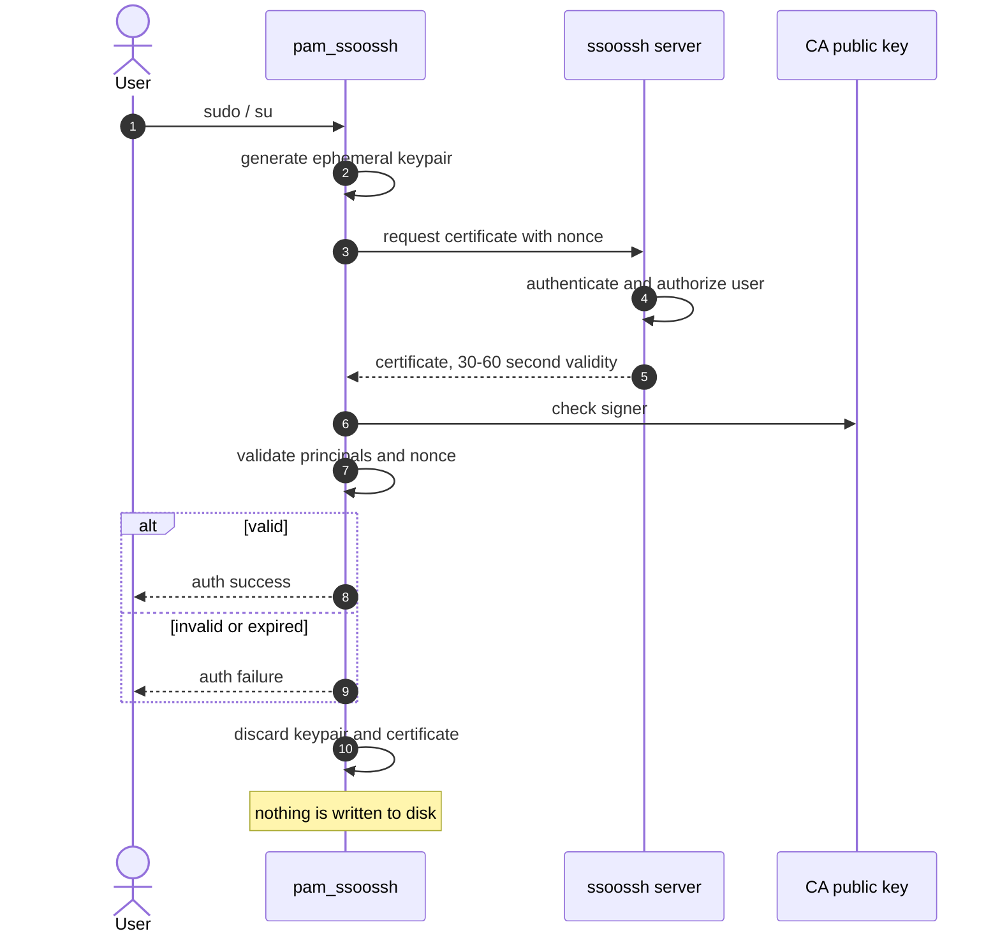
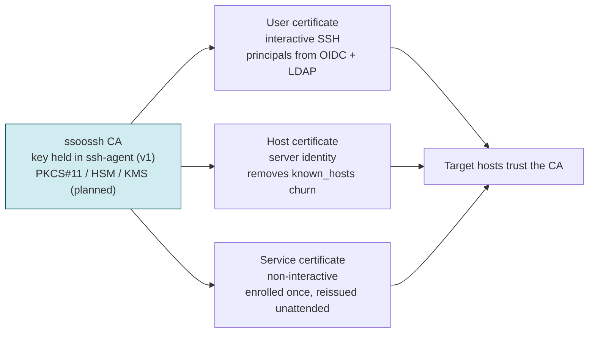

# ssoossh flows

Mermaid diagrams for the flows described in `what-ssoossh-is.md`. Rendered by GitHub,
GitLab, Obsidian, and anything else that supports
[Mermaid](https://github.com/mermaid-js/mermaid).

---

## 1. Interactive user certificate

The everyday path, in three parts. `ssh` invokes the ssoossh client (1a), the user
authenticates and approves in a browser (1b), and once the client has exited `ssh`
makes an ordinary certificate-authenticated connection (1c).

### 1a. `ssh` invokes the client, the client obtains a certificate

### 1b. Side process: OIDC authentication and certificate approval

Runs in the browser while 1a waits. The ssoossh client is not a participant — it learns
the outcome only when the certificate arrives on its SSE stream.

Signing is deliberately split out: the signer holds the CA key and has no
database access, so it can later run as a separate, minimally-privileged
process (see `docs/signer-split-deferred.md` and
`docs/signing-pipeline.md`). The certificate itself is never stored —
it's delivered once to the waiting client, which re-requests if it misses
that window.

### 1c. `ssh` connects to the target host

Nothing here involves ssoossh — the client has already exited and this is ordinary SSH.

sshd also checks the validity window, enforces critical options such as
`source-address` and `force-command`, applies the extension set, and requires the client
to sign a challenge proving it holds the private key. Those steps are standard
certificate authentication and are left out of the diagram.

---

## 2. Option resolution and the server config gate

Three layers narrow what a certificate may carry. Only the server config can define
what exists at all.

---

## 3. Service certificate: enrollment, then unattended reissue

A user is involved exactly once. Everything after that runs without a browser.

### 3a. Enrollment

### 3b. Unattended reissue

---

## 4. Certificate lifetime policy

Design in progress. The server is the policy decision point; the target host's sshd
enforces the result.

Weak correlation shortens a lifetime when absent; it never extends one when present.

---

## 5. pam_ssoossh

Scoped to `sudo` and `su`, `auth` management group only. The module keeps nothing.

> The shape of this module is an open design question — see the separate PAM design
> document. A future console login module using a typed code is a related but distinct
> problem.

---

## 6. Certificate types at a glance

