# ssoossh flows

Every flow as a sequence of small Mermaid diagrams, each covering one
stage. Rendered by GitHub, GitLab, Obsidian, and anything else that
supports [Mermaid](https://github.com/mermaid-js/mermaid). For the
feature-level view see [features.md](features.md); for a narrated,
illustrated version of flow 1 see [walkthrough.html](walkthrough.html).

---

## 1. Interactive user certificate

The everyday path, in four stages: the client requests a certificate (1a),
the user approves in a browser (1b), the server signs and delivers (1c),
and `ssh` connects (1d).

### 1a. `ssh` invokes the client, which requests a certificate

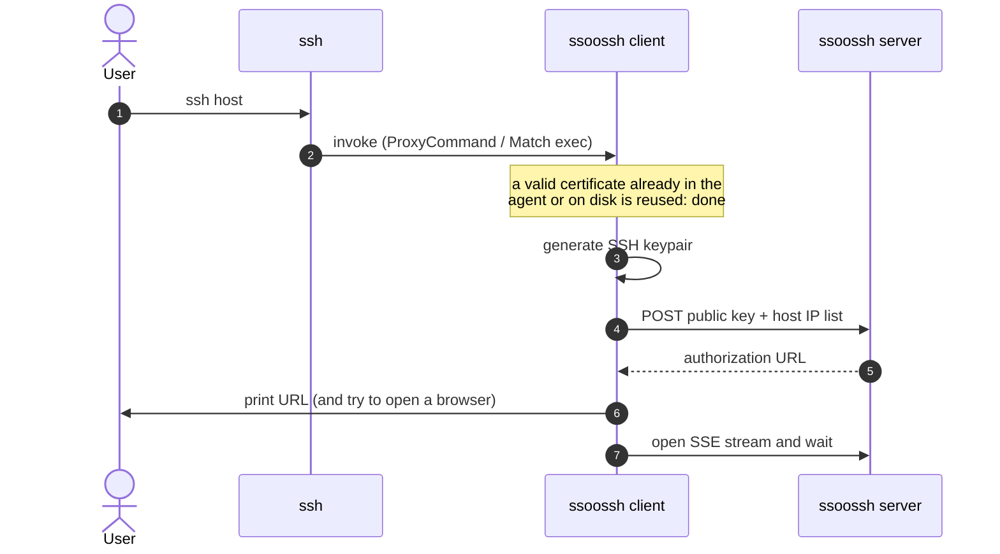

The wait window is configurable, up to about 5 minutes. The client never
opens a listening port; the browser lands on the server and the client
learns the outcome only over this SSE stream.

### 1b. The user authenticates and approves in a browser

Runs in the browser while 1a waits. The client is not a participant.

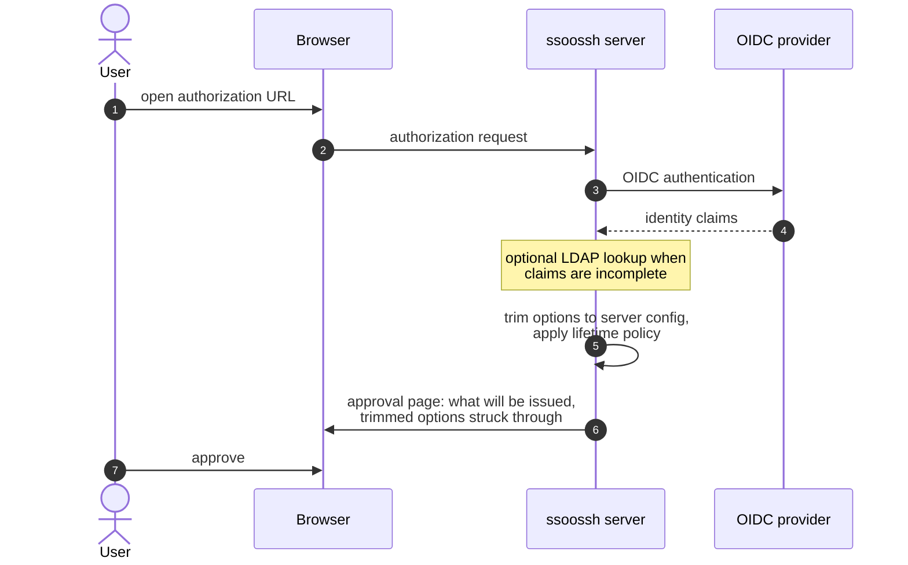

Approval is prompted by default; a deployment may allow bypassing the
prompt. Option trimming and lifetime policy are diagrams 2 and 3.

### 1c. The server signs and delivers

Signing happens asynchronously off a queue after approval. The signer
holds the CA key and has no database access, so it can run as a separate,
minimally privileged process
([signing-pipeline.md](signing-pipeline.md),
[signer-split-deferred.md](dev/signer-split-deferred.md)).

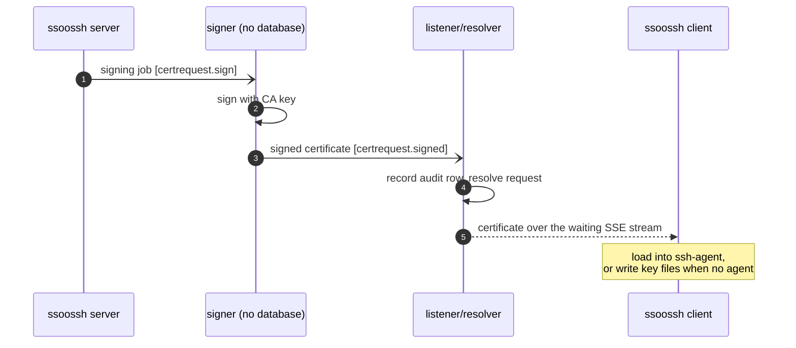

The certificate is never stored server-side. Delivery is the only copy; a
client that misses the window re-requests.

### 1d. `ssh` connects to the target host

Nothing here involves ssoossh. The client has exited (or, in
`ProxyCommand` mode, is only relaying bytes) and this is ordinary SSH
certificate authentication.

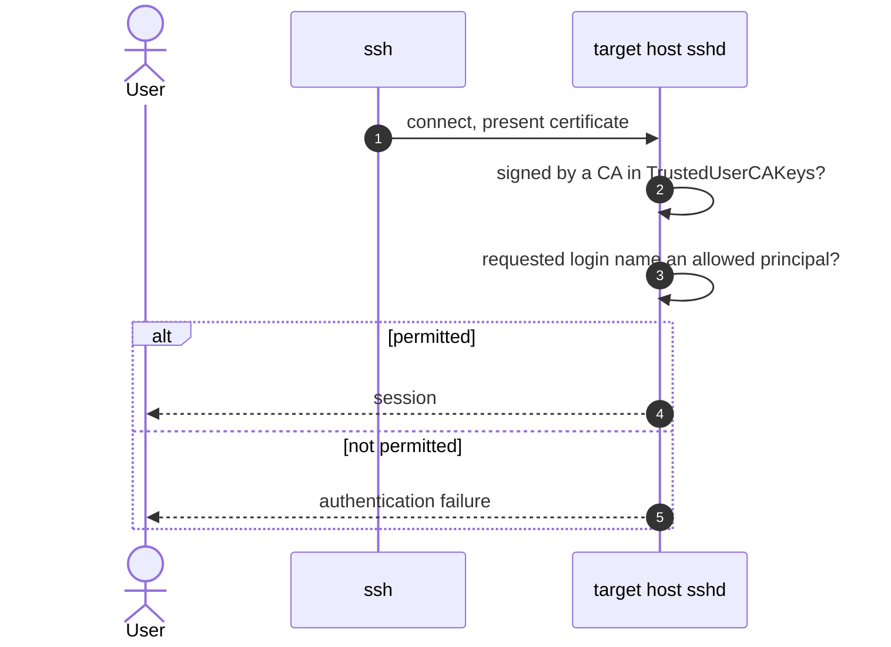

`sshd` also checks the validity window, enforces critical options such as
`source-address` and `force-command`, applies the extension set, and
requires proof of private-key possession. Principals map via
`AuthorizedPrincipalsFile` or `AuthorizedPrincipalsCommand`.

---

## 2. Option resolution: requests ask, the server narrows, config gates

Three layers narrow what a certificate may carry. Only the server config
defines what exists at all; nothing reachable over HTTP can exceed it.

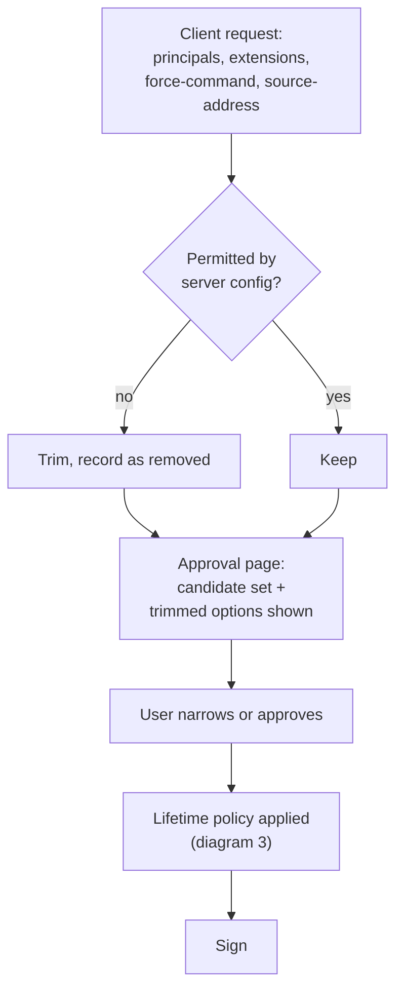

---

## 3. Certificate lifetime policy

The server is the policy decision point; the target host's `sshd`
enforces the result. Semantics and rationale:
[certificate-lifetime-policy.md](certificate-lifetime-policy.md).

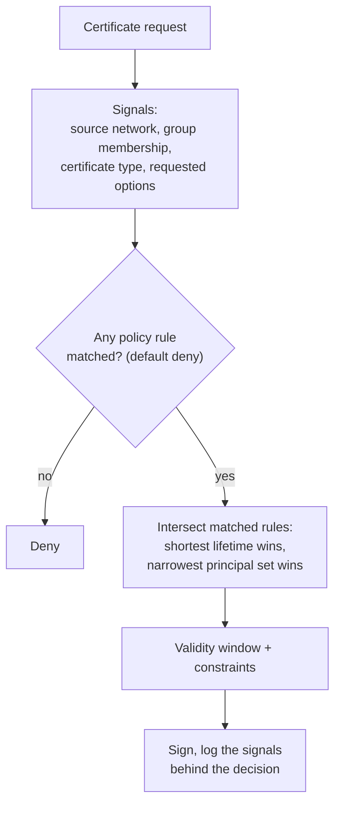

Rules only ever narrow: weak correlation between browser and client
shortens a lifetime when absent, and never extends one when present.

---

## 4. Service certificate: enroll once, reissue unattended

> **Status:** the server-side API exists; the client's `service enroll`
> and `service retrieve` commands are not wired up yet and fail with a
> clear message.

A user is involved exactly once. Everything after that runs without a
browser.

### 4a. Enrollment: key registration

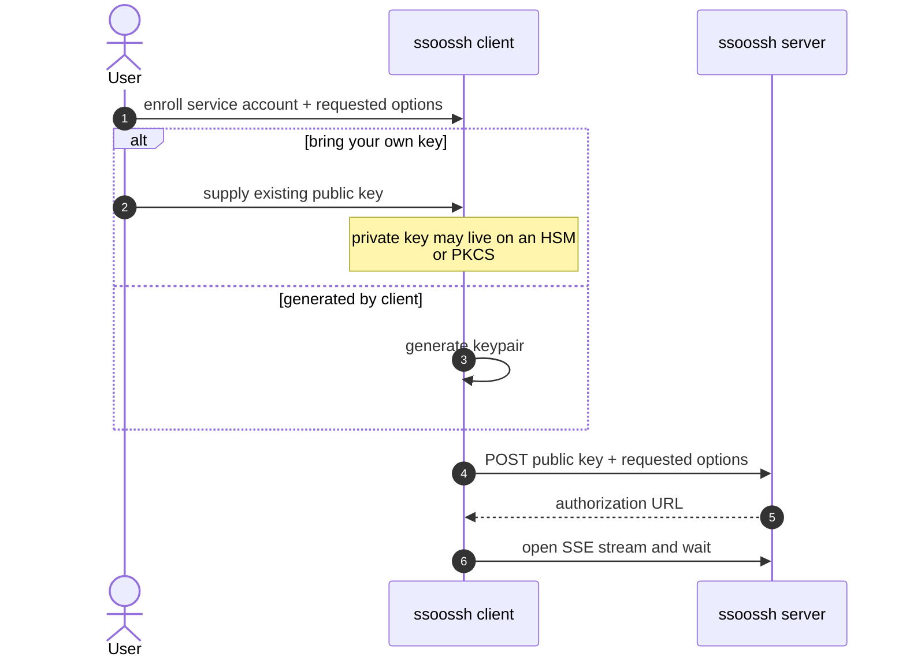

### 4b. Enrollment: approval and the enrollment code

The browser approval is the same as 1b. What comes back is different:

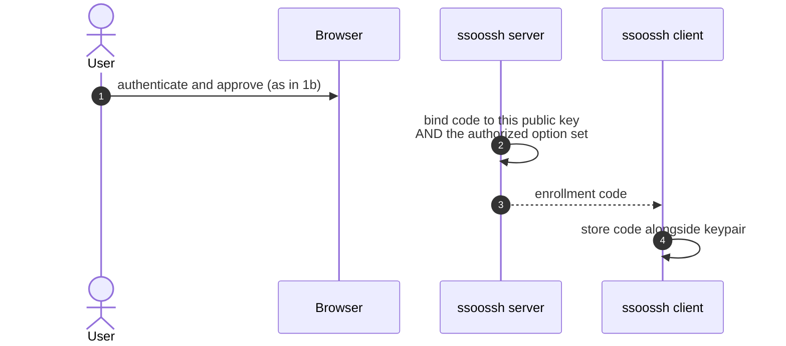

### 4c. Unattended reissue

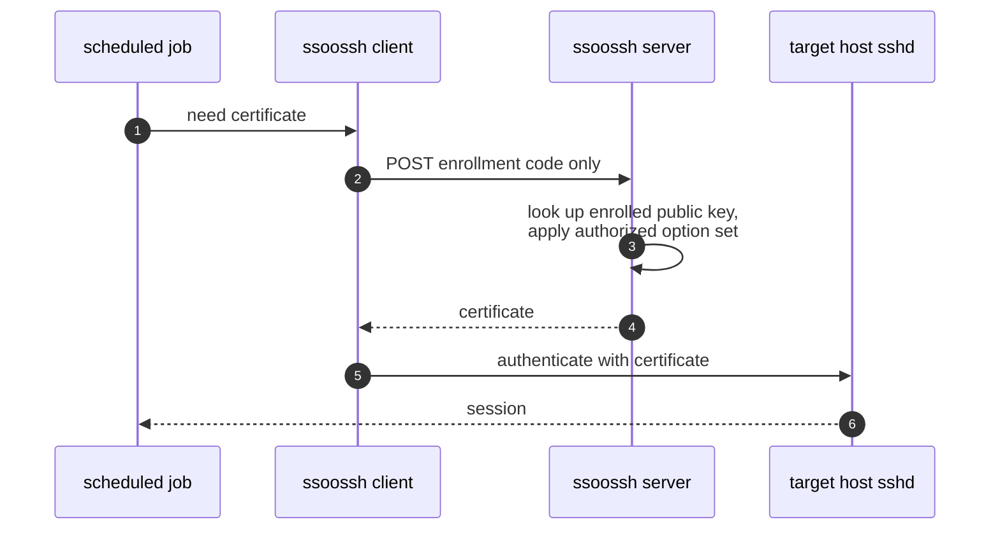

The public key is not resubmitted, so a stolen code cannot be paired with
an attacker's own keypair. The same keypair is used every time: no new
key, no browser, no user.

---

## 5. `sudo`/`su` via pam_ssoossh

Scoped to `sudo` and `su`, `auth` management group only. The module keeps
nothing: a per-attempt ephemeral keypair, a certificate valid for seconds,
and everything discarded afterward.

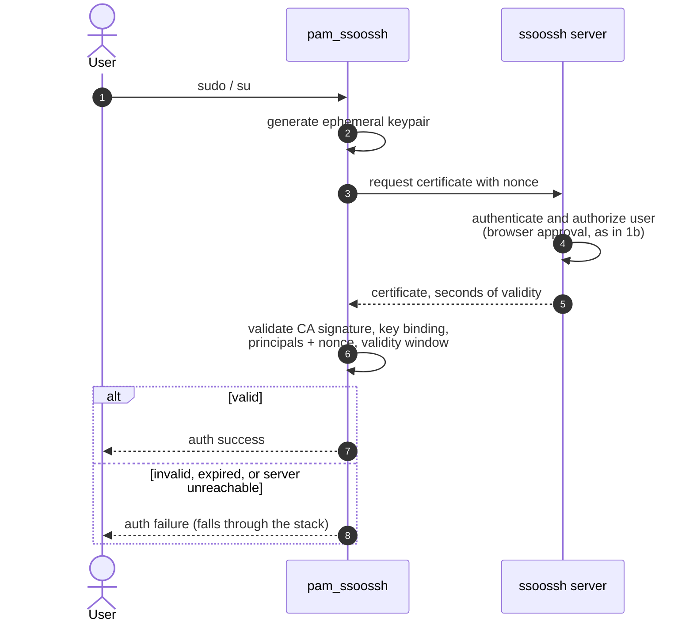

Nothing is written to disk. Stack configuration and the lockout warning:
[deployment.md](deployment.md#8-pam-sudo-and-su);
[pam.d-sudo.example](pam.d-sudo.example) documents every module argument.

---

## 6. Certificate types at a glance

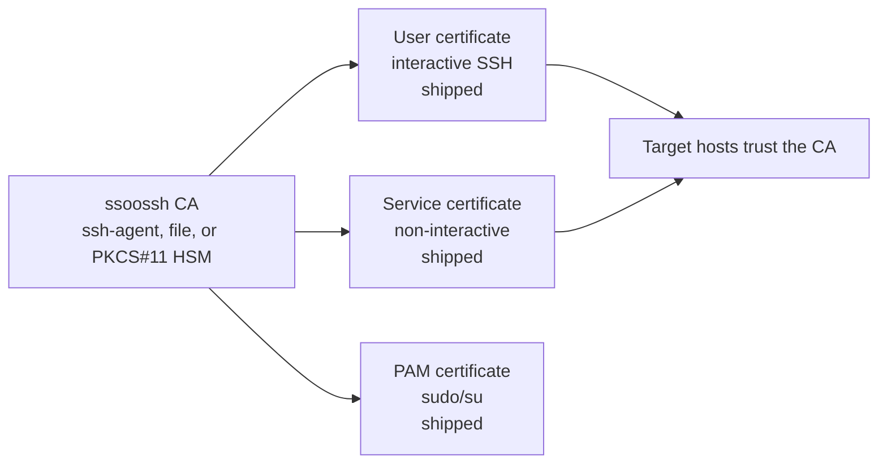

Service certificates: `service enroll` requests, a human approves in the
browser choosing which of their service accounts the certificate is for,
and the enrollment code redeems certificates unattended via
`service retrieve` until it expires — every redemption logged for the
approver and auditors. Host certificates were removed
([decisions.md](decisions.md)); the local principal-mapping commands
(`host mapping`, `host principals`) support sshd's
`AuthorizedPrincipalsCommand` without any server side.
