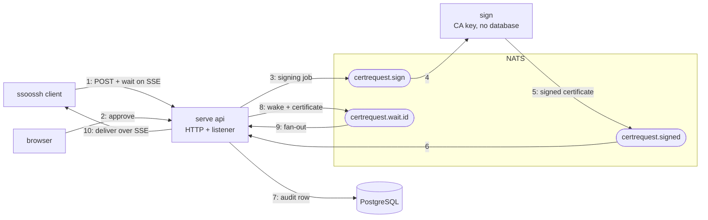

# The certificate signing pipeline (as built)

Architecture reference for the create → approve → sign → deliver pipeline.
This consolidates the six implementation phase documents that built it; those
are gone, but every decision that still constrains the code is recorded here.

**Status: built and working for user certificates.**
`server/service/pipeline_test.go` drives the whole path with a real Router,
real gochannel transport, real signer, and in-memory sqlite, and asserts a
CA-verifiable certificate comes out the far end.

Transport is Watermill's in-memory `gochannel` in the default single-process
mode. The split into separate signer and API processes is implemented: with
`pubsub.backend: nats`, the same pipeline runs across `ssoosshd serve api`
and `ssoosshd sign` processes — see
[deployment.md](../operations/deployment.md#6-startup-modes-full-api-and-sign).

## Why it looks like this

`Wait`/`notifyWaiter` used to be an in-process `map[string]chan struct{}`,
which could not survive a restart or scale past one process. Separately,
signing needed a home, and the decision was to keep it out of the webserver's
memory space entirely rather than implement it inline — the CA private key
should not sit alongside HTTP handling and OIDC/LDAP calls.

## Why message-passing rather than RPC

A direct gRPC/mTLS call from the approving node to the signer would have to
either block that node's thread waiting for the result, or re-publish the
result to whichever node holds the SSE connection — two hops instead of one,
with a blocked thread in between.

With Watermill the signer publishes the result directly to wherever the SSE
thread is listening. One signaling model end to end, and the cluster stays
stateless with respect to "which node owns this request": no node is pinned to
a request from approval through delivery.

## Components

Three logical components, one process:

| Component | Package | Database | Holds CA key |
| --- | --- | --- | --- |
| API / webserver | `server/controller`, `server/service` | yes | no |
| Signer | `server/signer` | **no** | yes |
| Listener / resolver | `server/service/signreply.go` | yes | no |

The signer's zero-database property is **enforced by a test**:
`server/signer/zerodb_test.go` runs `go list -deps` and fails if `gorm.io/gorm`
or `server/service` enters its dependency graph. That test is the only thing
keeping the boundary honest — it must stay green.

`server/certmsg` exists because of that boundary: the signer cannot import
`server/service` (which pulls gorm, and would become an import cycle once the
listener landed in `service`). It holds the wire shapes and topic names —
`SigningJob`, `SignedReply`, `SignQueueTopic`, `SignedTopic`, `WaitTopic`,
`RequestedOptions` — with no dependencies of its own.
`service.RequestedOptions` is an alias of `certmsg.RequestedOptions`, so
there is one type rather than two kept in sync by hand.

## Topics

| Topic | Shape | Durability need |
| --- | --- | --- |
| `certrequest.wait.<id>` | one per request | none — the database is truth |
| `certrequest.sign` | shared queue | none — at-most-once by decision, the human retries (see [decisions.md](../project/decisions.md)) |
| `certrequest.signed` | shared reply topic | none — same decision |

The signed-reply topic is shared rather than per-request because only the
listener ever subscribes to it — there is no fan-out concern.

## How the processes and NATS fit together

The split topology: a `serve api` process (HTTP handlers plus the
listener), a `sign` process, NATS carrying the three subjects between
them, and the database on the api side only. Numbers trace one request.



Steps 8–9 look like the api process talking to itself, and in this
two-process picture it is — but the hop through the wait topic is what
makes scaling out transparent. Run several `serve api` instances behind a
load balancer and nothing in the diagram changes: `certrequest.sign` is a
queue group ("signer"), so exactly one signer takes each job;
`certrequest.signed` is a queue group ("signed-listeners"), so exactly
one instance's listener records the audit row and publishes the wake;
`certrequest.wait.<id>` has no queue group, so it fans out and reaches
whichever instance holds the client's SSE stream — even when that is not
the instance that took the approval. No instance is pinned to a request
at any point.

In the default single-process mode the picture is the same minus the
middleman: the identical subjects ride Watermill's in-memory `gochannel`
instead of NATS, and API, listener, and signer are goroutines in one
process.

## Flow

1. Client `POST`s a request → gets `events_url` + `approval_url`.
2. Client opens `events_url` (SSE) → `Wait` subscribes to
   `certrequest.wait.<id>`.
3. A browser opens `approval_url`, authenticates, approves. **`Approve` does
   not sign.** It resolves policy, persists the row as `signing`, publishes a
   self-contained job to `certrequest.sign`, and returns immediately.
4. The signer consumes the job, signs, publishes to `certrequest.signed`.
5. The listener writes the audit row, delivers the certificate, marks the
   request terminal.
6. The client's `Wait` returns; `eventsHandler` sends the terminal SSE event.

See [flows.md](../guide/flows.md) §1b for the sequence diagram.

## Decisions that still constrain the code

### Certificates are ephemeral

Signed certificates are **never persisted**. They are delivered exactly once
through the in-memory `resolved` cache and its wake message; a client that
misses the window re-requests, which is cheap because they are short-lived by
design.

The consequence is load-bearing: `Wait` can find a terminal `approved` row
with nothing cached. It must **not** report success with an empty certificate
— it returns `errorresponses.CertificateUnavailableError` (**410 Gone**). The
410 is deliberate: it sits outside resty's SSE retry conditions (0/429/5xx),
so the client stops rather than reconnect-loops.

Note the asymmetry: an *enrollment token* is durable (a column on the request
row), so `enrolled` is rebuilt from the database rather than failing.

### Listener ordering is load-bearing

`resolveSuccess` does **audit row → deliver (cache + wake) → status update**,
in that order.

Delivering before the status update is what makes "approved with a cold cache"
mean only "the process restarted" — exactly the case the 410 describes.
Written the other way round, a live server would briefly show `approved` with
nothing cached and wrongly tell clients their certificate was gone.

The cost is that a crash between delivery and the status update leaves the row
in `signing`. That is what the sweep exists to clean up, and the audit row is
already durable by then.

### `Persistent: false` on gochannel

Originally set `true`. It is both unnecessary and actively wrong:

- Unnecessary — the wake topic's race is already covered by `Wait`'s DB
  fallback (see below).
- Wrong — gochannel replays a Persistent topic's **entire history** to every
  new subscriber, not just missed messages. A signer restart would re-receive
  every job ever queued, already-signed ones included.

It also never evicts, so Persistent meant unbounded memory growth. Full
reasoning lives on the `gochannel.Config` literal in `server/pubsub.New`.

### `Wait` subscribes before reading the database

Not because of message replay (that mechanism is gone), but because `Wait`
re-reads the database immediately after subscribing, and `reconcileStatus`'s
terminal branch re-notifies whenever it finds a resolved-but-not-yet-cached
status. A publish that races ahead of the `Subscribe` call is caught one loop
iteration later via the database, not lost.

`notifyWaiter` treats a failed publish as **non-fatal**. The database write it
follows already succeeded and is the durable fact; a lost wake message is a
latency problem a reconnect resolves, not a correctness one.

### Nacks busy-loop, so retries live in middleware

gochannel redelivers a Nack **immediately, with no backoff**
(`watermill@v1.5.2 /pubsub/gochannel/pubsub.go:412`), so "return an error to
retry" is a CPU spin, not a retry policy.

`pubsub.New` installs `middleware.Retry` (backoff) wrapped in a
`dropAfterRetries` middleware that gives up and acks, logging the discarded
payload. A dead-letter topic is deferred until there is a durable broker to
put one on.

**This is why the sweep must be periodic** — see below.

### Ack semantics: what is real, what is not

Achieved: correct *ordering*. The signer publishes its reply before acking;
the listener audits and delivers before updating status. A signing failure is
a successful handle (ack); only transport failures nack.

**Not** achieved: at-least-once redelivery across a restart. gochannel is
in-memory and non-persistent, so a crash loses in-flight jobs outright
regardless of ack timing. That guarantee arrives with JetStream.

### Router lifecycle

`Router.Run(ctx)` does **not** return when `ctx` is canceled — only an
explicit `Router.Close()` unblocks it. `PubSub.Run` watches `ctx.Done()` and
calls `Close()` itself.

`Router.Close()` then waits up to `CloseTimeout` (default **30s**) for
handlers, and `PubSub.Run` could call it before `Router.Run` had started them.
`PubSub.Run` now waits on `Router.Running()` first, and `CloseTimeout` is set
to 3s so it cannot overrun bootstrap's 5s shutdown budget.

## What `Approve` actually decides

`Approve` resolves policy and hands off; it never signs. Two items it was
originally meant to "compute" turned out to be undecided product design
(certificate lifetime policy, LDAP→principals), so it implements the
mechanically well-defined parts and takes the most conservative default for
the rest:

| Field | Behavior |
| --- | --- |
| Extensions | Intersection of requested and configured-permitted |
| ValidDuration | Flat per-type config value — no per-signal shortening |
| ForceCommand | **Dropped entirely** — no config concept to bound it against |
| SourceAddresses | **Dropped entirely** — same reason |
| NoTouchRequired | Only ever granted for service certificates |
| RequireGroup | Enforced where configured |
| Principals | `[identity.Username]`, or `[hostname]` for host — provisional |

Dropping `ForceCommand`/`SourceAddresses` is fail-closed, not an oversight:
granting an unbounded client-requested critical option would violate "server
config is the outer bound on every option."

The principal default is explicitly provisional. Extending it later only ever
*adds* principals, so it cannot cause an existing deployment to regress in
permissiveness when the real policy lands.

### Type routing

- **User** — through the queue. The only fully working path.
- **Service** — **bypasses the queue entirely.** There is no signer round trip
  to wait on, because the certificate isn't produced until a later
  `service retrieve` redeems the token. `Approve` marks the row `enrolled`,
  persists the *narrowed* options (overwriting the client-submitted ones, so
  only what was approved is ever retrievable), generates an
  `EnrollmentToken`, and calls `notifyWaiter` synchronously.
- **Host / PAM** — rejected outright at `Approve`, so the approving human gets
  an immediate error rather than the request quietly resolving to `failed` a
  moment later. The signer keeps its own guard as defense in depth.

**Open question preserved:** the enrollment token is a column on
`certificate_requests`, *not* a `model.Enrollment` row. The `enrollments`
table already exists and is entirely unused. Whichever way
`EnrollmentService.Retrieve` is eventually finished, one of the two has to
give.

## The stranded-request sweep

`CertRequestService.SweepStrandedRequests` (`server/service/sweep.go`),
scheduled from `server/bootstrap/scheduler.go`.

Policy: **invalidate, don't resume.** Replaying isn't safe to reason about
(did the signer already sign and die before publishing the reply?), and
re-requesting is cheap.

### It must be periodic, not boot-only

A healthy, never-restarted process can strand a request:

1. `dropAfterRetries` **deliberately drops** a message once retries are
   exhausted — the alternative on gochannel is an infinite busy-loop. A
   dropped job leaves the row in `signing` with nothing left to resolve it.
2. `reconcileStatus` applies **no TTL to `signing`** — that branch just says
   "keep waiting." The approval TTL only bounds how long something stays
   *pending*.

### Deriving the cutoff without a new column

Nothing records *when* a request entered `signing`. The bound is derived from
`created_at` instead:

```text
stranded if:  status = 'signing'
              AND created_at < now - (ApprovalTTL + SigningGrace)
```

A request is approved somewhere between `created_at` and
`created_at + ApprovalTTL`, so the latest it can have entered `signing` is
`created_at + ApprovalTTL`. This can never invalidate a healthy in-flight
request.

**Accepted imprecision:** a request approved immediately waits
`ApprovalTTL + SigningGrace` to be swept rather than `SigningGrace`. Erring
long is the right direction — the cost is a client waiting longer for bad
news, whereas erring short would cancel certificates about to be issued.

Both terms are shares of one configured budget: `ApprovalTTL` and
`SigningGrace` derive from `cert_options.client_timeout`, which must be
positive, so there is no configuration in which the formula degenerates and
no special case for an unbounded approval window. The sweep also runs on the
`SigningGrace` interval, which is why the worst-case client wait spends two
of those shares and why `ApprovalTTL` reserves for both — the three add up to
exactly `client_timeout`.

### A bulk UPDATE is not sufficient

`Wait` only re-reads the database when a message arrives on its wake topic. A
direct SQL update publishes nothing, so a client blocked on a swept request
keeps blocking even though its row now reads `failed`.

The sweep selects stranded rows and, per row, updates **and** calls
`notifyWaiter`. Per-row also keeps the update guarded
(`WHERE id = ? AND status = 'signing'`), matching `Deny`, `expire`, and the
listener's `markResolved`, so a concurrently-resolved request isn't
overwritten.

## Gotchas worth not rediscovering

- **Serial numbers are masked to 63 bits.** Go's `database/sql` refuses to
  bind a `uint64` with the high bit set, so random 64-bit serials failed the
  audit insert roughly half the time — the certificate was never delivered and
  the client hung. Caught only by the end-to-end test, and only
  intermittently.
- **Terminal status names live in `internal/apitypes`** (`TerminalStatuses()`).
  They were once duplicated as literals in `internal/api/sse.go`, which is how
  `enrolled` shipped as a status the client treated as informational — every
  service enrollment hung. Add a status in one place only.
- **`AutoMigrate` (tests) and the embedded SQL migrations (production) can
  silently diverge.** Verify schema changes against the real migration, not
  just the test path.

## Known gaps

- `Certificate.UserID` / `CertificateRequest.UserID` are never written —
  nothing resolves the approving identity to a `users` row. Addressed in the
  security-hardening delivery phase, done before this release plan started.
- No foreign key from `certificates` back to `certificate_requests`, so an
  audit row can't be traced to what was requested. Needs a migration.
- `CAService` and the signer both parse `config.SSHKey`. When they split
  across processes, CAService should read a `ca_public_keys` list instead.
- `signing_started_at` column would remove the sweep's imprecision, which is
  that a request approved immediately still waits the whole approval share
  before being swept. Reconsider if that becomes a practical problem.
- The sweep's age-threshold approach is safe for several instances sharing a
  database: every instance derives the same bound from the same configured
  budget. See
  [multi-instance-safety-plan.md](../dev/multi-instance-safety-plan.md).
