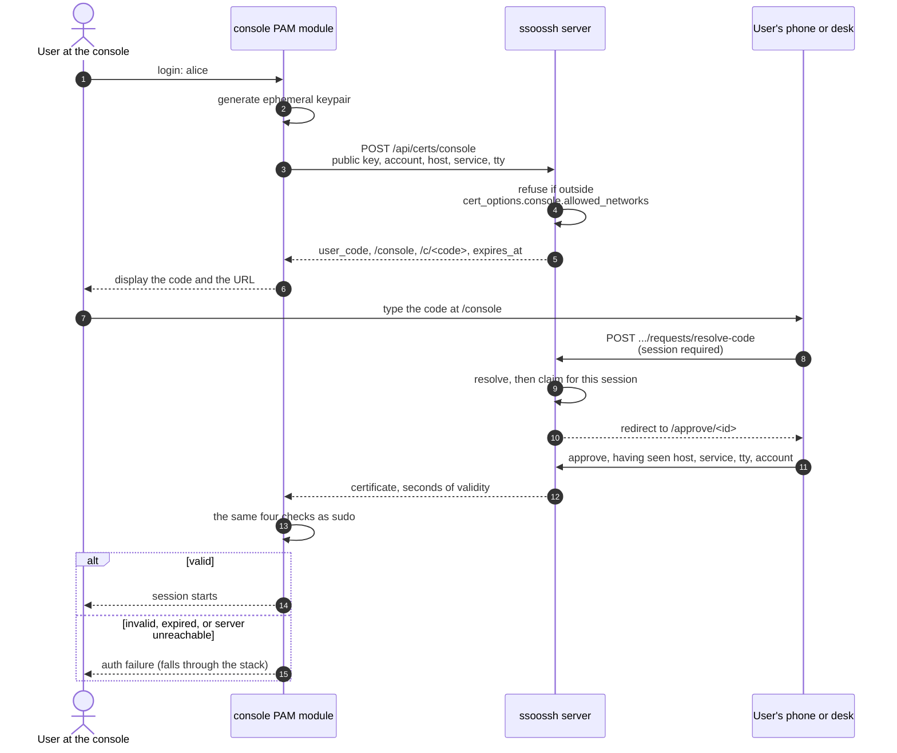

A console has a human in front of it and no browser: a physical tty, a serial
console on a rack server, a BMC or KVM viewer, a hypervisor's VM console. There
is nothing on that screen to copy and no way to click a link, so printing an
approval URL nobody can transcribe is not a flow. The machine prints a short
code instead, and the approver carries it to a device that does have a browser.

This page is the contract between the two halves. For the `/etc/pam.d/login`
entry, see [console login](/ssoossh/hosts/pam/console/).

## Where this is the only option that works

- **A serial console on a rack server.** You are on `ttyS0` through a console
  server. There is no clipboard, and a 60-character URL with a UUID in it is a
  transcription error waiting to happen.
- **A BMC or KVM viewer.** The keyboard is remote and the screen is a video
  stream. Copy and paste does not cross that boundary.
- **A VM console in a hypervisor UI.** The same problem, one layer up.
- **A machine whose networking is broken enough that you came in the back
  door.** SSH is not available, which is why you are at the console at all.

An eight-character code can be read off any of those screens and typed on a
phone.

## The flow



1. Someone types a login name at the console.
2. The module generates an ephemeral keypair for this attempt.
3. It posts to `/api/certs/console` with the public key, the account being
   logged into, and what it can say about the host, the PAM service, and the
   terminal.
4. The server refuses outright if the request came from outside
   [`cert_options.console.allowed_networks`](/ssoossh/reference/config/cert_options/console/#allowed_networks).
5. It answers with an eight-character user code (Crockford Base32, shown as
   `K7M4-QP2X`), the page that accepts it, a `/c/<code>` shortcut, and the
   deadline it will hold the request to.
6. The module displays the code and the URL. Where the terminal font supports
   it, it also draws a QR code carrying the complete verification URL, so the
   approver can photograph it instead of typing.
7. The approver signs in on a phone or at a desk and types the code at
   `/console`, or opens the shortcut.
8. The browser submits the code. **A session is required.**
9. The server resolves the code and then claims the request for that session.
10. The browser is redirected to the approval page.
11. The approver approves, having seen the machine, the PAM service, the
    terminal, and the account being logged into.
12. The certificate comes back to the module with seconds of validity.
13. The module runs
    [the same four checks as `sudo`](/ssoossh/concepts/sudo-flow/#the-four-checks).
14. Passing starts the session; anything else fails and the stack continues.

## Three things in that diagram are load-bearing

- **Resolving a code requires a session.** An unauthenticated caller never
  learns whether a code is live and never receives a request ID -- and the
  request ID is the credential the certificate is delivered against. Step 8 is
  the whole reason the code is safe to display on a screen.
- **Resolving claims the request**, before either party sees any detail, so two
  people typing the same code is settled at submission rather than at the
  approval page. The second person is refused.
- **The window is short on purpose.**
  [`cert_options.console.client_timeout`](/ssoossh/reference/config/cert_options/console/#client_timeout)
  defaults to `2m` against the `5m` global ceiling in
  [`cert_options.client_timeout`](/ssoossh/reference/config/cert_options/#client_timeout).
  A type may only shorten the global budget, never extend it: a longer value is
  a startup error.

## The code is the consent-phishing control

Request binding stops one user approving another's pending request. It does
nothing about a user talked into approving a request an attacker created for
them.

Start with which side is which, because it is easy to get backwards. The
certificate is delivered to the machine that asked for it, and it carries the
*approver's* identity. So in this attack the attacker is the one sitting at
the console and the victim is the one holding the browser. The attacker reads
the code off the console screen and tells it to the victim. The reverse is not
an attack at all: a victim at the console whose request an attacker approves
simply receives a certificate naming the attacker.

The code is what makes that call expensive. It appears only on the console
screen, so there is no link to send and nothing to mass-mail, and the attacker
has to be at a real host's console to have a code in the first place. The
victim has to sign in, reach the approval page themselves, and type eight
characters into it, and the page then names the machine, the service, the
terminal and the account being logged into.

That is also why the window is the number it is. The approval window is the
attacker's working time in the phone-call case: someone starts a login at an
unattended console and rings the victim to read them the code. The human's
share of a 2m budget is 96 seconds, not 120, and the floor is social rather
than technical -- below about 90 seconds a first approval that has to go
through an OIDC login starts to fail, people retry, and a flow people
habitually retry is a flow people learn to approve without reading.

## What the approval page shows, and what it flags

The page shows the machine, the PAM service, the terminal, the account being
logged into, and the address the server observed. Everything except that last
one is self-reported by an unauthenticated caller and is labelled as such.

A console login that also reports a remote host is **flagged outright**: a
console has nobody connecting to it over the network, so the two claims
contradict each other.

## Which accounts may console in is the host's decision

Not the server's. Put a host-side test above the ssoossh line in
`/etc/pam.d/login`:

```ini
auth    requisite   pam_securetty.so
auth    [success=ignore default=1]  pam_succeed_if.so user ingroup ssoossh-console quiet
auth    sufficient  pam_ssoossh.so server=https://ssoosshd.example.com \
                    trusted-ca-file=/etc/ssoossh/ca.pub \
                    principals-map=/etc/ssoossh/principals.yaml \
                    mode=console timeout=120s
```

The `[success=ignore default=1]` control skips the ssoossh line for anyone
outside the group rather than failing the whole stack, so the distribution's
password prompt still follows for everyone else. That test is root-owned,
unforgeable, and costs no network call, because it fails before one is made. A group sent on the wire would be untrusted input
that stops applying the moment somebody omits it.

As with `sudo`, the certificate names the **approver**, and the host's
principals map decides which local account that authorizes. Someone who types
`root` at an unattended console gets a certificate their host's map refuses,
unless it already says that approver may become `root`.

## How the module knows it is a console

`mode=auto` decides per login rather than per host, so one pam.d line does the
right thing for a serial console and for an SSH session. It chooses the console
flow when `PAM_RHOST` is empty -- nothing came in over the network -- **and**
`PAM_TTY` names a physical terminal: a Linux or FreeBSD virtual console, a
serial line, a hypervisor console, or `/dev/console` itself.

Everything else gets the browser flow, and each exclusion is deliberate:

| Situation | Flow | Why |
| --- | --- | --- |
| `pts/N` | browser | A terminal emulator or an SSH session, where a browser is a keystroke away. |
| `PAM_TTY` unset | browser | A cron job or a script, with no human at all. |
| `PAM_RHOST` set | browser | The person is at their own machine, which has a browser, however console-like this end looks. |

## Its own certificate type

A console certificate is deliberately not a flag on the PAM type. It buys a
whole interactive session where a PAM certificate buys a single local
operation, so an operator can gate, time, and label the two separately -- a
`sudo` may be approvable by a colleague when a console login is not, and the
two must stay distinguishable in an audit log. That is also why
[`cert_options.console.key_id_template`](/ssoossh/reference/config/cert_options/console/#key_id_template)
does not fall back to the `user` template.

The network gate is judged on the source address the server observes rather
than a hostname the caller typed, for the same reason host certificates were
declined: the address is a fact the server established, and the hostname is a
string.

:::caution[Behind a reverse proxy]
`allowed_networks` is only meaningful with
[`http.trusted_proxies`](/ssoossh/reference/config/http/#trusted_proxies) set.
Without it every request carries the proxy's address, and a network gate that
matches the proxy matches everything.
:::

## Where this is configured

| What | Key or file |
| --- | --- |
| Which networks may create a console request | [`cert_options.console.allowed_networks`](/ssoossh/reference/config/cert_options/console/#allowed_networks) |
| How long a console login waits for a human | [`cert_options.console.client_timeout`](/ssoossh/reference/config/cert_options/console/#client_timeout) |
| The global waiting ceiling | [`cert_options.client_timeout`](/ssoossh/reference/config/cert_options/#client_timeout) |
| How long the issued certificate is valid | [`cert_options.console.valid_duration`](/ssoossh/reference/config/cert_options/console/#valid_duration) |
| Who may approve a console login at all | [`cert_options.console.require`](/ssoossh/reference/config/cert_options/console/#require) |
| Extensions on a console certificate | [`cert_options.console.extensions`](/ssoossh/reference/config/cert_options/console/#extensions) |
| Keeping console logins distinguishable in the audit log | [`cert_options.console.key_id_template`](/ssoossh/reference/config/cert_options/console/#key_id_template) |
| Which proxy to believe about the source address | [`http.trusted_proxies`](/ssoossh/reference/config/http/#trusted_proxies) |
| Which accounts may console into this machine | `/etc/pam.d/login`, above the ssoossh line |
| Which principals may become which local account | the principals map on the host |

## Related

- [Console login on a host](/ssoossh/hosts/pam/console/) -- the pam.d entry and
  the lockout rules.
- [pam_ssoossh reference](/ssoossh/hosts/pam/reference/) -- modes, arguments,
  and return values.
- [The principals map](/ssoossh/hosts/pam/principals-map/) -- what decides that
  an approver may become `root`.
- [sudo and su through PAM](/ssoossh/concepts/sudo-flow/) -- the four checks,
  and the same module in its other mode.
- [Host context](/ssoossh/internals/host-context/) -- every self-reported field
  and how far it travels.
- [HTTP API](/ssoossh/reference/api/) -- `/api/certs/console` and the
  code-resolution endpoint.
