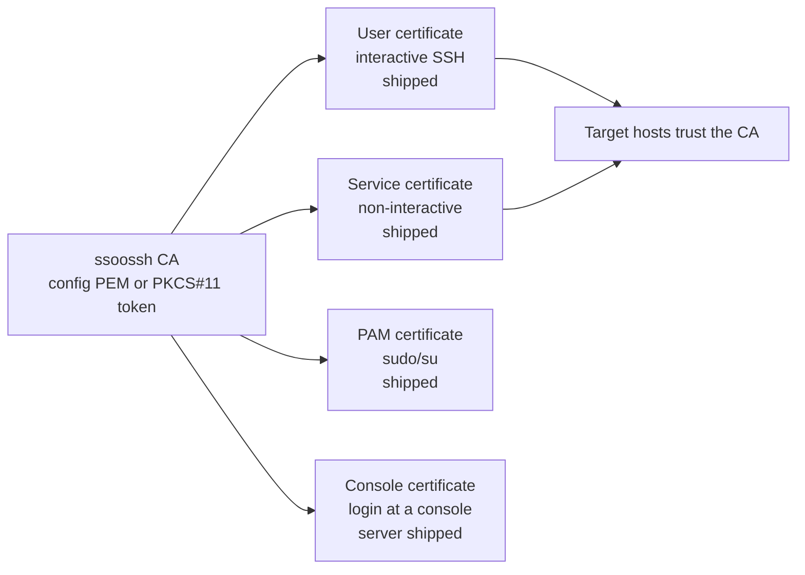

What ssoossh is made of, what a certificate is here, and which flow applies to
which kind of login. Read this first if you are deciding whether ssoossh fits
your deployment; the pages after it walk each flow end to end.

## The components

- **`ssoosshd`** -- the server. Authenticates people through OIDC, optionally
  enriches the identity from LDAP, decides what a certificate may carry, signs
  public keys, and serves the web UI for approval, confirmation, and
  per-user certificate history. Go, on top of gin.
- **`ssoossh`** -- the client. macOS, Linux, and Windows. Invoked from
  `ssh_config` as a `ProxyCommand` or a `Match exec`, or run by hand. It talks
  to the server over HTTPS and waits for issuance over a server-sent-events
  stream. It manages its own keypair and loads the result into your ssh-agent,
  or writes key files when no agent is available.
- **`pam_ssoossh`** -- a PAM module in the `auth` management group. It
  generates an ephemeral keypair, requests a certificate, validates it, and
  discards everything. It backs `sudo`, `su`, a password-less `sshd` stack,
  and console `login`.

Two constraints shape all three:

- The server never receives a private key. The client sends private keys
  nowhere except the local ssh-agent or a local file.
- The client never opens a listening port. There is no loopback redirect: the
  browser lands on the server, and the client learns the outcome only over its
  own stream.

## What a certificate is here

An SSH certificate is a signed statement that a particular public key may log
in as a particular set of login names, for a particular window of time, with a
particular set of capabilities. Target hosts hold no per-person keys; they
trust one CA public key in `TrustedUserCAKeys` and check every certificate
against it.

That is the whole trick, and it is what makes the rest follow: removing
someone is a change at the identity provider, not a sweep of
`authorized_keys` files, and a leaked certificate stops working on its own
when its window closes rather than when somebody remembers to revoke it.

The CA private key comes from one of exactly two places, and one of them must
be set or the server does not start: an inline PEM in
[`ssh_key`](/ssoossh/reference/config/top-level/#ssh_key), or a PKCS#11 token
under [`hsm`](/ssoossh/reference/config/hsm/), where the private half never
leaves the hardware.

## Certificate types and status

| Type | Purpose | Status |
| --- | --- | --- |
| **User** | interactive SSH | shipped end to end |
| **PAM** | `sudo`/`su` via `pam_ssoossh` | shipped end to end |
| **Console** | interactive login at a machine with no browser, approved by a typed code | server and web UI shipped; the console-side module ships separately as `pam_ssoossh` from the `ssoossh-pam` repository, which implements the console mode |
| **Service** | non-interactive: enroll once, retrieve unattended, every retrieval logged | shipped end to end |

The status vocabulary used across this site:

| Status | What it means |
| --- | --- |
| shipped end to end | every half exists and is released: the server, the client or PAM module that drives it, and the configuration keys named on this site |
| server shipped | the server and web UI exist; the piece that runs on the host is separate and may be at a different stage |
| not built | a design exists under `docs/proposals/` in the source repository and nothing else. Nothing on this site describes it as configurable |

Each type is its own configuration block --
[`cert_options.user`](/ssoossh/reference/config/cert_options/user/),
[`cert_options.service`](/ssoossh/reference/config/cert_options/service/),
[`cert_options.pam`](/ssoossh/reference/config/cert_options/pam/), and
[`cert_options.console`](/ssoossh/reference/config/cert_options/console/) --
with its own lifetime ceiling, its own extension ceiling, and its own key ID
template, so a `sudo` and an SSH login by the same person stay
distinguishable in an audit log.

ssoosshd issues no host certificates. Without a secure way for a host to prove
its claim to a hostname, host identity would be a hole rather than a feature.
The client keeps local principal-mapping tooling (`ssoossh host mapping`,
`ssoossh host principals`) for sshd's `AuthorizedPrincipalsCommand`; it has no
server side.

## Certificate types at a glance

## The shape of every issuance

Whatever the type, issuance has the same five beats:

1. **Create.** Something asks: the client for a person at a terminal, the PAM
   module for a `sudo` or a console login, or an enrollment code for an
   unattended job.
2. **Approve.** A human authenticates through the identity provider and
   approves in the browser. The approval page shows what will be issued, with
   anything policy trimmed struck through, *before* anyone approves. Nothing
   reachable over HTTP can exceed the config file.
3. **Sign.** Signing happens asynchronously off a queue. The signer holds the
   CA key and has no database access, so it can run as a separate, minimally
   privileged process.
4. **Deliver.** The certificate goes straight to the waiting caller.
   Issued certificates are never stored server-side, so there is no
   certificate store to steal, and a caller that misses the window
   re-requests.
5. **Record.** Every decision is recorded append-only: who approved or denied,
   from where, when, and what was actually granted. `sshd` logs the key ID on
   every login, so the trail reaches the target hosts themselves.

Denial resolves the caller cleanly, and a request nobody answers expires on its
own within the type's budget.

The service path is the one exception to "a human every time": a person
approves exactly once, at enrollment, and the enrollment code redeems
certificates unattended after that.

## Where each flow is documented

| Flow | Page |
| --- | --- |
| A person runs `ssh host` | [Interactive user certificates](/ssoossh/concepts/user-certificate/) |
| The same flow, narrated for a newcomer | [Illustrated walkthrough](/ssoossh/concepts/walkthrough/) |
| What a certificate may carry, and for how long | [Options and lifetime resolution](/ssoossh/concepts/options-and-lifetime/) |
| A backup job or CI runner with no human present | [Service certificates](/ssoossh/concepts/service-certificates/) |
| `sudo` and `su` on a host | [sudo and su through PAM](/ssoossh/concepts/sudo-flow/) |
| A login at a serial console, BMC viewer, or VM console | [Console login](/ssoossh/concepts/console-flow/) |
| What holds all of it together | [Security model](/ssoossh/concepts/security-model/) |

## Related

- [Getting started](/ssoossh/getting-started/) -- the components and how the
  server is configured.
- [Deployment overview](/ssoossh/operations/) -- standing a server up.
- [Hosts overview](/ssoossh/hosts/) -- what a target host needs.
- [Configuration reference](/ssoossh/reference/config/) -- every key, its
  type, and its default.
- [Decisions](/ssoossh/project/decisions/) -- what ssoossh deliberately does
  not do, including host certificates.
