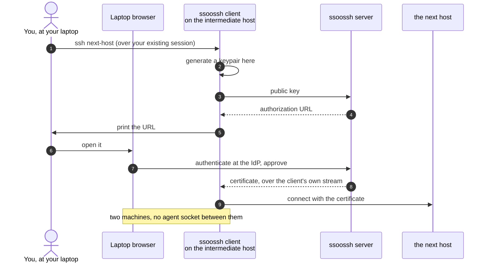

Both approaches end in the same place: `sshd` decides whether to let you in on
the strength of public-key cryptography, and your private key never crosses the
network either way. What differs is what the host was told to trust in advance,
and that one difference is what changes the five situations below.

This page is the comparison. The pages after it are the mechanism.

## The structural difference

| Property | An `authorized_keys` entry | An ssoossh certificate |
| --- | --- | --- |
| What the host trusts | that specific public key, copied there ahead of time | one CA public key, named once in `TrustedUserCAKeys` |
| What the credential asserts | possession of the matching private key | a signed statement: these principals, these options, valid between these two timestamps |
| Who decided | whoever could write that file | the identity provider, plus a human approval recorded in the audit log |
| When it stops working | when somebody edits the file, on every host | on its own, at the expiry inside the certificate |
| What the host records | a key fingerprint | the key ID, which names the identity and the request behind it |

Everything below follows from the third and fourth rows: the decision moves off
the hosts and into one place, and it carries its own clock.

## Identity proofing

**With keys.** An `authorized_keys` entry proves that the client connecting
holds the matching private key. That is the whole of what it proves. The link
between that key and a person exists only in whatever process put the line
there, and nothing re-checks it afterwards: not that the person still works
here, not that they are still on the team that account belongs to, not that
they are still the only holder of the key. A key copied to a second laptop, or
shared with a colleague to unblock them on a Friday, looks identical on the
wire to the original.

**With certificates.** Nothing is issued without an OIDC authentication at your
identity provider and a human approving in the browser, and the approval page
shows what will be issued -- with anything policy trimmed struck through --
before anyone approves. Two details do most of the work here:

- **Principals come from the approver's identity and the accounts it holds,
  never from a field the caller sent.** A request cannot name itself into an
  account it was not already entitled to.
- **Group membership never appears in the certificate.** Groups feed the gating
  and lifetime decisions and stop there, so a certificate is not a place stale
  group data can accumulate.

Every decision is then recorded append-only -- who approved or denied, from
where, when, and what was actually granted -- and `sshd` logs the key ID on
every login, so the trail reaches the target hosts rather than ending at the
server.

**What it does not give you.** The proof happens at issuance, not at each
connection. A certificate already issued is a bearer credential for the rest of
its window, and there is no revocation. Short lifetimes are the whole of the
answer to that; see [Security model](/ssoossh/concepts/security-model/).

## SSH onward from a remote system, with agent forwarding disabled

**With keys.** Your private key is on your laptop, and if you have done this
properly it is in hardware and cannot be copied off. You reach the first host
fine. To reach a second one from there you have exactly two options, and both
are bad: enable `ForwardAgent`, which lets anyone with root on the intermediate
host use your agent for as long as you are connected, or copy a private key
onto the intermediate host, which is worse and defeats the hardware token
entirely. With a hardware-backed key and `ForwardAgent` off there is no third
option. The key cannot follow you.

**With certificates.** Run the client on the machine you are already on. It
generates a fresh keypair *there*, posts the public half, and prints an
approval URL. You open that URL in the browser you already have on your laptop,
authenticate, and approve. The certificate comes back over that client's own
event stream, to the remote machine, and `ssh` connects onward.



The property that makes this work is deliberate: **the client never opens a
listening port, and there is no loopback redirect.** The browser lands on the
server, not on the client, so the browser and the client do not have to be on
the same machine, the same network, or the same continent. The URL is always
printed before any browser launch is attempted, so a headless machine loses
nothing by leaving
[`try_open_browser`](/ssoossh/reference/client-config/#try_open_browser) off.

Nothing of yours moves. The keypair generated on the intermediate host stays
there and is inert the moment the certificate expires; your agent is never
exposed to that host at all. And if you want to be sure it stays that way, the
certificate can be requested without the forwarding extension in the first
place:

```bash
ssoossh ssh login --no-agent-forwarding --no-port-forwarding --no-x11-forwarding
```

Where the machine cannot show a URL anyone will transcribe -- a serial console,
a BMC or KVM viewer -- the same flow substitutes an eight-character code typed
into the web UI. See [Console login](/ssoossh/concepts/console-flow/).

## Logging in as an alternate account

**With keys.** You append your public key to `~deploy/.ssh/authorized_keys`, on
every host where `deploy` matters. Who may become `deploy` is now one file per
account per host, and taking someone out means finding all of them. `sshd` logs
the login as `deploy` with a key fingerprint, so attributing it to a person
needs a fingerprint-to-human registry that you maintain by hand and that
nothing validates.

**With certificates.** Your certificate carries your principals. Which
principals may assume which local account is a *separate* decision, made on the
host, in a root-owned file: either `AuthorizedPrincipalsFile` per account, or
`AuthorizedPrincipalsCommand` answered by `ssoossh host principals`, which
reads `/etc/ssoossh/principals.yaml` and never touches the network.

```yaml
# /etc/ssoossh/principals.yaml
deploy:
  - alice
  - bob
alice:
  - alice
root:          # listed with nothing: nobody becomes root this way
```

Two things follow:

- **The credential never asserts the local account.** The certificate says who
  you are; the host says which of its accounts that identity may become. Adding
  someone to `deploy` on one machine is a change on that machine and does not
  touch what they can reach anywhere else.
- **Attribution survives the shared account.** `sshd` logs the key ID, which is
  templated per certificate type, so a `deploy` login names the human behind
  it. That is the fact a fingerprint could never carry.

`sudo` and `su` reach the same file: it is check 3 of `pam_ssoossh`. So "who
may become root here" is one statement, in one place, covering both the SSH
login and the escalation afterwards. See
[the principals map](/ssoossh/hosts/pam/principals-map/).

## Unattended work: cron jobs, timers, CI

**With keys.** A long-lived key in `authorized_keys`, generated once, rotated
never, attributable to nothing. Rebuild the host and you copy it again. If it
leaks, you have to work out every `authorized_keys` it ever reached.

**With certificates.** A person is involved exactly once. You enroll a keypair,
approve once in the browser choosing which service account it mints for, and
the job is left holding an **enrollment code** bound to that one public key and
to the option set authorized at approval. `service retrieve` posts the code and
nothing else, so a stolen code cannot be paired with an attacker's own keypair.

What matters for something running on a timer:

- It **skips the server entirely and exits 0** when the certificate on disk is
  still valid beyond `--grace` (default one minute), so a five-minute timer is
  not five minutes' worth of traffic.
- If retrieval fails but a still-valid certificate exists, it **warns and exits
  0**, so a briefly unreachable server does not break the job.
- Only when there is no readable, valid certificate does it fail non-zero.
- The private key can live on a PKCS#11 token: enroll the existing `.pub` and
  ssoossh never sees the private half.
- The enrollment belongs to the **service account, not the approver**, so the
  person who set it up leaving does not stop the job.
- Every redemption is logged with the address it was fetched from, and ending
  an enrollment early is one idempotent action in the admin service code
  directory, not a sweep of hosts.

**What it does not give you.** The code is still a bearer credential and still
has to sit somewhere the job can read it. What changed is that it is bound to
one keypair, expires on its own, is ended in one place instead of N, and leaves
a redemption log behind. See
[Service certificates](/ssoossh/concepts/service-certificates/).

## Key management, scenario by scenario

| Scenario | With `authorized_keys` | With ssoossh |
| --- | --- | --- |
| A new hire needs access to 40 hosts | Get their key into 40 files, by hand or through configuration management, and wait for it to converge | They log in. Their identity provider account already exists and the hosts already trust the CA |
| Someone leaves | Sweep every `authorized_keys` on every host, and hope none was missed | Disable them at the identity provider. Anything they hold expires within the type's [`valid_duration`](/ssoossh/reference/config/cert_options/user/#valid_duration) |
| Someone changes teams | Edit the accounts they should lose, everywhere those accounts exist | Change the group at the identity provider. Gating and lifetime follow at the next issuance |
| Routine key rotation | Schedule it, chase the stragglers, accept that it slips | Nothing to rotate. Every login already generates a fresh keypair |
| A laptop is lost | Work out which key it held, then find and remove it everywhere | Disable the account. Nothing on any host to edit |
| A host is rebuilt or added | Provision `authorized_keys` for everyone who might ever need it | One line of `sshd_config` naming the CA, plus a principals map if local names differ from identity provider ones |
| Rotating the CA itself | Does not apply | `TrustedUserCAKeys` takes several keys, and several signers can be active at once, so old and new overlap without an outage |
| "Who logged into db07 as `root` in March?" | Correlate a fingerprint against a registry you kept by hand | The key ID in that host's `sshd` log, and the approval record on the server |
| A private key turns up in a git repository | Identify it, then find every host it reached | Certificates are never persisted server-side and expire on their own. The only long-lived secret is an enrollment code, bound to one keypair and ended in one place |

## What this costs

Worth stating plainly, because none of it is free:

- **ssoosshd is on the path for new certificates.** An outage drops no
  established session and does not invalidate a certificate already loaded, but
  nobody gets a new one until it is back. That is why the PAM line is
  `sufficient` rather than `required`, so `sudo` and console login fall through
  to the local stack, and why a working local credential belongs somewhere
  physical.
- **There is no revocation.** Expiry does that work, which is only true if the
  lifetimes you configure are genuinely short.
- **The enrollment code for unattended work is a bearer credential**, as above.
- **ssoossh issues no host certificates.** Verifying the host you are
  connecting *to* stays exactly the problem it was with keys.
- **Identity is proven at issuance, not at each connection.** The certificate's
  window is the blast radius.

## Related

- [How ssoossh works](/ssoossh/concepts/) -- the components and the four
  certificate types.
- [Interactive user certificates](/ssoossh/concepts/user-certificate/) -- the
  everyday path in four stages.
- [Service certificates](/ssoossh/concepts/service-certificates/) -- enrollment
  and unattended reissue in full.
- [Security model](/ssoossh/concepts/security-model/) -- the invariants, and
  why revocation is deliberately absent.
- [Trusting the CA in sshd](/ssoossh/hosts/sshd-trust/) -- the one line every
  host needs, and mapping principals to accounts.
- [The principals map](/ssoossh/hosts/pam/principals-map/) -- who may become
  which local account on a given machine.
