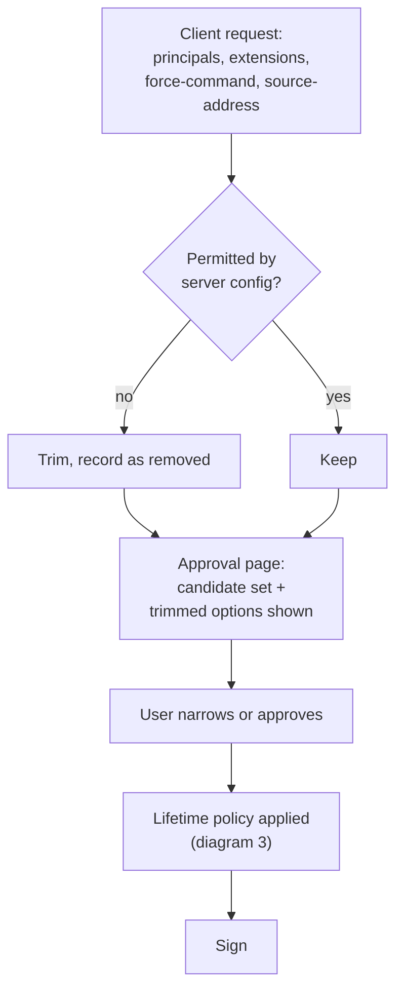
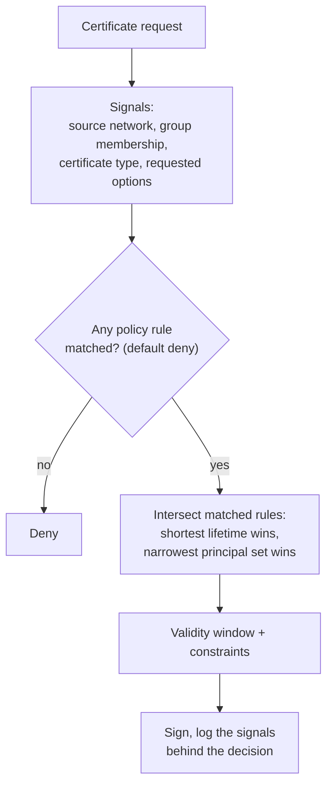

Between "the client asked" and "the CA signed" sit two decisions: what the
certificate may carry, and how long it lives. Both only ever narrow. This page
is the mechanism; the operator-facing settings are on
[certificate lifetime policy](/ssoossh/operations/certificate-policy/).

## Requests ask, the server narrows, config gates

Three layers narrow what a certificate may carry. Only the server config
defines what exists at all; nothing reachable over HTTP can exceed it.

1. The client's request states what it wants: principals, extensions, a
   `force-command`, `source-address` restrictions.
2. The server checks each against the type's configuration.
3. Anything the config does not permit is **trimmed, not rejected**, and
   recorded as removed. A request asking for too much still succeeds; it just
   gets less.
4. The approval page shows the candidate set together with the trimmed options,
   struck through, so the difference between "asked for" and "will be issued"
   is visible before anyone clicks.
5. The approver may narrow it further, or approve as shown.
6. Lifetime policy runs on the result.
7. The certificate is signed.

The extension ceiling is per type:
[`cert_options.user.extensions`](/ssoossh/reference/config/cert_options/user/#extensions)
defaults to `permit-pty, permit-user-rc`, while
[`cert_options.pam.extensions`](/ssoossh/reference/config/cert_options/pam/#extensions)
and
[`cert_options.console.extensions`](/ssoossh/reference/config/cert_options/console/#extensions)
default to empty, because `permit-pty` and friends mean nothing to a
certificate that authenticates one local operation and is then discarded.

Two things never come from the request:

- **Principals.** They come from the approver's identity and the accounts it
  holds, never from a field the caller sent.
- **The source address policy is judged on.** The server uses the address it
  observed, not the `source-address` restriction the client asked for, which
  is unverified client input.

Group membership never appears in a certificate. Groups feed the lifetime
decision only.

## Certificate lifetime policy

The server is the policy decision point; the target host's `sshd` enforces the
result.

1. A request arrives.
2. The signals available to the decision are the source network the server
   observed, what the approver's identity satisfies, and which certificate type
   is being issued, which selects the `cert_options` block the whole decision
   is bounded by.
3. Rules are matched.
4. The matched rules are combined, and combining can only shorten and narrow.
5. The result is a validity window plus the constraints that go with it.
6. The certificate is signed, and the signals behind the decision are recorded.

:::note[How "no match" actually resolves]
The diagram's "default deny" is about the gate, not the clock. Whether an
identity may have a certificate of this type at all is the `require` condition
(for example
[`cert_options.user.require`](/ssoossh/reference/config/cert_options/user/#require)),
and failing it denies issuance. The lifetime rules underneath are different:
when no tier matches, the certificate gets
[`lifetime_policy.default_duration`](/ssoossh/reference/config/cert_options/user/#lifetime_policydefault_duration),
which is required whenever any part of the lifetime policy is configured, and a
zero there is a startup error rather than a zero-second certificate. When no
source rule matches, nothing is reduced: rules *are* reductions, so the absence
of one leaves the type's ceiling in place.
:::

### How a duration is actually chosen

1. **Tier.** The **first** tier in
   [`lifetime_policy.tiers`](/ssoossh/reference/config/cert_options/user/#lifetime_policytiers)
   whose `when` condition the approver's identity satisfies. Order matters and
   is not validated: numeric thresholds nest, since everyone satisfying
   `at_least: 40` also satisfies `at_least: 30`, so write them in descending
   order. No match means `default_duration`.
2. **Source rule.** The **longest-prefix** match against the request's source
   address, as in a routing table. Order does not matter, and ties resolve to
   the stricter rule, so a duplicate can never loosen anything.
3. The result is the **minimum** of those, clamped to the type's
   `valid_duration` ceiling.

Extensions follow their own algebra. A tier may *grant* extensions, which reads
like widening and is not: the grant is bounded by the type's `extensions`
ceiling, and a grant naming anything outside that ceiling fails startup rather
than being silently trimmed. Identity grants, network narrows -- a source rule
can only subtract. On the service path a source rule may also pin the issued
certificate to the address it was requested from, which is a restriction, not a
capability.

The winning tier, the condition it matched, the source rule, the ceilings, and
the effective values are recorded as a structured document on the approval's
decision row, so "why did this certificate get fifteen minutes" is answerable
from the record rather than by re-deriving the computation.

:::caution[Behind a reverse proxy]
Source rules are judged on the address ssoosshd observes. With
[`http.trusted_proxies`](/ssoossh/reference/config/http/#trusted_proxies)
unset, every request appears to come from the proxy, very likely an internal
range, so everyone silently lands in the most generous rule. ssoosshd warns at
startup when a source policy is configured and no proxy is trusted.
:::

## Ceilings above the policy

Two absolutes sit above everything above, checked before signing as
defense in depth:
[`max_cert_lifetime`](/ssoossh/reference/config/top-level/#max_cert_lifetime)
and
[`max_service_cert_lifetime`](/ssoossh/reference/config/top-level/#max_service_cert_lifetime).
Below them, each type's `valid_duration` is the ceiling any policy narrows
from.

Note how different the types are by default:
[`cert_options.user.valid_duration`](/ssoossh/reference/config/cert_options/user/#valid_duration)
and
[`cert_options.pam.valid_duration`](/ssoossh/reference/config/cert_options/pam/#valid_duration)
are short, because a PAM or console certificate is validated once and thrown
away, while
[`cert_options.service.valid_duration`](/ssoossh/reference/config/cert_options/service/#valid_duration)
is long, because the job holding it has no human to ask.

## What the key ID says

The key ID is the string `sshd` logs on every login, so it is where the audit
trail reaches the target host. Each type shapes it with a Go template:
`{{.Username}}:{{.ClientIP}}:{{.UniqueID}}`, including operator-defined extra
OIDC claim fields captured at login (`{{.Extra.dept}}`).

- A bad template fails startup, not the first issuance.
- A field with no value renders as `MISSING` rather than vanishing.
- An unset
  [`cert_options.service.key_id_template`](/ssoossh/reference/config/cert_options/service/#key_id_template)
  falls back to the `user` template. The
  [PAM](/ssoossh/reference/config/cert_options/pam/#key_id_template) and
  [console](/ssoossh/reference/config/cert_options/console/#key_id_template)
  templates deliberately do not, so a `sudo`, a console login, and an SSH login
  by the same person stay distinguishable in an audit log.
- The fields render from the **approver's** login. For a service enrollment
  that names the human who approved it, because the key ID and principals are
  fixed at approval, long before the code is redeemed unattended.

## Where this is configured

| What | Key |
| --- | --- |
| Who may get this type at all | `cert_options.<type>.require` ([user](/ssoossh/reference/config/cert_options/user/#require), [service](/ssoossh/reference/config/cert_options/service/#require), [pam](/ssoossh/reference/config/cert_options/pam/#require), [console](/ssoossh/reference/config/cert_options/console/#require)) |
| Lifetime ceiling per type | `cert_options.<type>.valid_duration` |
| Extension ceiling per type | `cert_options.<type>.extensions` |
| Tiered durations by identity | [`lifetime_policy.tiers`](/ssoossh/reference/config/cert_options/user/#lifetime_policytiers) |
| Fallback when no tier matches | [`lifetime_policy.default_duration`](/ssoossh/reference/config/cert_options/user/#lifetime_policydefault_duration) |
| Narrowing by source network | [`lifetime_policy.source_policy`](/ssoossh/reference/config/cert_options/user/#lifetime_policysource_policy) |
| What a missing claim resolves to | [`lifetime_policy.on_absent_claim`](/ssoossh/reference/config/cert_options/user/#lifetime_policyon_absent_claim) |
| Absolute ceilings | [`max_cert_lifetime`](/ssoossh/reference/config/top-level/#max_cert_lifetime), [`max_service_cert_lifetime`](/ssoossh/reference/config/top-level/#max_service_cert_lifetime) |
| Which proxy to believe about the client address | [`http.trusted_proxies`](/ssoossh/reference/config/http/#trusted_proxies) |
| The claims the conditions read | [`authentication.fields`](/ssoossh/reference/config/authentication/#fields) |

## Related

- [Certificate lifetime policy](/ssoossh/operations/certificate-policy/) -- the
  full semantics, with worked configurations.
- [Key ID templates](/ssoossh/operations/key-id-templates/) -- every field, and
  what a bad template does.
- [Server configuration examples](/ssoossh/examples/server-configs/) -- whole
  files you can start from.
- [Interactive user certificates](/ssoossh/concepts/user-certificate/) -- where
  in the flow this all happens.
- [Audit log](/ssoossh/operations/audit-log/) -- what the decision record
  keeps.
