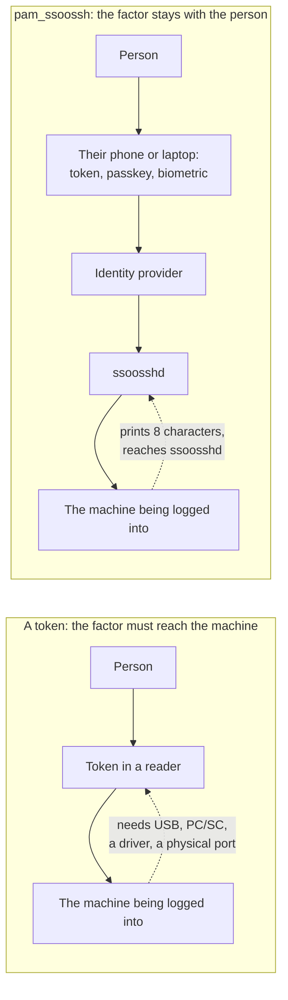

Three things can decide that whoever is asking for `sudo`, `su`, or a console
login is who they say: a local password, a hardware-backed token, or an
approval carried out at your identity provider. They answer different
questions, and they fail in different places.

The short version: a token is the strongest proof of the three, and it only
works where you can physically attach it. That is a real constraint on a
fleet of virtual machines, where the console is a video stream in a browser
tab and there is no USB port to put anything into.

This page compares the three. For how the module itself works, see
[sudo and su through PAM](/ssoossh/concepts/sudo-flow/) and
[Console login](/ssoossh/concepts/console-flow/).

## What each one proves

| Property | Local password | Hardware-backed token | `pam_ssoossh` |
| --- | --- | --- | --- |
| The claim it checks | you know a secret this host has a hash of | you hold this device, and unlocked it with a PIN or a touch | you authenticated at the identity provider just now, and a human approved this specific request |
| Where the authority lives | on this host, per account | on the device in someone's hand | at the identity provider |
| What the host holds in advance | a password hash per account | trust anchors, plus a mapping from certificate to account | one CA public key, plus a principals map |
| Proof of presence, now | none: a stored secret, replayable by anyone who learns it | yes: a PIN entry or a touch at the moment of use | yes: an interactive approval at the moment of use |
| Resists phishing | no | yes, the credential is bound to the origin or the reader | partly: the credential cannot be phished, but the *approval* can be talked out of someone. See below |
| Names an individual through a shared account | no | only if the device is not shared either | yes: the certificate names the approver, and the key ID reaches the host's log |
| Says what is being authorized | no, a prompt is a prompt | no | yes: the approval page names the host, the service, the tty, the account, and the command line |

The phishing row is the one to read twice. A token cannot be phished because
the credential never leaves the device. `pam_ssoossh`'s certificate cannot be
phished either, for the same kind of reason: it is issued against a keypair
generated on the host for that one attempt and is checked against it. What can
be attacked is the human, talked into approving a request somebody else
started. That is a real difference from a token, and it is what the console
code and the short approval window exist to make expensive; see
[the consent-phishing section](/ssoossh/concepts/console-flow/#the-code-is-the-consent-phishing-control).

## Where each one can actually be used

This is the matrix that decides deployments, and it is mostly a question of
what is physically attached to what.

| Situation | Local password | Smartcard / PIV | FIDO2 or platform authenticator | `pam_ssoossh` |
| --- | --- | --- | --- | --- |
| At the keyboard of a physical machine | yes | yes | yes | yes |
| Over SSH to a remote host | yes | only by forwarding the reader, which most deployments refuse | only by forwarding the agent, which is the thing you disabled | yes, and this is the ordinary case |
| A VM console in a hypervisor UI | yes | no: nothing to attach a reader to | no | yes |
| A BMC or KVM viewer (iDRAC, iLO, IPMI SOL) | yes | no: the keyboard is a video stream | no | yes |
| A serial console on a rack server or a switch | yes | no | no | yes |
| A crash cart, machine not booting far enough for SSH | yes | rarely, and not on a machine that is half up | no | yes |
| The host cannot reach the network | yes | yes | yes | **no** |
| Unattended, no human at all | yes | no | no | no: use [service certificates](/ssoossh/concepts/service-certificates/) |

Two rows carry the argument. The token columns are `no` for every remote and
virtual console, and `pam_ssoossh` is `no` for the offline row. Those are the
complementary halves of the same trade, which is why the module is wired
`sufficient` and the local stack stays underneath it.

## Why a VM console is the case a token cannot cover

A hardware token authenticates by being **attached to the machine doing the
authenticating**. That assumption is invisible until the machine is virtual.

A VM's console is a video stream rendered in a hypervisor UI or a BMC viewer.
There is no USB port on it, and the workarounds are each worse than they sound:

- **USB passthrough** puts the reader on the *hypervisor*, not in the hand of
  the person logging in, and pins that VM to that physical host.
- **Smartcard redirection** exists in some remote-desktop protocols and in
  essentially none of the text-console paths that matter here: not SOL, not a
  serial line, not a crash cart.
- **A platform authenticator** authenticates the Mac or PC you are sitting at.
  It has nothing to say about the VM you are looking at through it.

`pam_ssoossh` inverts the arrangement. The factor stays with the person, and
the machine being logged into needs only two things: enough screen to print
eight characters, and a route to `ssoosshd`. Where the terminal font allows it
the module also draws a QR code carrying the whole verification URL, so a BMC
viewer is photographed rather than transcribed.

The consequence worth stating plainly: **whatever your identity provider
already enforces applies to that console login.** If signing in requires a
WebAuthn passkey, a smartcard at the IdP, or a push, then the console login
behind it inherited that, without one byte of it touching the console machine.
A VM with no ports gets the same factor as a laptop with a token in it.

`allowed_networks` bounds where a console request may be created at all, judged
on the address the server observed rather than a hostname the caller typed:
[`cert_options.console.allowed_networks`](/ssoossh/reference/config/cert_options/console/#allowed_networks).

## Operational properties

Where the three differ once they are running, rather than at the moment of a
login.

| Cost | Local password | Hardware-backed token | `pam_ssoossh` |
| --- | --- | --- | --- |
| Enrollment | set a password per account per host | issue and personalize a device, then register it | none on the host: the person already exists at the identity provider |
| Adding a host | provision accounts and passwords | distribute trust anchors and a certificate-to-account mapping | one CA public key, one principals map |
| Revocation | change it on every host it was set on | revoke the device centrally, if the deployment has that | disable the person at the identity provider |
| Rotation | scheduled, chased, and it slips | device lifecycle, replacements, lost-token process | nothing to rotate: the keypair is generated per attempt and discarded |
| A lost credential | find every host it worked on | replace the device, revoke the old one | nothing on any host to change |
| What the host records | "authentication failure" and a username | a device or certificate identifier | the key ID naming the identity, plus the server's own approval record |
| What the module leaves on disk | a hash, permanently | a mapping, permanently | nothing: no state, no cache, no key outliving the attempt |
| Second-person authorization | not possible | not possible | possible, and audited: one operator can approve a console login for a colleague |

The last row is a capability rather than a weakness, but it is worth knowing
about. No host-side gate constrains *who* approved, so the audit trail is the
control: `cert.code_resolved` records who typed the code and which machine
they were told about, and the decision record carries their subject, username,
groups and source.

## What it does not replace

`pam_ssoossh` is a factor added in front of a host's existing stack, not a
replacement for it. Four limits follow, and none of them is incidental:

- **The host must reach `ssoosshd` at authentication time.** An unreachable
  server returns `PAM_AUTHINFO_UNAVAIL`, and with the line wired `sufficient`
  the stack falls through to what follows it. That is why the local stack has
  to keep working, and why the console guidance insists on a working local
  credential kept somewhere physical.
- **It does not remove the password file.** A denial, a timeout, a Ctrl-C, and
  an outage all reach the prompt underneath. Disallowing that is a separate,
  deliberate decision with its own lockout risk.
- **It composes with a token rather than competing with it.**
  [`ssh-only`](/ssoossh/hosts/pam/reference/#ssh-only) exists for exactly this:
  a host whose local logins already carry a factor a remote login cannot use
  keeps that factor for the person at the keyboard, and sends remote `sudo`
  through the browser flow. A Mac with Touch ID and a workstation with a
  smartcard reader are the same shape.
- **It authenticates, it does not authorize.** Which of the approver's names
  may become which local account is the host's own root-owned
  [principals map](/ssoossh/hosts/pam/principals-map/), and the certificate
  never carries the local account that was asked for.

Two smaller facts that catch people out: the module is an `auth` module only,
with no code for `account`, `password` or `session` lines, and console mode is
compiled in on Linux and FreeBSD only. On macOS `mode=console` is refused and
`mode=auto` always takes the browser flow.

## Which to reach for

| Situation | Reach for |
| --- | --- |
| Someone at the keyboard of their own Mac or workstation | the platform authenticator or smartcard, with `ssh-only` so remote `sudo` still goes through ssoossh |
| `sudo` over SSH across a fleet | `pam_ssoossh`, browser flow |
| A VM console in a hypervisor UI | `pam_ssoossh`, console mode |
| A BMC, KVM viewer, or serial console | `pam_ssoossh`, console mode, and let it draw the QR code |
| A shared operations account several people use | `pam_ssoossh`: it is the only one of the three that names the individual afterwards |
| Recovery when the network or the identity provider is down | the local credential underneath, which is what `sufficient` keeps reachable |
| A cron job or CI runner | none of these: [service certificates](/ssoossh/concepts/service-certificates/) |

## Related

- [sudo and su through PAM](/ssoossh/concepts/sudo-flow/) -- the flow, the four
  checks, and every return value.
- [Console login](/ssoossh/concepts/console-flow/) -- the code, the QR, and the
  consent-phishing argument.
- [Keys and certificates compared](/ssoossh/concepts/keys-and-certificates/) --
  the same comparison for SSH login rather than local authentication.
- [Installing pam_ssoossh](/ssoossh/hosts/pam/install/) -- packages, platforms,
  and current status.
- [pam_ssoossh reference](/ssoossh/hosts/pam/reference/) -- `ssh-only`, `mode=`,
  and the rest of the arguments.
- [sudo and su on a host](/ssoossh/hosts/pam/sudo/) and
  [console login on a host](/ssoossh/hosts/pam/console/) -- the pam.d entries,
  with the lockout warnings.
