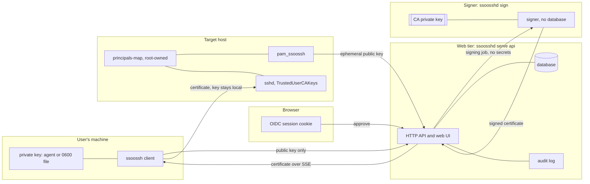

What ssoossh guarantees, what it deliberately does not defend against, and
where each control lives in the config file. Written for whoever has to
justify the deployment: an operator, a reviewer, or the person asked "what
happens if the server gets popped".

The short version: the config file on disk is the outer bound on everything.
Nothing reachable over HTTP -- not a client, not the web UI, not an admin, not
an attacker holding the web tier -- can produce a certificate the loaded
configuration would not already have allowed.

## Trust boundaries

Four boundaries are worth naming:

- **The user's machine keeps the private key.** Only a public key crosses to
  the server, on every path including PAM.
- **The web tier holds no CA key** when you run the split topology. It holds
  the database, the sessions, and the audit log.
- **The signer holds the CA key and no database.** It never learns who
  requested a certificate; the signing job is the future certificate's own
  contents and nothing more.
- **The target host decides which local account a certificate reaches.** That
  decision is a root-owned file on the host, not a server setting.

## The invariants

### Issuance

**Server config is the outer bound.** Requests *ask*, the web UI *narrows*,
the config file *gates*. Options a deployment does not permit are trimmed
rather than rejected, so the approval page can show what was asked for next
to what would actually be granted -- struck through where policy took
something away. A human authorizing issuance sees what they are authorizing.

Standing policy sits in the same shape, with the administrator in the
"narrows" position: policy may only ever reduce what the config file already
allows. See
[Certificate lifetime policy](/ssoossh/operations/certificate-policy/).

**Every issuance is approved by a human in the browser, then signed.** There
is no path that turns a request into a certificate without passing through
the sign queue.

**Two option families are never granted from a request.** `ForceCommand` and
`SourceAddresses` are dropped outright, because there is no configured
ceiling to bound them against, and granting an unbounded client-requested
critical option would break the rule above. `no-touch-required` is granted
only for service certificates, and only for an enrolled hardware-backed `sk-`
key -- never for a client-generated one. `verify-required` is never used at
all.

**There is no host certificate type.** Nothing in the design can verify a
host's claim to its own hostname, so approval would reduce to a human
eyeballing a string an unauthenticated requester typed. Unverifiable host
identity from the CA that also signs user access is worse than none. The
client's `host mapping` and `host principals` commands are local tooling for
`AuthorizedPrincipalsCommand` and never talk to the server.

### Keys

**Private keys never leave the machine that generated them.** The server
never generates or stores a private key; it records public key material and
issuance metadata only. On macOS and Linux a key file is written `0600`; on
Windows the client sets an equivalent access list.

**Issued certificates are never persisted.** Delivery to the waiting client
is the only copy. A client that misses the window re-requests, which is cheap
because certificates are short-lived by design. There is no certificate store
to steal.

**The CA key is reached through one interface, not hardcoded to a backend.**
That seam is what lets the signer become a separate, minimally-privileged
process.

### Identity

**Group membership never appears in a certificate.** Groups feed the
lifetime and gating decisions only.

**Persisted group rows are never an authorization input.** Admin, SOC,
auditor, and the certificate policy gates are all evaluated from the session
identity. The `user_groups` table is a snapshot for notification fan-out and
display: it answers "who should this reach", never "may this caller do this".

**Session and authorization headers are never captured.** The headers
recorded on an approval decision are a deliberate allowlist -- `User-Agent`,
`Accept-Language`, `X-Forwarded-For` -- not "every header minus a denylist".
`Cookie` carries the live session token; neither it nor `Authorization` is
ever written to an audit record.

**Client-supplied addresses never feed policy.** The address any policy
consults is the one the server observed, not one a caller reported. Same for
everything a PAM or console request says about its host: see
[host context](/ssoossh/internals/host-context/).

The code-level statement of all of the above, with the reasons each one is
load-bearing, is [Invariants](/ssoossh/internals/invariants/).

## Where the CA private key lives

Exactly one of two sources, and startup fails without one:

| Source | Configured by | What the process holds |
| --- | --- | --- |
| Inline PEM in the config file | [`ssh_key`](/ssoossh/reference/config/top-level/#ssh_key) | the private key, in memory, readable by anyone who can read the file |
| A PKCS#11 token (HSM or SoftHSM2) | [`hsm.module`](/ssoossh/reference/config/hsm/#module) and the rest of the [`hsm`](/ssoossh/reference/config/hsm/) section | a handle. The private key never leaves the hardware |

:::danger
A config file containing `ssh_key` *is* the CA. Anyone who can read it can
sign certificates for any principal your hosts accept. Treat the file like
the private key it contains, and prefer the token path where you have one.
:::

Independently of which source you choose, the key does not have to sit in the
web tier at all. Run `ssoosshd sign` as its own process against
[`pubsub.backend`](/ssoossh/reference/config/pubsub/#backend) `nats` and the
CA key never shares memory with HTTP handling, OIDC and LDAP calls, or the
web UI. In that mode signers announce their public keys and the web tier
serves only those, so the web tier holds no private key of any kind. Several
CA keys can be active at once, which is what covers rotation. See
[startup modes](/ssoossh/operations/startup-modes/) and
[HSM and PKCS#11](/ssoossh/operations/hsm/).

:::note[The FAQ says otherwise]
The repository FAQ still answers "where does the CA private key live" with
"in an ssh-agent the server process reaches", and calls PKCS#11 planned. The
shipped configuration surface has no ssh-agent source: `ssh_key` and `hsm`
are the two, exactly one of them must be set, and the HSM path is documented
and tested. Treat the FAQ wording as stale.
:::

## A compromised web tier, or a rogue admin

Neither can widen access. This is a design property, not an operational hope.

| An attacker holding the web tier can | ...but cannot |
| --- | --- |
| Deny service: refuse approvals, drop requests, break logins | Issue a certificate more permissive than the config file allows |
| Read the database: request history, audit rows, public keys, issuance metadata | Recover any private key, or any issued certificate |
| Edit standing policy through the web tier | Loosen anything by doing so -- runtime-editable policy may only narrow |
| See what was approved | Sign anything, in the split topology, because it holds no CA key |

An admin is subject to the same bound plus its own limits. Admin is an OIDC
group named in
[`admin.require_group`](/ssoossh/reference/config/admin/#require_group), not a
database flag: there is no bootstrapping question about who creates the first
admin, no drift from the identity provider, and no API path by which an admin
promotes anyone. On top of that, an admin cannot approve someone else's
request, raise a ceiling, grant admin, or touch the audit trail. The roles
fail closed -- an empty group authorizes nobody -- and admins inherit the
auditor views rather than the reverse
([`admin.auditor_group`](/ssoossh/reference/config/admin/#auditor_group),
[`admin.soc_group`](/ssoossh/reference/config/admin/#soc_group)).

The auditor's effective-configuration view is a fixed, deliberately chosen set
of fields. It never shows the whole file, and never the CA key, client secret,
cookie signing key, or database password.

## Why there is no revocation

Deliberately absent, and not an oversight. Certificates are short-lived by
design, so they expire faster than a revocation list could reasonably be
distributed to every host. Expiry does the work.

The practical consequence for offboarding: disable the person in the identity
provider. They cannot get a new certificate, and the one they hold dies on its
own within the type's
[`valid_duration`](/ssoossh/reference/config/cert_options/user/#valid_duration).
Nothing on your hosts needs touching -- no KRL to distribute, no
`authorized_keys` to edit. Ceilings that bound how long "short-lived" can be
configured to mean are
[`max_cert_lifetime`](/ssoossh/reference/config/top-level/#max_cert_lifetime)
and
[`max_service_cert_lifetime`](/ssoossh/reference/config/top-level/#max_service_cert_lifetime).

The one thing to hold onto is that a certificate is checked once, at session
start. An established SSH session does not drop when the certificate behind it
expires.

## Consent phishing, and the console code

Request binding stops one user approving another user's pending request. It
does nothing about the other shape of the attack: a user talked into
approving a request the *attacker* created for them. "Click this link and sign
in" is a phone call away.

The console flow's eight-character code
(Crockford Base32, shown as `K7M4-QP2X`) is the control for that, not a
convenience. The code exists only on the screen of the machine in front of
the person, so the attacker's script becomes "read me the eight characters on
your console" -- which is a very different conversation from clicking a link.

Three properties make it hold:

- **Resolving a code requires a session.** An unauthenticated caller can
  never turn a code into a request ID, and the request ID is what the
  certificate is delivered against.
- **Resolving claims the request.** A second person typing the same code is
  refused.
- **The approval window is the attacker's working time**, so console login
  gets its own, shorter budget:
  [`cert_options.console.client_timeout`](/ssoossh/reference/config/cert_options/console/#client_timeout)
  defaults to `2m` against the global `5m` ceiling in
  [`cert_options.client_timeout`](/ssoossh/reference/config/cert_options/#client_timeout).
  A type may only shorten the global budget, never extend it.

:::caution[Do not shorten the console budget below about 90 seconds]
Below that, a first approval that has to go through an OIDC login starts to
fail, people retry, and a flow people habitually retry is a flow people learn
to approve without reading.
:::

Two more controls sit on the same path.
[`cert_options.console.allowed_networks`](/ssoossh/reference/config/cert_options/console/#allowed_networks)
refuses a request from outside named networks at creation, before a keypair is
certified and before any human is asked -- gated on the address the server
observed, not on a hostname the caller typed. And which accounts may console
into which machine stays the host's decision: put
`pam_succeed_if.so user ingroup ...` above the ssoossh line in
`/etc/pam.d/login`. Host-side, root-owned, and it fails before any network
call. A group sent on the wire would be untrusted input that stops applying
the moment someone omits it.

See [Console login](/ssoossh/concepts/console-flow/) for the whole flow.

## Threats and controls

| Threat | Control | Where configured |
| --- | --- | --- |
| A user's private key leaks | Short lifetimes; expiry replaces revocation | [`cert_options.user.valid_duration`](/ssoossh/reference/config/cert_options/user/#valid_duration), [`max_cert_lifetime`](/ssoossh/reference/config/top-level/#max_cert_lifetime) |
| The server is asked for more than policy allows | Config is the outer bound; options trimmed, not rejected, and shown before approval | the whole [`cert_options`](/ssoossh/reference/config/cert_options/) section |
| The web tier is compromised | It holds no CA key in split mode; runtime policy may only narrow | [`pubsub.backend`](/ssoossh/reference/config/pubsub/#backend) `nats` plus a `ssoosshd sign` process |
| The CA key is read off disk | PKCS#11 token: the private key never leaves the hardware | [`hsm`](/ssoossh/reference/config/hsm/) instead of [`ssh_key`](/ssoossh/reference/config/top-level/#ssh_key) |
| A rogue admin escalates | Admin is an OIDC group, not a row; cannot self-approve, raise a ceiling, grant admin, or edit audit | [`admin.require_group`](/ssoossh/reference/config/admin/#require_group) |
| The database is stolen | No private keys, no issued certificates, no group rows used for authorization | not configurable, by design |
| Consent phishing on a console login | A code that exists only on the console screen; short per-type budget | [`cert_options.console.client_timeout`](/ssoossh/reference/config/cert_options/console/#client_timeout) |
| A console request from an unexpected network | Refused at creation on the observed address | [`cert_options.console.allowed_networks`](/ssoossh/reference/config/cert_options/console/#allowed_networks) |
| One user approves another's request | Request binding, and resolving a code claims the request | not configurable, by design |
| A PAM caller lies about its host, user, or command line | Nothing in the host context feeds a decision; principals come from the approver's held accounts | not configurable, by design ([host context](/ssoossh/internals/host-context/)) |
| A local account is assumed without authority | Check 3 in the module: the host's `principals-map` decides which of the approver's names may become which local account | the host's root-owned map, plus `pam_succeed_if` above the ssoossh line |
| An enrollment code is stolen | The code is bound to the stored public key, so it cannot be paired with an attacker's keypair; every redemption is logged and notified to the account's holders | [`cert_options.service`](/ssoossh/reference/config/cert_options/service/), [email notifications](/ssoossh/operations/email-notifications/) |
| A browser session is stolen or replayed | Signed, encrypted, strict same-site cookies; sliding idle window under an absolute cap activity never extends; CSRF and per-request CSP nonces | [`http.cookie_key`](/ssoossh/reference/config/http/#cookie_key), [`http.cookie_idle_timeout`](/ssoossh/reference/config/http/#cookie_idle_timeout), [`http.cookie_max_age`](/ssoossh/reference/config/http/#cookie_max_age) |
| A proxy hop spoofs the client address | `X-Forwarded-For` is ignored unless the hop is named; empty by default | [`http.trusted_proxies`](/ssoossh/reference/config/http/#trusted_proxies) |
| The OIDC redirect is pointed somewhere else | Redirect URI and the CSRF origin check both derive from one setting | [`http.public_url`](/ssoossh/reference/config/http/#public_url) |
| Brute-forcing a console code | Rate limit keyed on both the submitting session and the source address | [`http.console_code_rate_limit.limit`](/ssoossh/reference/config/http/#console_code_rate_limitlimit) |
| Group membership goes stale mid-session | Groups are read at login; the session's absolute cap bounds staleness | [`http.cookie_max_age`](/ssoossh/reference/config/http/#cookie_max_age) |
| An issued certificate cannot be traced later | Append-only decision records, and `sshd` logs the key ID on every login | [`audit.retention`](/ssoossh/reference/config/audit/#retention), [key ID templates](/ssoossh/operations/key-id-templates/) |
| A signing job is intercepted on the broker | Per-node identity via mTLS; the payload is not secret and is useless without the client's private key | [multi-instance and NATS](/ssoossh/operations/multi-instance/) |
| Clock skew breaks PAM validity checks | The module's own skew tolerance, and run NTP on every host | the `skew-tolerance` module argument in the host's pam.d stack |

## What is deliberately out of scope

- **Revocation**, for the reason above.
- **User certificates pinned to a source address.** People move between
  office, VPN, hotel and tether, and a pinned certificate turns every network
  change into a failed login for no gain a short lifetime does not already
  provide. Service certificates sit still and *can* be pinned.
- **At-least-once delivery of signing jobs.** The flow is short and
  interactive, so the human is the retry mechanism: a dropped job means a
  terminal still waiting, cancelled and rerun.
- **Re-checking group claims mid-session.** The session's absolute cap bounds
  how stale a claim can get.
- **A dedicated signer config file.** The signer reuses the full server config
  with mode-aware validation today, so secrets it never uses can sit in its
  file. Worth hardening once the split topology is in real use.

Each of these, with the argument behind it, is in
[Decisions](/ssoossh/project/decisions/).
