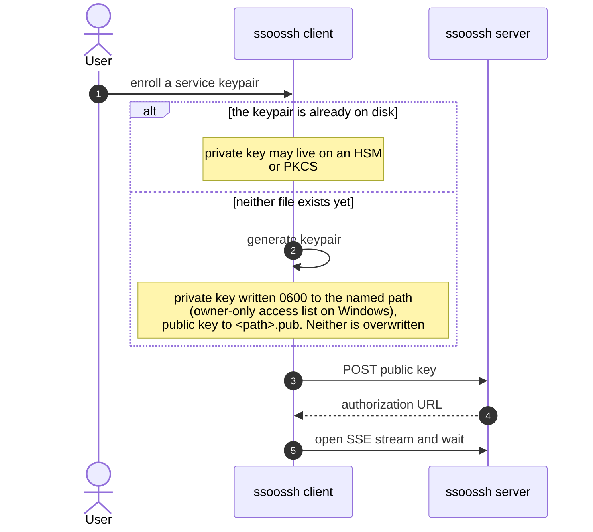
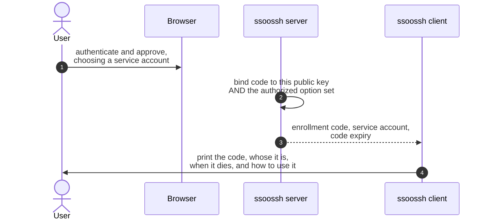
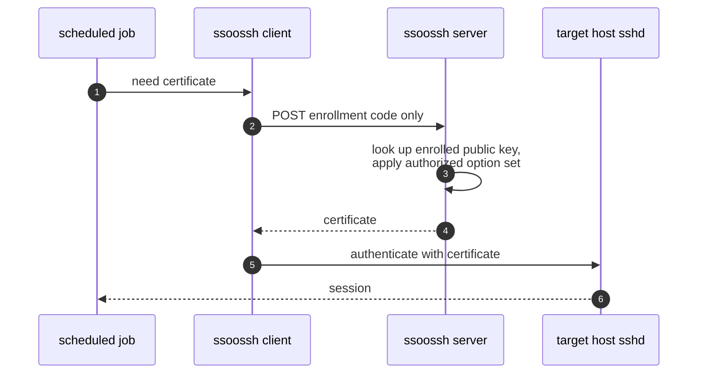

A nightly backup job, a CI runner pushing artifacts, a file transfer on a
timer: work that needs SSH at 3am with nobody there to approve anything. The
service path involves a person exactly once, at enrollment. Everything after
that runs without a browser.

## What it replaces

The usual answer for an unattended job is a long-lived key in
`authorized_keys` that nobody rotates and nobody can attribute. Here the job
holds an **enrollment code** instead, bound to one keypair and one authorized
option set, and every redemption is logged against the account it mints for.

## 4a. Enrollment: key registration

1. An operator runs `ssoossh service enroll --key <path>`.
2. One flag decides both branches. If neither `<path>` nor `<path>.pub`
   exists, the client generates the keypair. If the public key is already
   there, that one is enrolled and no key is generated -- which is how a
   private key that lives on an HSM or a PKCS#11 token gets enrolled without
   ssoossh ever seeing it. Neither file is overwritten.
3. The client posts the public key to the server.
4. The server answers with an authorization URL.
5. The client opens an SSE stream and waits, exactly as the interactive flow
   does.

The key files follow OpenSSH naming: the private key is `<name>`, the public
key is `<name>.pub`, and the certificate, once retrieved, is
`<name>-cert.pub`. All three must sit in the same directory for `ssh` to find
them.

## 4b. Enrollment: approval and the enrollment code

The browser approval is the same as
[stage 1b](/ssoossh/concepts/user-certificate/#1b-the-user-authenticates-and-approves-in-a-browser).
What comes back is different.

1. The approver authenticates, picks which of their own service accounts the
   enrollment is for, and reviews the options before approving.
2. The server binds the code to **both** the enrolled public key and the
   authorized option set.
3. The code, the service account, and the code's expiry come back to the
   waiting client.
4. The client prints the code, whose it is, when it stops working, and the
   exact command to redeem it with.

The code is printed once and stored nowhere. It is a bearer credential --
anyone holding it can obtain certificates for that service account until the
enrollment expires -- and where it belongs is wherever the unattended job will
read it, which only the operator knows. So `service enroll` prints it along
with the `service retrieve` command to run, and `service retrieve` reads it
from `--code`.

:::caution
Treat the code like the credential it is. It is in no notification email and
must not be put in one, there is no endpoint that returns one, and it exists
on the wire exactly once: in the approval event above.
:::

The chosen account and the expiry travel with the code because the operator at
the terminal never sees the approval screen. Without them, the only way to
learn which principal the certificates carry would be to retrieve one and
inspect it. The account is set by the approver from their own linked accounts,
and it is the sole principal of every certificate the code redeems. The expiry
bounds the **code**
([`cert_options.service.enrollment_duration`](/ssoossh/reference/config/cert_options/service/#enrollment_duration)),
not those certificates, which get their own lifetime at each redemption from
[`cert_options.service.valid_duration`](/ssoossh/reference/config/cert_options/service/#valid_duration).

Because the account comes back with the code, the printed `ssh_config` recipe
names it: the `Match user` block keys on the service account rather than a
placeholder the operator has to fill in.

Afterwards the approver can see what they granted, without the code, at
**Service codes** in the web UI: one row per approved enrollment, opening into
which account it mints for, the options and certificate lifetime fixed at
approval, the keypair it is bound to, when it stops being redeemable, and its
redemption log. Every holder of an account sees its codes, whoever approved
them.

## 4c. Unattended reissue

1. The job needs a certificate, so it runs
   `ssoossh service retrieve --code ... --key <path>`.
2. The client posts the enrollment code, and only the code.
3. The server looks up the enrolled public key and applies the option set that
   was authorized at approval.
4. The certificate comes back and is written to `<name>-cert.pub`.
5. `ssh` presents it to the target host.
6. The job gets its session.

The public key is not resubmitted, so a stolen code cannot be paired with an
attacker's own keypair. The same keypair is used every time: no new key, no
browser, no user.

`service retrieve` is built to be run on a timer or from a `Match exec` line
without generating traffic it does not need:

- It skips the server entirely and exits 0 when the certificate on disk is
  still valid beyond `--grace`, which defaults to 1 minute. `--force`
  overrides that.
- If retrieval fails but a still-valid certificate exists, it warns and exits
  0, so a briefly unreachable server does not break the job.
- Only when there is no readable, valid certificate does it fail with a
  non-zero exit.

## What the record shows

Each redemption is logged, and the serial ties the two halves together: it is
allocated before the signing job is queued, written to the retrieval row, and
lands on the issued certificate. That is what lets the certificate history
report the address a service certificate was actually fetched from, which is a
different fact from the approval's source IP -- that one belongs to the human
who approved the code and is identical on every certificate it mints.

Policy is evaluated at retrieval, so a certificate signed months after
approval is still bounded by the ceilings in force when it is signed.

Disabling the person who approved an enrollment does not stop the job. Service
enrollments belong to the service account, not to the approver, so the
account's other holders keep control and unattended work keeps running. Ending
an enrollment early is its own action, in the admin **Service code directory**,
and it is idempotent.

## Two worked shapes

**A nightly backup.** Enrol a keypair on the backup host, put the code in the
unit's environment file (root-owned, mode 600), and have the timer run
`service retrieve` before `rsync`. The certificate is refreshed only when the
one on disk is close to expiry.

**A CI runner.** Enrol once from a workstation, store the code in the CI
system's secret store, and retrieve at the start of a job that needs SSH. The
runner never holds a key that outlives the enrollment, and the redemption log
shows every build that used it, with the address it came from.

## Where this is configured

| What | Key or flag |
| --- | --- |
| How long a code stays redeemable | [`cert_options.service.enrollment_duration`](/ssoossh/reference/config/cert_options/service/#enrollment_duration) |
| Lifetime of each certificate the code mints | [`cert_options.service.valid_duration`](/ssoossh/reference/config/cert_options/service/#valid_duration) |
| Who may approve a service enrollment | [`cert_options.service.require`](/ssoossh/reference/config/cert_options/service/#require) |
| Extensions a service certificate may carry | [`cert_options.service.extensions`](/ssoossh/reference/config/cert_options/service/#extensions) |
| Which accounts count as service accounts | [`authentication.fields.service_accounts`](/ssoossh/reference/config/authentication/#fieldsservice_accounts) |
| The absolute service ceiling | [`max_service_cert_lifetime`](/ssoossh/reference/config/top-level/#max_service_cert_lifetime) |
| Key ID for service certificates | [`cert_options.service.key_id_template`](/ssoossh/reference/config/cert_options/service/#key_id_template) |
| Enrollment and redemption email | [`mail`](/ssoossh/reference/config/mail/) |
| Where the code is read from | `--code` on `ssoossh service retrieve` |
| Where the keypair lives | `--key` on `ssoossh service enroll` and `service retrieve` |

## Related

- [Service accounts](/ssoossh/guides/service-accounts/) -- the operator's
  walkthrough, with commands.
- [Options and lifetime resolution](/ssoossh/concepts/options-and-lifetime/) --
  what "the authorized option set" is made of.
- [Email notifications](/ssoossh/operations/email-notifications/) -- the
  enrollment and redemption kinds, and why the code is in none of them.
- [Audit log](/ssoossh/operations/audit-log/) -- the redemption record.
- [HSM and PKCS#11](/ssoossh/operations/hsm/) -- for a private key that should
  never touch disk.
- [HTTP API](/ssoossh/reference/api/) -- the enrollment endpoints.
