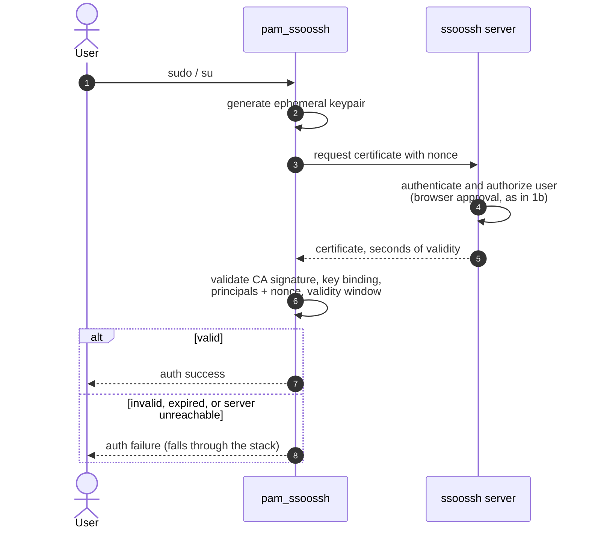

`sudo` and `su` are the two moments where a local password still decides
something important. `pam_ssoossh` puts them behind the same identity
provider, the same approval page, and the same CA as SSH itself: a per-attempt
ephemeral keypair, a certificate valid for seconds, and everything discarded
afterwards.

This page is the mechanism. For the file to edit and the arguments to pass, see
[sudo and su](/ssoossh/hosts/pam/sudo/).

## The flow

Scoped to the `auth` management group. The module keeps nothing: no state on
disk, no cache, no key that outlives the attempt.

1. Someone runs `sudo` or `su`.
2. The module generates an ephemeral keypair for this attempt alone. It is
   always ECDSA P-384, which every platform's crypto supports.
3. It requests a certificate, carrying a nonce and what it can honestly say
   about the host.
4. The server authenticates and authorizes the approver in the browser, the
   same approval as
   [stage 1b](/ssoossh/concepts/user-certificate/#1b-the-user-authenticates-and-approves-in-a-browser).
   The module prints the approval URL through the PAM conversation and waits;
   nothing is read back from the terminal.
5. The certificate comes back with seconds of validity.
6. The module runs four checks on it.
7. All four passing is an auth success; anything else fails and the stack
   continues to whatever follows the ssoossh line.

Nothing is written to disk at any point.

## The four checks

Run in order on the certificate the server issues. Every failure logs its
reason.

| # | Check | What it stops |
| --- | --- | --- |
| 1 | **CA signature** -- the certificate is cryptographically signed by a key in the module's trusted CA file. Not a string comparison against that file's contents. | A certificate from any other CA. |
| 2 | **Key binding** -- the certificate's public key is the one generated for this attempt. | A CA-signed certificate carrying the right principal but issued to somebody else's keypair. |
| 3 | **Principal** -- the certificate's principals authorize this local account, through the principals map when one is loaded, and by exact name otherwise. | An approver becoming an account the host never said they could. |
| 4 | **Validity window** -- now is inside the certificate's window, plus or minus the configured skew tolerance. | A replayed certificate from an earlier attempt. |

Check 3 is the one worth dwelling on. The certificate names the **approver**:
their OIDC username and the other accounts they hold. It does not name the
local account the module is authenticating -- that is reported by an
unauthenticated caller and is used for display and audit only. Which of the
approver's names may assume which local account is the **host's** decision,
made against the local principals map, so `sudo` on a machine is authorized by
a file only root on that machine can edit.

## Fail-closed, and how it falls through

| Outcome | Return value |
| --- | --- |
| All four checks passed | `PAM_SUCCESS` |
| Denied, expired, unparseable, a failed check, or a timeout | `PAM_AUTH_ERR` |
| The server could not be reached, or answered with something that was not an answer | `PAM_AUTHINFO_UNAVAIL` |
| The person pressed Ctrl-C at the approval prompt | `PAM_IGNORE` |
| `ssh-only` is set and the session did not arrive over SSH | `PAM_IGNORE` |
| `server` is not configured, or the user could not be read | `PAM_USER_UNKNOWN` |
| The trusted CA file is missing, holds no usable key, or an argument is malformed | `PAM_NO_MODULE_DATA` |

The distinction matters when the module is `sufficient` in the stack: an
ssoossh outage returns `PAM_AUTHINFO_UNAVAIL` and the stack falls through to
whatever follows, so a server outage does not become a fleet-wide lockout.

The last `PAM_IGNORE` row is a deliberate opt-out rather than a failure. With
[`ssh-only`](/ssoossh/hosts/pam/reference/#ssh-only) set, the module takes part
only in a session that arrived over SSH and stands aside for a local login,
which is how a host keeps Touch ID or a smartcard for the person at the
keyboard while remote logins go through ssoossh. Nothing is generated or sent
on the path it declines.

:::danger
Editing `/etc/pam.d/sudo` wrongly costs you `sudo` on that machine, which is
also how you would normally fix a PAM mistake. Keep a root shell open in a
second terminal, and read
[sudo and su](/ssoossh/hosts/pam/sudo/) before you touch the file.
:::

## What the approver sees about the host

A `sudo` asks for a certificate from a process on a machine the server has
never seen. The approver has to decide whether that ask is theirs, so the
module sends as much as it can honestly say:

| Field | Where the module reads it | What it tells the approver |
| --- | --- | --- |
| `username` | `PAM_USER` | The account being authenticated: who `sudo` runs as. |
| `hostname` | `gethostname()` | Which machine. The join key against that host's own logs. |
| `pam_service` | `PAM_SERVICE` | `sudo`, `su`, `sshd`, `login`. Tells a `sudo` from an `su`. |
| `tty` | `PAM_TTY` | `pts/3` for a terminal window, `tty1` for a virtual console, `ttyS0` for a serial line, empty for cron. |
| `remote_host` | `PAM_RHOST` | The peer for network services. |
| `requesting_user` | `PAM_RUSER` | Who invoked the service, as opposed to `username`. "alice is becoming root" is only readable with both. |
| `process` | `/proc/self/cmdline` on Linux, `KERN_PROC_ARGS` on FreeBSD, absent on macOS | `sudo -i` versus `sudo systemctl restart nginx`. The most useful single line an approver of a `sudo` can read. |
| `caller_uid`, `caller_pid`, `caller_ppid` | `getuid()`, `getpid()`, `getppid()` | Join keys into the host's auditd or journal. |
| `machine_id` | `/etc/machine-id`, `kern.hostuuid` | Stable across a rename, so two hosts claiming one name stay distinguishable. |
| `os` | os-release `PRETTY_NAME`, `uname -sr` | The platform as the host describes itself. |
| `client` | module name and version | Which implementation and build sent the request. |
| `mode` | the `mode=` argument | `auto`, `sudo`, or `console` as configured. |
| `client_time` | the host's clock | Skew against the server, made visible before it starts breaking logins. |
| `trusted_ca_fingerprints` | SHA256 of each key in the trusted CA file | Lets the page say "this host will not accept what is about to be signed" before the host does. |

:::caution[None of it is trusted]
Every field above is self-reported by an unauthenticated caller, and the
approval page renders each as a claim. Nothing here feeds a decision:
principals come from the approver's held accounts, lifetime from policy, and
source restrictions from the address the server observed itself. A hostname or
a command line is context for a human, not an input to any check. The server
bounds each string on the way in.
:::

`source_ip` is the one value in that block the server established itself, and
the page shows it as such.

## Two worked shapes

**An interactive root shell.** `sudo -i` on a jump host. The approver sees the
host, the tty, `alice` becoming `root`, and `sudo -i` as the process line, and
approves on their phone. The certificate lives 30 seconds and authenticates
that one escalation; the shell it opens outlives it, because the certificate is
checked once at the door.

**One command from a script a person is running.** `sudo systemctl restart
nginx` shows up as exactly that. An approver who was expecting a shell can
decline something that says something else.

## Where this is configured

| What | Key or file |
| --- | --- |
| How long a PAM certificate is valid | [`cert_options.pam.valid_duration`](/ssoossh/reference/config/cert_options/pam/#valid_duration) |
| Who may approve a `sudo` at all | [`cert_options.pam.require`](/ssoossh/reference/config/cert_options/pam/#require) |
| Extensions on a PAM certificate | [`cert_options.pam.extensions`](/ssoossh/reference/config/cert_options/pam/#extensions) |
| Keeping `sudo` distinguishable in the audit log | [`cert_options.pam.key_id_template`](/ssoossh/reference/config/cert_options/pam/#key_id_template) |
| How long the module waits for approval | `timeout=` in the pam.d line |
| Clock skew allowance | `skew-tolerance=`, chosen alongside `valid_duration` |
| Which principals may assume which local account | the principals map on the host |
| Which CAs the host will accept | the trusted CA file on the host |

## Related

- [sudo and su](/ssoossh/hosts/pam/sudo/) -- the stack entry, with the lockout
  warning.
- [Installing pam_ssoossh](/ssoossh/hosts/pam/install/) -- packages and
  platforms.
- [The principals map](/ssoossh/hosts/pam/principals-map/) and
  [the trusted CA file](/ssoossh/hosts/pam/trusted-ca/) -- checks 3 and 1.
- [pam_ssoossh reference](/ssoossh/hosts/pam/reference/) -- every argument,
  mode, and return value.
- [PAM troubleshooting](/ssoossh/hosts/pam/troubleshooting/) -- unreachable
  servers and clock skew.
- [Console login](/ssoossh/concepts/console-flow/) -- the same module where
  there is no browser.
- [Host context](/ssoossh/internals/host-context/) -- every field above, and
  how far each one travels.
