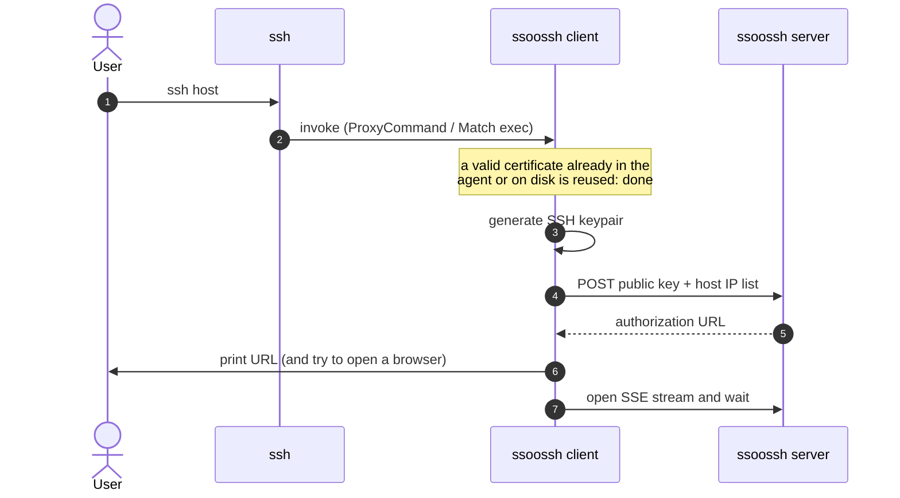
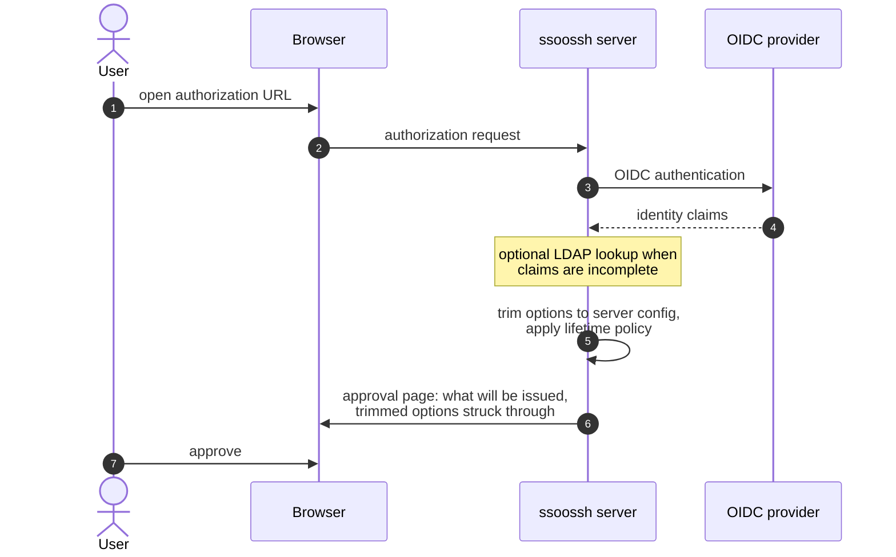
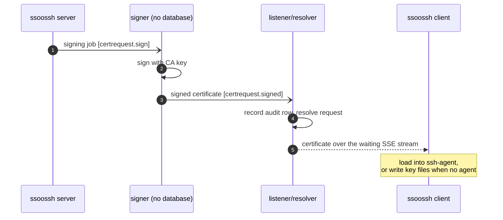
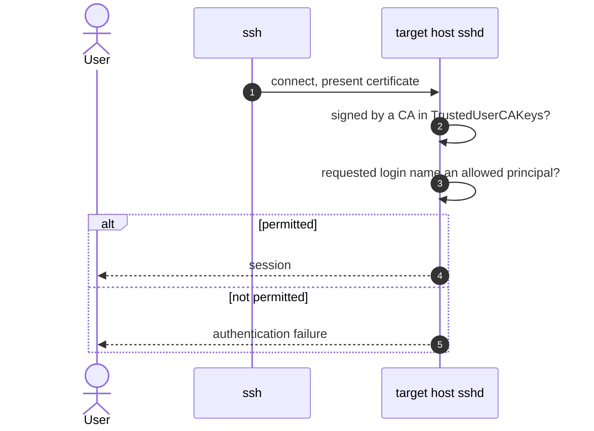
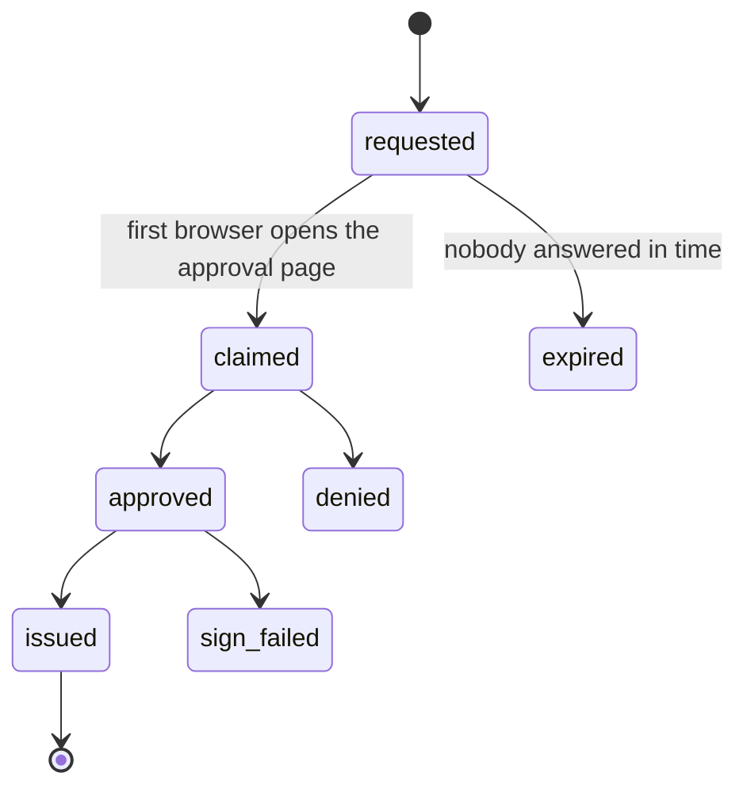

The everyday path: a person types `ssh host` and gets a shell. It runs in four
stages. The client requests a certificate (1a), the user approves in a browser
(1b), the server signs and delivers (1c), and `ssh` connects (1d). For the same
story told for a newcomer, with pictures, see the
[illustrated walkthrough](/ssoossh/concepts/walkthrough/).

## 1a. `ssh` invokes the client, which requests a certificate

1. The user runs `ssh host`.
2. `ssh` invokes the ssoossh client, from a `ProxyCommand` or a `Match exec`
   line in `ssh_config`. A valid certificate already in the agent or on disk is
   reused and the flow ends here, with no browser at all.
3. The client generates a fresh SSH keypair, locally.
4. It posts the public key and the host IP list to the server.
5. The server answers with an authorization URL.
6. The client prints that URL and tries to open a browser.
7. The client opens an SSE stream and waits.

The wait window is configurable, up to about 5 minutes:
[`cert_options.client_timeout`](/ssoossh/reference/config/cert_options/#client_timeout)
is the whole budget and defaults to `5m`. The server owns that deadline and
measures it from the request's creation, so a client that reconnects to its
event stream re-attaches to the original deadline instead of extending it.

The client never opens a listening port. The browser lands on the server, and
the client learns the outcome only over this SSE stream.

## 1b. The user authenticates and approves in a browser

This runs in the browser while 1a waits. The client is not a participant.

1. The user opens the authorization URL.
2. The browser sends the authorization request to the server.
3. The server sends the user to the OIDC provider.
4. The provider returns identity claims.
5. Optionally, the server enriches an incomplete identity from LDAP.
6. The server trims the requested options down to what the config permits and
   applies the lifetime policy.
7. The approval page shows what will be issued, with the trimmed options struck
   through.
8. The user approves.

The identity provider stays authoritative for everything here, including who
counts as an administrator. Option trimming and lifetime policy have their own
page: [Options and lifetime resolution](/ssoossh/concepts/options-and-lifetime/).

## 1c. The server signs and delivers

Signing happens asynchronously off a queue after approval. The signer holds the
CA key and has no database access, so it can run as a separate, minimally
privileged process.

1. The server publishes a signing job on `certrequest.sign`.
2. The signer signs the public key with the CA key.
3. The signer publishes the signed certificate on `certrequest.signed`.
4. The listener records the audit row and resolves the request.
5. The certificate goes to the client over the waiting SSE stream.
6. The client loads it into the ssh-agent, or writes key files when there is no
   agent.

The certificate is never stored server-side. Delivery is the only copy; a
client that misses the window re-requests.

## 1d. `ssh` connects to the target host

Nothing here involves ssoossh. The client has exited, or in `ProxyCommand` mode
is only relaying bytes, and this is ordinary SSH certificate authentication.

1. `ssh` connects and presents the certificate.
2. `sshd` checks that it was signed by a CA in `TrustedUserCAKeys`.
3. `sshd` checks that the requested login name is an allowed principal.
4. If both hold, the session starts; otherwise the login fails.

`sshd` also checks the validity window, enforces critical options such as
`source-address` and `force-command`, applies the extension set, and requires
proof of private-key possession. Principals map onto local accounts through
`AuthorizedPrincipalsFile` or `AuthorizedPrincipalsCommand`.

## The certificate does not bound the session

The certificate is used once, at session initiation. A ten-hour certificate is
not a ten-hour session limit, and an expiring certificate does not drop a
session already running.

A valid certificate is reused until it expires, so one approval can cover a
workday: you see the browser when a new certificate is needed, not once per
connection.

## What the record says

Each stage leaves an audit event, which is what makes "who issued this, and
when did nobody answer" answerable afterwards:

`cert.claimed` has no actor: the user agent is what tells a person from a link
scanner. `cert.expired` is a system event, raised when nobody answered within
the type's budget. `cert.sign_failed` means an approval produced no
certificate, either because the signer refused or because the stranded sweep
found the row stuck.

## Where this is configured

| What | Key or file |
| --- | --- |
| How long a client may wait | [`cert_options.client_timeout`](/ssoossh/reference/config/cert_options/#client_timeout) |
| User certificate lifetime ceiling | [`cert_options.user.valid_duration`](/ssoossh/reference/config/cert_options/user/#valid_duration) |
| Extensions a user certificate may carry | [`cert_options.user.extensions`](/ssoossh/reference/config/cert_options/user/#extensions) |
| Who may get a user certificate at all | [`cert_options.user.require`](/ssoossh/reference/config/cert_options/user/#require) |
| What `sshd` logs on every login | [`cert_options.user.key_id_template`](/ssoossh/reference/config/cert_options/user/#key_id_template) |
| The identity provider | [`authentication`](/ssoossh/reference/config/authentication/) |
| Trusting the CA on a target host | `TrustedUserCAKeys` in `sshd_config` |

## Related

- [The ssoossh client](/ssoossh/guides/client/) and
  [ssh_config integration](/ssoossh/guides/ssh-config/) -- the two invocation
  modes and how to wire them up.
- [Approving in the browser](/ssoossh/guides/approving/) -- what the approval
  page shows you.
- [Options and lifetime resolution](/ssoossh/concepts/options-and-lifetime/) --
  stage 1b's trimming step in full.
- [Trusting the CA in sshd](/ssoossh/hosts/sshd-trust/) -- the host side of
  stage 1d.
- [Identity provider](/ssoossh/operations/identity-provider/) and
  [LDAP enrichment](/ssoossh/operations/ldap/).
- [Signing pipeline](/ssoossh/internals/architecture/) -- the queue topics in
  stage 1c.
- [Audit log](/ssoossh/operations/audit-log/) -- the events above.
