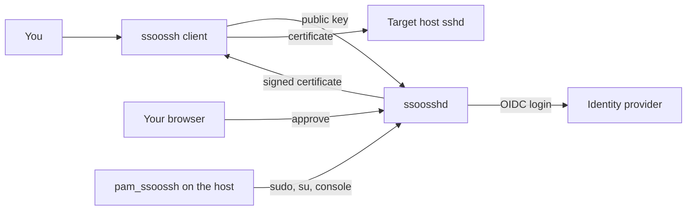

ssoossh turns a login at your identity provider into a short-lived SSH
certificate. This page names the pieces, then walks the shortest path from a
fresh machine to `ssh bastion.example.com` working. It is written for the
person who will use ssoossh to connect; operators and host administrators have
their own pointers at the end.

## The three components

- **`ssoosshd`** -- the server. It authenticates you through OIDC, decides what
  a certificate may carry, signs your public key, and serves the web UI where
  requests are approved and history is read.
- **`ssoossh`** -- the client. `ssh` invokes it from your `ssh_config`; it
  generates a keypair, asks the server for a certificate, and loads the result
  into your ssh-agent (or into key files when there is no agent). Private keys
  never leave your machine.
- **`pam_ssoossh`** -- the PAM module installed on target hosts. It puts
  `sudo`, `su`, and console login behind the same identity provider and the
  same approval, using a certificate valid for seconds and stored nowhere.



## Before you start

This assumes an `ssoosshd` server is already running and reachable, with a CA
key configured and an identity provider wired up. If it is not,
[Deployment overview](/ssoossh/operations/) is the runbook for that half.

If you would rather see the flow before running it, the
[illustrated walkthrough](/ssoossh/concepts/walkthrough/) shows what steps 3
and 4 look like from the user's chair.

## 1. Install the client

Download the release package for your platform from the
[releases page](https://github.com/mnestor/ssoossh/releases).

**Debian / Ubuntu**

```bash
sudo dpkg -i ssoossh-client_*.deb
```

**RHEL / Fedora**

```bash
sudo rpm -i ssoossh-client_*.rpm
```

Both packages put the binary in `/usr/local/bin` and an annotated copy of the
client defaults at `/etc/ssoossh/ssoossh.yaml`.

**Windows** -- download the `.zip`, extract `ssoossh.exe` somewhere on `PATH`.

**macOS** -- download the `.zip`. The binary inside is signed and notarized, so
Gatekeeper does not block it. Extract it and put `ssoossh` on `PATH`.

## 2. Point the client at the server

One setting has no default. Check it resolves before trying a real login:

```bash
ssoossh --server https://ssh.example.com --debug ca
```

The CA public key goes to stdout; `--debug` puts the resolved configuration
report on stderr, including every config file it looked at and what came of
each. To make the address permanent, put it in `ssoossh.yaml` instead of
passing `--server` every time:

```yaml
# ~/.config/ssoossh.yaml
server: "https://ssh.example.com"
```

[Client configuration](/ssoossh/guides/client-config/) covers where that file
is looked for and what else can go in it.

## 3. Wire up `ssh_config`

```ssh-config
Match host bastion.example.com exec "ssoossh ssh login"
    User youruser
```

`ssoossh ssh config` prints this recipe and the `ProxyCommand` alternative, and
needs no server to do it. [ssh_config integration](/ssoossh/guides/ssh-config/)
explains which of the two you want.

## 4. Log in

```bash
ssh bastion.example.com
```

The client prints an approval URL (and opens a browser if
[`try_open_browser`](/ssoossh/reference/client-config/#try_open_browser) is
set). Approve it in the browser, and `ssh` proceeds: the certificate is loaded
into your agent and reused for every later connection until it expires, so one
approval typically covers a workday.

If it takes more than this to get a certificate, something is wrong with the
deployment rather than with you. `-v` says what the client did and `--debug`
says what it resolved -- see [Diagnostics](/ssoossh/guides/diagnostics/).

## For operators

Running the server itself:

- [Deployment overview](/ssoossh/operations/) -- the numbered runbook.
- [Installing the server](/ssoossh/operations/install/) -- CA key and systemd.
- [Identity provider](/ssoossh/operations/identity-provider/) -- OIDC client and
  redirect URI.
- [TLS and reverse proxies](/ssoossh/operations/tls-and-proxy/) -- the two
  settings that fail silently until someone tries to log in.
- [Configuration reference](/ssoossh/reference/config/) -- every server key,
  its type, and its default.

## For host admins

Making a target host accept these certificates:

- [Hosts overview](/ssoossh/hosts/) -- what a host needs.
- [Trusting the CA in sshd](/ssoossh/hosts/sshd-trust/) -- the one
  `sshd_config` line.
- [Installing pam_ssoossh](/ssoossh/hosts/pam/install/) and
  [sudo and su](/ssoossh/hosts/pam/sudo/) -- read the lockout warning before
  editing a real PAM stack.
- [Client settings enforcement](/ssoossh/hosts/client-enforcement/) -- locking
  client settings across a fleet.

## Where to go next

- [The ssoossh client](/ssoossh/guides/client/) -- every command and flag.
- [Approving in the browser](/ssoossh/guides/approving/) -- what the approval
  page shows and what else the web UI holds.
- [Service accounts](/ssoossh/guides/service-accounts/) -- certificates for a
  backup job, a CI runner, or a cron entry.
- [User FAQ](/ssoossh/guides/faq/) -- the questions that come up first.
- [How it works](/ssoossh/concepts/) -- what is actually happening underneath.
