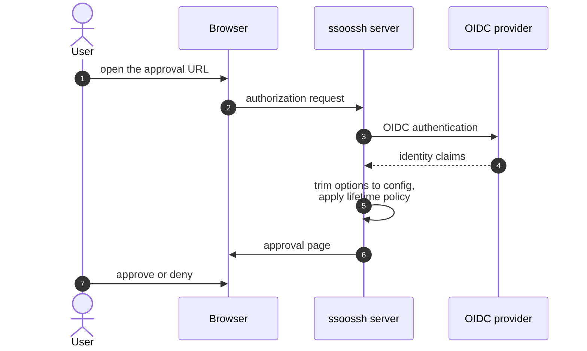
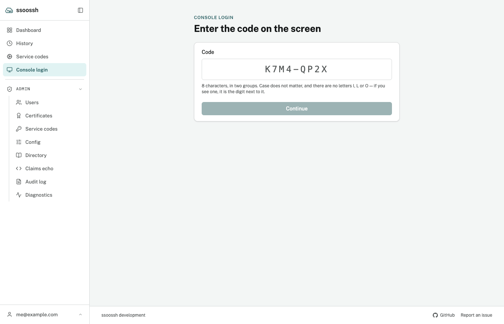
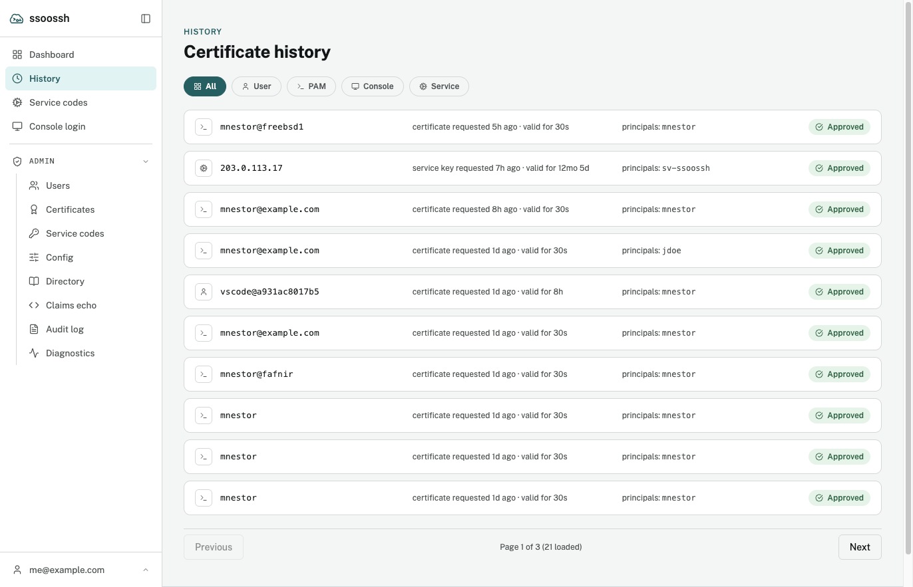
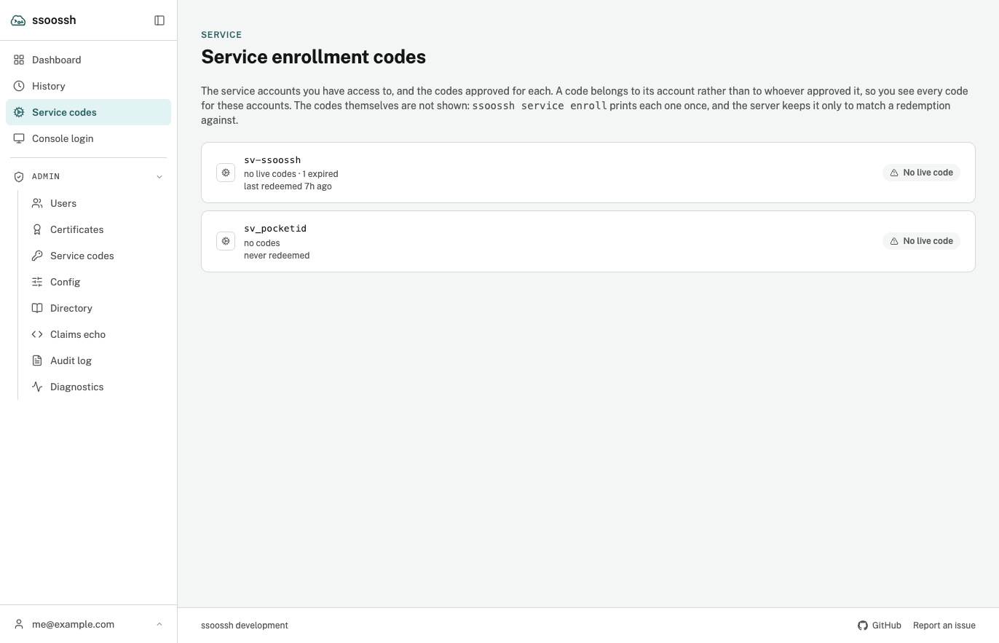
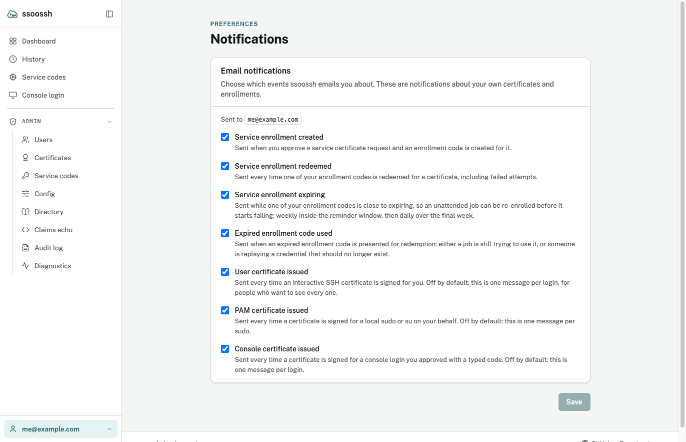

Every certificate ssoossh issues is approved by a human in a browser. This page
is the tour of what you see there: signing in, the approval page itself,
confirming a console login by code, your own history, and the preferences that
decide which emails you get. It ends with what an administrator can do to your
account, since that is the other thing the web UI holds.

For the layout of the UI itself -- the rail, where each page lives, and the
detail pages you can link to -- see [The web UI](/ssoossh/guides/web-ui/).

## Signing in

The client prints an approval URL and waits. Opening it takes you through your
identity provider; the server never sees a password. If you are not signed in
when you open the link, you land on the sign-in screen first, including any
consent notice the deployment sets, and come back to the request afterwards.

The URL can be opened in any browser, including one on a different device from
the machine running `ssh`. Be aware that the deployment's lifetime policy may
compare the browser's address with the client's, and weak correlation can
shorten the issued lifetime -- never lengthen it.

## The approval page

The page does two things and nothing else: it shows what would be granted, and
it records one decision. The certificate itself never appears here -- it is
signed asynchronously and delivered to the waiting client over its own stream.

Loading the page is itself the claim on the request. A second person opening
the same link is refused before any button exists to click.

A user certificate request. Everything under "reported by the client" is what the requesting machine said about itself. The struck-through entries are what this server's policy removed, and the notice at the bottom says so before you decide.

What the page shows depends on the certificate type, but the shape is constant:

- **Principals** -- which of your accounts the certificate will name. For a
  user, PAM, or console request you pick them from your own accounts as toggle
  chips. A PAM or console request defaults to the local account being acted as,
  when you hold it, because that is the account the host will match against.
- **Valid for**, **Requested at**, **Approvable until** -- the certificate's
  lifetime and the deadline on the decision itself.
- **Requested from** and the client's registered IPs -- where the request came
  from.
- **Extensions this certificate will carry** and **Critical options** --
  what was asked for, with anything server policy trimmed struck through, so
  you see the narrowing before you approve rather than after.
- **Public key** -- the key being certified.
- A **Decision record** once a decision exists: the outcome, who made it, from
  which address, and when.

A PAM request is titled "Approve a PAM authentication" and describes a single
`sudo` (or other PAM) call, not an SSH session. A console request is titled
"Approve a console login" and describes an interactive session at the machine's
console. Both show the machine, terminal, and account claimed by the caller,
clearly labelled as self-reported by an unauthenticated machine. A console
request that also reports a remote host is flagged outright, because a console
has nobody connecting to it over the network.

For a service enrollment, you also pick which of your service accounts the code
mints for, and may set a notification address for it. See
[Service accounts](/ssoossh/guides/service-accounts/).

### Approve or deny

Both record a decision, and the decision is final for that request. Denial
resolves the waiting client cleanly rather than leaving it hanging; a request
nobody decides expires on its own.

An administrator cannot approve someone else's request. Approval is bound to
the identity that claimed the request, and there is no override.

## Confirming a console login

A machine with no browser -- a physical tty, a serial console, a BMC or KVM
viewer -- cannot print a URL anyone will transcribe. It shows an
eight-character code instead, written like `K7M4-QP2X`.

Sign in, open **Console login** in the navigation, and type the code. There is
also a `/c/<code>` shortcut a phone can open directly. Resolving a code
requires a session, so an unauthenticated caller can never turn a code into a
request, and resolving it claims the request: a second person typing the same
code is refused.

Console login. The code is eight characters in two groups; the alphabet leaves out the letters that look like digits.

The code is a control, not a convenience. You are approving a login for
whoever is at that machine, and the certificate carries *your* identity, not
theirs. Anyone who wants to borrow your access has to reach you and talk you
through typing a code read off a console you cannot see, so treat an
unexpected request to approve one as exactly that. The page names the machine,
the service, the terminal and the account before you confirm.

## Your history

Three destinations in the rail hold your own history. Your account page is
not among them: it sits in the drop-up behind your identity at the bottom of
the rail, with preferences and sign-out.

| Page | What it holds |
| --- | --- |
| **Dashboard** | Your recent certificates, newest first |
| **History** (`/logs/me`) | Your full certificate history, filterable by type |
| **Service codes** | The service accounts you hold, then the codes approved for each |
| **Account** (identity drop-up) | Your identity, the accounts you can mint certificates for, your service accounts, and your groups |

History. Every row leads with where the certificate came from, then what was requested and for how long, the principals it carries, and the decision.

A row leads with where the certificate came from: the `user@host` the client
reported for an interactive request, or the address a service certificate was
actually fetched from, falling back to the key ID. The row is a link to the
certificate's own page, `/certs/<id>`, which can be reloaded and shared and
carries a back chip to the list it was opened from.

Each certificate is traceable to what produced it. A service certificate links
back to the code it was redeemed from and shows where it was fetched from,
which is a different fact from the approval's source address -- that one
belongs to the human who approved the code and is identical on every
certificate the code mints.

The **Service codes** view never shows a code. It lists the accounts you hold
and, inside each, the codes approved for it. A code's own page shows what a
redemption grants, the code's **valid period** with the time remaining, when it
was **last redeemed** and how many times, and a redemption history naming
each fetch's address and serial. Every holder of an account sees its codes,
whoever approved them, and every holder can end one early with **Expire this
code**, which asks for a reason and records it. There is no endpoint that
returns a code: it exists on the wire exactly once, in the output of the
`service enroll` that created it.

Service codes, at the account level. Opening an account lists its codes; opening a code shows what it hands out and who can see it. See [Service accounts](/ssoossh/guides/service-accounts/) for that page.

## Notification preferences

Email is optional and off unless the deployment turned it on. When it is on,
**Preferences**, in the drop-up behind your identity in the rail, is where you
choose which kinds you receive, one toggle per kind.

Notification preferences. The page names the address the deployment will use, and says under each kind what would trigger it.

| Notification | Default |
| --- | --- |
| Service enrollment created | on |
| Service enrollment redeemed | on |
| Service enrollment expiring | on |
| Expired enrollment code used | on |
| User certificate issued | **off** |
| PAM certificate issued | **off** |
| Console certificate issued | **off** |

The three "was this you?" kinds default off because they are one message per
login, per `sudo`, and per console login respectively. They are separate kinds
so someone who runs `sudo` forty times a day can keep the login signal without
drowning in the rest. Nothing turns them on for you.

Your choice is read at delivery rather than when the event happens, so opting
out also stops something already queued. In a service-account fan-out each
holder's own choice gates only their own copy.

Two things stop delivery regardless of the toggles, and the page says so: mail
being disabled server-side, and an identity whose provider releases no email
address.

The enrollment code is in no message and must not be added to one.

## What administrators can do to your account

Roles come from OIDC groups named in the server's configuration, not from a
database flag, and they fail closed: an unset group authorizes nobody.

| Role | Can do |
| --- | --- |
| **Auditor** | View the effective server configuration (a fixed, chosen set of fields, never secrets) and certificate history across all users |
| **SOC** | Everything an auditor can do, plus disable a user and expire any service enrollment early (a holder can already expire the codes of an account they hold, with no role at all) |
| **Admin** | Everything above, plus re-enable a disabled user |

Admins inherit SOC and auditor access; SOC inherits auditor access but
deliberately not the restorative operations, so re-enabling stays admin-only.

**Disabling** takes effect immediately and is fail-closed at login: a transient
database error denies rather than admits. A reason is required and is recorded;
you land on a page that can carry an operator-set message and contact address.

Disabling does exactly that and no more. Service enrollments you approved keep
working, because they belong to their service accounts rather than to you, so
unattended jobs keep running and the account's other holders keep control.
**Re-enabling** restores your ability to authenticate; enrollments that already
expired are not restored, and it too records a reason.

What no role can do is approve someone else's request, raise a policy ceiling,
grant admin, or alter the audit trail. A compromised web tier can deny service;
it cannot widen access.

## Where to go next

- [The web UI](/ssoossh/guides/web-ui/) -- the rail, where each page lives,
  and the detail pages you can link to.
- [Service accounts](/ssoossh/guides/service-accounts/) -- the enrollment you
  approve on this page, from the other end.
- [Diagnostics](/ssoossh/guides/diagnostics/) -- when the client never reaches
  the approval page at all.
- [User FAQ](/ssoossh/guides/faq/).
