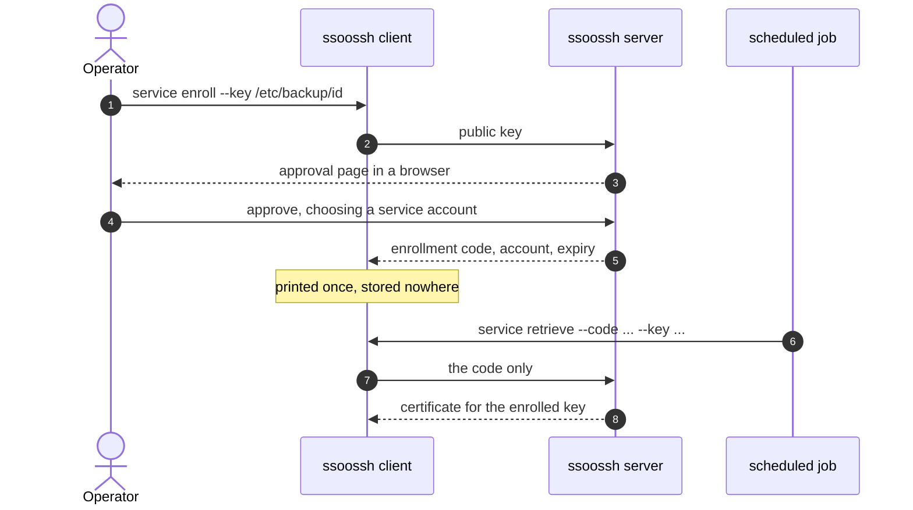

A service account is a non-interactive identity -- a backup job, a CI runner, a
cron entry -- that needs an SSH certificate without a person at a browser every
time. A human is involved exactly once, at enrollment. Everything after that
runs from an enrollment code.

The certificate a code produces is an ordinary user-type SSH certificate; there
is no separate service certificate type on the wire. What differs is how it is
obtained.



## 1. Enroll

```bash
ssoossh service enroll --key /etc/backup/id
```

`--key` names the keypair, and what is already on disk decides what happens:

| On disk | What `enroll` does |
| --- | --- |
| Neither `/etc/backup/id` nor `/etc/backup/id.pub` | Generates both: the private key `0600`, the public key `0644` |
| Both | Enrolls the existing `/etc/backup/id.pub`, leaving the private half untouched |
| Only one of the two | Fails, naming the missing file |

The half-present cases are errors rather than something to work around: `ssh`
will not use a certificate without the private key beside it, so an enrollment
built from a lone public key produces certificates nothing on that host can
present.

The file names follow the OpenSSH convention and are not negotiable: the
private key is `<name>`, the public key `<name>.pub`, the certificate
`<name>-cert.pub`, and all three must be in the same directory for `ssh` to
find them.

The command prints an approval URL and waits. A human approves it in the
browser and picks which of *their* service accounts the enrollment mints for --
the requesting machine does not choose, and cannot. When approval lands, the
command prints the enrollment code, the account it was approved for, when the
code stops being redeemable, the three file paths, and a ready-to-paste
`ssh_config` recipe.

:::danger
The code is printed once and stored nowhere. It is a bearer credential: anyone
holding it can obtain certificates for that service account until the
enrollment expires. Save it where the unattended job can read it, and nowhere
else. The web UI never shows a code after approval and no endpoint returns one
-- if it is lost, enroll again.
:::

Add `--retrieve` to redeem the code once immediately and write the first
certificate, which proves the enrollment works rather than leaving you to find
out when cron first runs:

```bash
ssoossh service enroll --key /etc/backup/id --retrieve
```

If that retrieval fails after the code has been printed, the command returns an
error but the code is not lost.

## 2. Retrieve

Later, and on a schedule, the job redeems its code:

```bash
ssoossh service retrieve --code K7M4QP2X --key /etc/backup/id
```

The certificate is written to `/etc/backup/id-cert.pub`.

| Flag | Default | What it does |
| --- | --- | --- |
| `--code` | required | The enrollment code to redeem |
| `--key` | required | The keypair path; the certificate lands at `<path>-cert.pub` |
| `--grace` | `1m` | How much validity a certificate on disk must still have to count as fresh |
| `--force` | off | Retrieve regardless of what is on disk |

The exit behavior is built for `Match exec`, where a non-zero exit blocks the
connection:

| Situation | Result |
| --- | --- |
| A certificate at `<path>-cert.pub` is valid beyond `--grace` | Nothing fetched, exit 0 |
| Retrieval fails but a still-valid certificate exists | Warning printed, exit 0 |
| No readable, valid certificate and retrieval fails | Error, non-zero exit |

`--grace` is what keeps a job that runs every minute from asking the server for
a new certificate every minute. `--force` is the escape hatch for when you need
to know the fetch actually happened. Durations are a number followed by `s`,
`m`, or `h`.

Each call sends only the code. The public key is never resubmitted, because the
server already holds the one the code is bound to -- so a stolen code cannot be
paired with an attacker's own keypair, and every certificate it produces is
useless without the private key sitting beside it on disk.

## Use case: a nightly backup job

The backup runs as its own local account and connects to a fleet of hosts.
Enroll once as the operator:

```bash
sudo install -d -o backup -g backup -m 0700 /etc/backup
sudo -u backup ssoossh service enroll --key /etc/backup/id --retrieve
```

Then let `ssh` refresh the certificate itself, so nothing else has to be
scheduled:

```ssh-config
# /home/backup/.ssh/config
Match user backup-bot exec 'ssoossh service retrieve --code K7M4QP2X --key /etc/backup/id'
    IdentityFile /etc/backup/id
    IdentitiesOnly yes
```

No `CertificateFile` line is needed: `ssh` derives `/etc/backup/id-cert.pub`
from `IdentityFile`'s name. `Match exec` runs before `ssh` reads the key files,
so this needs no agent.

```bash
# the backup itself, unchanged
rsync -a /var/lib/app/ backup-bot@store.example.com:/srv/backups/app/
```

## Use case: a CI runner

A runner has no long-lived `ssh_config`, so retrieve explicitly as a step
before the one that connects. Keep the code in the CI system's secret store and
pass it through the environment:

```bash
#!/bin/sh
set -eu
install -m 0600 /dev/null "$RUNNER_TEMP/id"
install -m 0644 /dev/null "$RUNNER_TEMP/id.pub"
# ... place the enrolled keypair from the secret store into those two files ...

ssoossh service retrieve --code "$SSOOSSH_CODE" --key "$RUNNER_TEMP/id" --force
ssh -i "$RUNNER_TEMP/id" -o IdentitiesOnly=yes deploy-bot@app.example.com ./deploy.sh
```

`--force` is right here: a fresh container has nothing cached, and a runner that
silently reuses a certificate baked into an image is the failure this avoids.

## Use case: cron on a host

Where the job is not `ssh` itself -- a script that shells out several times, or
a tool that will not read `ssh_config` -- refresh on a timer instead and let
`--grace` do the deduplication.

```ini
# /etc/systemd/system/ssoossh-cert.service
[Unit]
Description=Refresh the deploy-bot ssoossh certificate

[Service]
Type=oneshot
User=deploy
ExecStart=/usr/local/bin/ssoossh service retrieve --code K7M4QP2X --key /etc/deploy/id --grace 15m
```

```ini
# /etc/systemd/system/ssoossh-cert.timer
[Unit]
Description=Refresh the deploy-bot ssoossh certificate

[Timer]
OnBootSec=1min
OnUnitActiveSec=5min

[Install]
WantedBy=timers.target
```

The plain cron equivalent:

```text
*/5 * * * * deploy /usr/local/bin/ssoossh service retrieve --code K7M4QP2X --key /etc/deploy/id --grace 15m
```

Running every five minutes with a fifteen-minute grace means the server is
called only when the certificate is genuinely close to expiring, and there are
two further attempts before it does.

## What the approver controls

Everything durable about an enrollment is fixed at approval, not requested by
the client:

- **The account it mints for.** It is the sole principal of every certificate
  the code produces, chosen by the approver from the accounts they hold.
- **The certificate options granted**, narrowed against server configuration
  before they are fixed.
- **How long the code stays redeemable**, via
  [`cert_options.service.enrollment_duration`](/ssoossh/reference/config/cert_options/service/#enrollment_duration).
- **How long each issued certificate is valid**, via
  [`cert_options.service.valid_duration`](/ssoossh/reference/config/cert_options/service/#valid_duration),
  measured from each redemption.

The key ID and principals render from the *approver's* login, because the
approving identity is long gone by the time a scheduled job redeems the code.

Afterwards the approver -- and every other holder of the account -- can see what
was granted at **Service codes** in the web UI: the account, the options and
lifetime fixed at approval, the keypair the code is bound to, when it stops
being redeemable, and its redemption log. Never the code.

## Notifications

If the deployment has email enabled, four notifications concern an enrollment.
All of them go to every holder of the service account, resolved at delivery,
unless a notification address was set on the enrollment -- in which case that
address is the sole recipient.

| Notification | When | Default |
| --- | --- | --- |
| Service enrollment created | You approve a request and a code is minted | on |
| Service enrollment redeemed | Every redemption, including ones where signing failed | on |
| Service enrollment expiring | Weekly inside the reminder window, then daily over the final week | on |
| Expired enrollment code used | An expired code is presented for redemption | on |

The "created" message carries everything the `enroll` command printed except
the code: the account, the key fingerprint, the expiry, the `ssh_config`
recipe. The code is in no message, deliberately. The expiring reminder tells you
to run `ssoossh service enroll` again rather than offering anything to reuse.

"Expired enrollment code used" is rate-limited rather than one-shot, because
what it usually reports is a cron job holding a dead code and failing on its own
schedule indefinitely. Each holder's own
[preferences](/ssoossh/guides/approving/#notification-preferences) gate their
own copy.

Set the notification address on the approval page, or afterwards from the
service codes page (any holder) or the admin console (SOC). Clearing it restores
the fan-out. Changing it is recorded in the audit stream with both the old and
the new value.

## Containment

Enrollments are visible and revocable to the admin and SOC roles, gated by
[`admin.require_group` and `admin.soc_group`](/ssoossh/reference/config/admin/).
Expiring an enrollment early stops it minting new certificates; certificates it
already issued stay valid until their own `valid_duration` runs out, which is
what keeps that duration short.

Disabling the person who approved an enrollment does not stop it. The
enrollment belongs to the service account, not to the approver, so the
unattended job keeps running and the account's other holders keep control.

:::note[Windows]
The account that runs `ssoossh service enroll` is the account named on the key
file's access list. If the service then runs as a different, non-administrator
user, grant that user access to the key file explicitly -- exactly as you would
with `chown` on Linux.
:::
