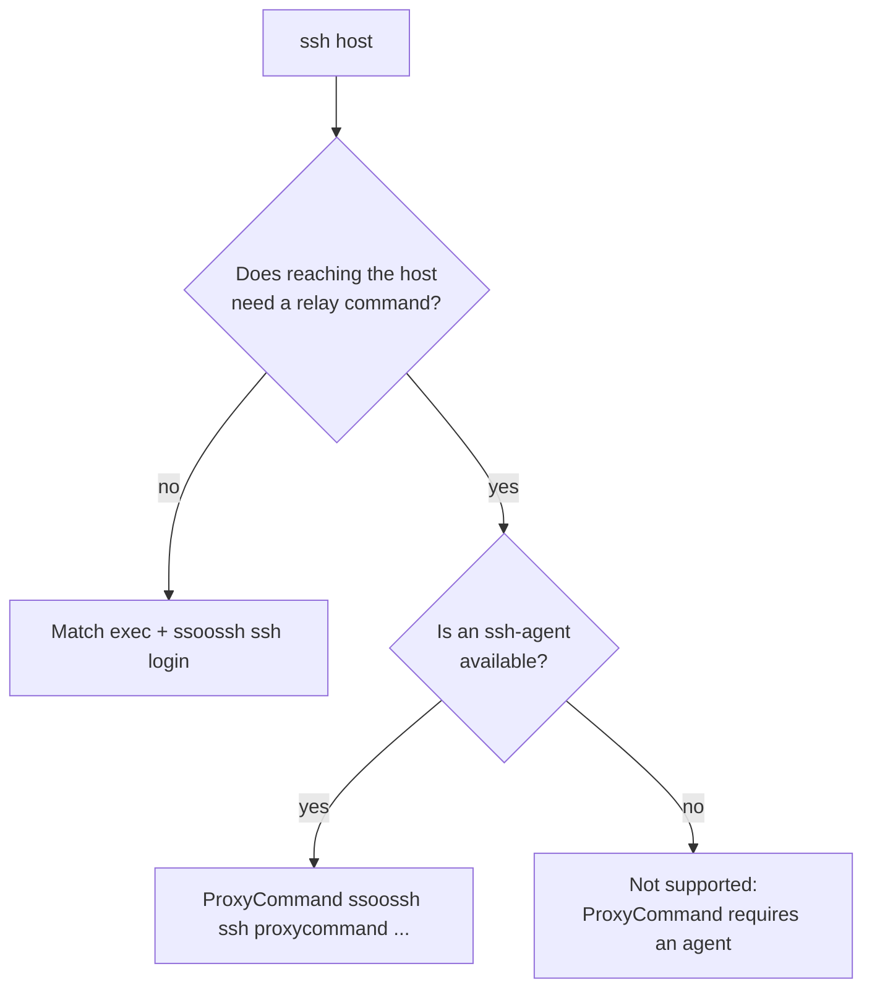

The client is never run on its own -- `ssh` invokes it. There are two ways to
arrange that, and the difference that matters is what happens after a
certificate is issued. This page covers both, plus the recipe for a service
account, which is wired up differently.

`ssoossh ssh config` prints these recipes and nothing else. It contacts no
server and needs none configured, because these are the lines you go looking
for when the connection is the broken thing.

## Choosing a mode

| | `Match exec` + `ssh login` | `ProxyCommand` |
| --- | --- | --- |
| Client after issuance | exits | stays running, relays the connection |
| ssh-agent | optional; key files on disk also work | **required** |
| Reaches the target through a proxy | no | yes, that is the point |

`ssh` reads `IdentityFile` and `CertificateFile` once at startup. That is why
`ProxyCommand` needs an agent: a certificate refreshed on disk after that point
is never re-read.



## `Match exec` (recommended)

Runs before `ssh` connects. An already-loaded, still-valid certificate is
reused, so this costs no browser round trip until it expires. A non-zero exit
blocks the connection.

```ssh-config
Match host bastion.example.com exec "ssoossh ssh login"
    User youruser
```

Because the client exits before `ssh` reads its key files, this mode works with
an agent or with key files on disk. It is the only mode that works with
[`use_agent: false`](/ssoossh/reference/client-config/#use_agent).

Widen the match to a whole estate with the usual `ssh_config` patterns:

```ssh-config
Match host *.example.com exec "ssoossh ssh login"
    User youruser
```

## `ProxyCommand`

Ensures a valid certificate, then hands off to whatever relay command follows
it. This is what you want when reaching the target also requires an HTTP or
SOCKS proxy. The arguments after `ssoossh ssh proxycommand` are exactly what
you would have written without ssoossh:

```ssh-config
Host jump.example.com
    ProxyCommand ssoossh ssh proxycommand /usr/bin/nc -X connect -x 192.0.2.0:8080 %h %p
```

:::caution
This mode requires a running ssh-agent. With key files, `ssh` has already read
them by the time the certificate lands, so the fresh certificate goes unused
and the connection fails.
:::

## Service accounts

An unattended job has no browser, so it does not use `ssh login` at all. It
redeems an enrollment code instead, and `ssoossh service enroll` prints the
recipe with the real paths already filled in at the end of a successful
enrollment:

```ssh-config
Match user backup-bot exec 'ssoossh service retrieve --code K7M4QP2X --key /etc/backup/id'
    IdentityFile /etc/backup/id
    IdentitiesOnly yes
```

No `CertificateFile` line is needed: `ssh` derives `/etc/backup/id-cert.pub`
from `IdentityFile`'s name, which is why the three file names are not
negotiable. `Match exec` runs before `ssh` reads the key files, so this needs
no agent. See [Service accounts](/ssoossh/guides/service-accounts/).

## Checking what actually happened

`ssoossh ssh config` prints the recipes; it does not report what this machine
resolved. For the config files that were merged and what came of each, the
settings that resulted, and where the key files are, add `--debug` to the
command you are actually running:

```bash
ssoossh --debug ssh login
```

When `ssh` is the one invoking the client, its command line is not yours to
edit, so use the environment variable instead:

```bash
SSOOSSH_DEBUG=1 ssh bastion.example.com
```

[Diagnostics](/ssoossh/guides/diagnostics/) has the rest.
