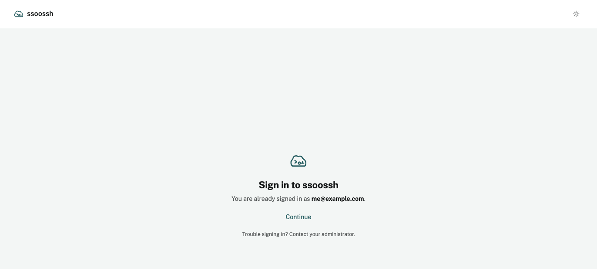
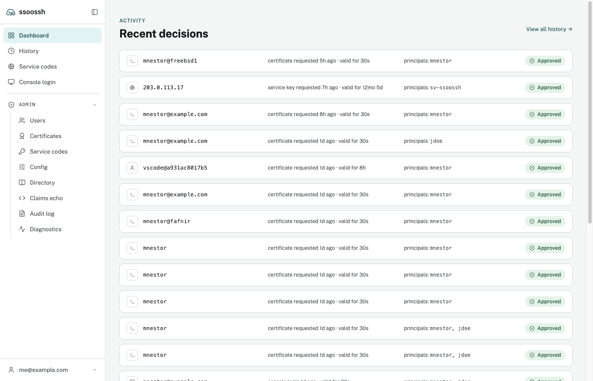
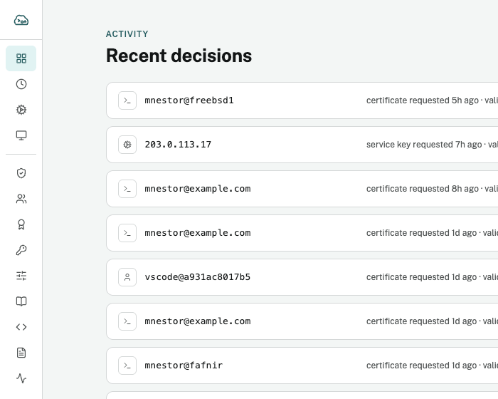
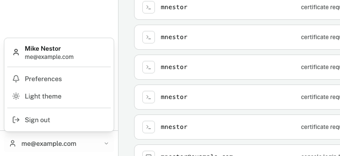
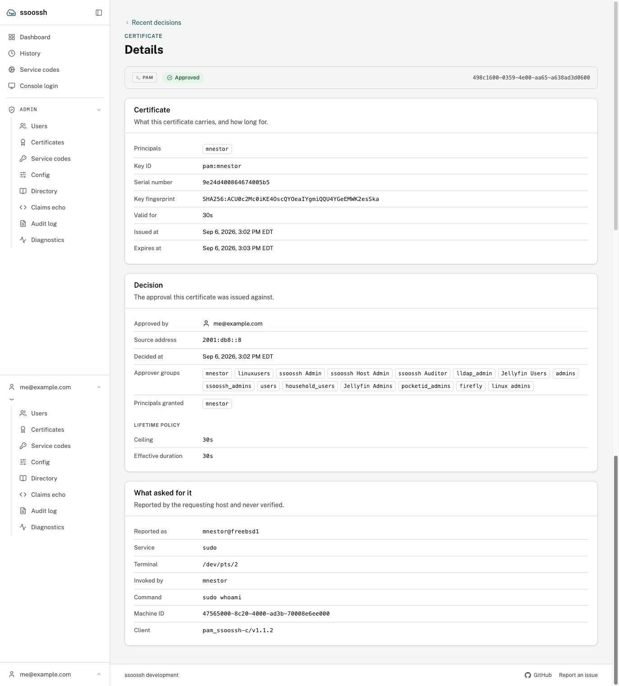

Everything a person does with ssoossh outside a terminal happens in one web
UI: approving requests, confirming console logins, reading their own history,
managing service codes, and -- for the roles that have it -- administering the
deployment. This page is the map of that UI. What each screen *means* is on
the pages it links to; this one is about finding your way around.

## Signing in

There is no password. The sign-in screen hands you to the deployment's
identity provider and takes you back afterwards. If a deployment sets a
consent notice, it stands in front of the sign-in button and has to be
accepted before anything else is clickable.

The sign-in screen. Opening an approval link while signed out lands here first and returns to the request afterwards.

Most people never open the UI by hand. They arrive on an approval link the
client printed, sign in, decide, and leave. The rest of this page is for when
you do open it by hand.

## The navigation rail

Signed in, the app has one navigation surface: the rail down the left edge.
It holds the brand, every destination, and -- at its bottom edge -- your
identity, which opens into the account controls.

The dashboard, with the rail expanded and the Admin group open. Someone without an admin role sees the rail without that group.

The rail has a few behaviours worth knowing:

- **It collapses.** The control at the head of the column, beside the
  wordmark, folds the rail down to an icon strip. Collapsed, the mark itself
  is the button that brings it back. The choice is remembered in the browser.
- **Admin is a group inside the same rail**, shown only to auditors, SOC
  members and admins. It can be folded shut, and that is remembered too --
  except that landing on any admin page opens it, because arriving in the
  admin area with its section list hidden is never what you meant.
- **Your identity is a menu.** The row at the bottom opens a drop-up holding
  the account page, notification preferences, the theme switch, and sign-out.
  These are deliberately not in the destination list: they act on the
  session, not on the app.
- **On a narrow screen** the same rail becomes a drawer behind a single
  button, always expanded, so a phone and a desktop can never disagree about
  what the app contains.

Left: the rail collapsed. Right: the drop-up behind the identity row, where the account page, preferences, the theme and sign-out live.

Four screens have no rail at all: sign-in, an approval, a console code, and
the page shown when an approval cannot proceed. They are single-decision
screens, and a column of other destinations beside them would only invite
you to wander off mid-decision.

## Where everything lives

| Page | Path | What it holds | Who sees it |
| --- | --- | --- | --- |
| **Dashboard** | `/dashboard` | Your recent certificates, newest first | everyone |
| **History** | `/logs/me` | Your full certificate history, filterable by type | everyone |
| **Service codes** | `/service-codes` | The service accounts you hold, then the codes approved for each | everyone |
| **Console login** | `/console` | Where you type the code a console showed you | everyone |
| **Account** | `/account` | Your identity, the principals you can mint, your service accounts, and your groups | everyone, from the identity drop-up |
| **Preferences** | `/preferences` | Which notification emails you receive | everyone, from the identity drop-up |
| **Users** | `/admin/users` | The user directory, with disable and re-enable | auditor and up |
| **Certificates** | `/admin/certificates` | Certificate history across every user | auditor and up |
| **Service codes** | `/admin/service-codes` | Every approved enrollment code, searchable by id, account, key ID, request id or approver | auditor and up |
| **Config** | `/admin/config` | The effective server configuration, secrets redacted | auditor and up |
| **Directory** | `/admin/directory` | The LDAP sync's last pass, a dry run, and a read-only probe | auditor to view; admin to run |
| **Claims echo** | `/admin/identity/echo` | Your own decoded ID token, annotated by the field that consumes each claim | admin |
| **Audit log** | `/admin/audit` | Recent administrative activity | auditor and up |
| **Diagnostics** | `/admin/diagnostics` | Read-only checks of the deployment's public URL, proxy trust and edge headers | admin |

What each of these shows, and what the roles mean, is on
[Approving in the browser](/ssoossh/guides/approving/),
[Service accounts](/ssoossh/guides/service-accounts/), and
[Roles and containment](/ssoossh/operations/roles/).

## Detail pages you can link to

A certificate, a service code, and an admin's view of a service code are each
a page with its own address -- `/certs/<id>`, `/service-codes/<id>`, and
`/admin/service-codes/<id>` -- rather than a panel over a list. That means a
detail can be reloaded, bookmarked, pasted into a ticket, and left with the
browser's own Back button. Each carries a back chip naming the list it was
opened from.

A PAM certificate's detail page. The "What asked for it" card at the bottom is what the requesting host reported about itself, labelled as never verified.

## Theme, and the footer

The theme switch in the identity drop-up steps between light, dark, and
following the system. It is a browser preference, not an account setting.

The footer names the build. A tagged release shows its version linked to the
GitHub release; an untagged build shows `development` and a short commit. A
deployment can hide or replace this -- see
[what the version endpoint discloses](/ssoossh/operations/install/#what-the-version-endpoint-discloses).

## Where to go next

- [Approving in the browser](/ssoossh/guides/approving/) -- the approval
  page, console codes, your history, and preferences.
- [Service accounts](/ssoossh/guides/service-accounts/) -- what the service
  codes pages hold and what a holder can do there.
- [Roles and containment](/ssoossh/operations/roles/) -- the admin pages, for
  the people who have them.
