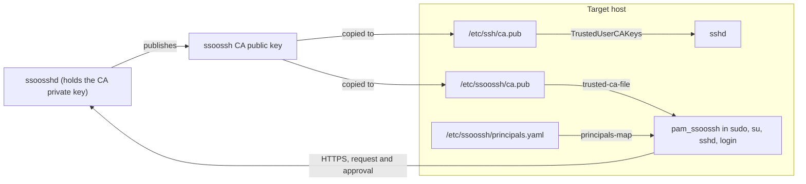

For whoever administers the machines people log in to. A target host needs one
thing to accept ssoossh certificates over SSH, and optionally a second thing if
local operations -- `sudo`, `su`, a console login, an SSH second factor --
should go through the same approval.

## What a host needs

**Trust the CA in `sshd`.** One line of `sshd_config` pointing
`TrustedUserCAKeys` at the ssoossh CA public key. That is the whole
requirement for certificate-based SSH login, and `authorized_keys` files can
go away once it is in place. See
[Trusting the CA in sshd](/ssoossh/hosts/sshd-trust/).

**Optionally, install `pam_ssoossh`.** A PAM module that authenticates a local
account by asking `ssoosshd` for a short-lived certificate, showing the person
at the terminal how to get it approved, and validating what comes back. It
implements the `auth` stack only, and it is wired into individual services --
`sudo`, `su`, `sshd`, `login` -- one at a time, by you. Installing the package
writes nothing into `/etc/pam.d`. See
[Installing pam_ssoossh](/ssoossh/hosts/pam/install/).

Nothing on a host ever holds a CA private key, and nothing on a host is
registered with the server. The relationship is one-way: the host holds the
CA's public half and decides for itself what a certificate signed by it may do.

## I want X, configure Y

| I want | Configure |
| --- | --- |
| SSH logins by certificate instead of `authorized_keys` | `TrustedUserCAKeys` in `sshd_config` -- [sshd trust](/ssoossh/hosts/sshd-trust/) |
| To decide which certificate principals may log in as which local account over SSH | `AuthorizedPrincipalsFile` or `AuthorizedPrincipalsCommand` -- [sshd trust](/ssoossh/hosts/sshd-trust/) |
| `sudo` approved in a browser instead of a typed password | `pam_ssoossh` in `/etc/pam.d/sudo` -- [sudo and su](/ssoossh/hosts/pam/sudo/) |
| The same for `su` | `pam_ssoossh` in `/etc/pam.d/su` -- [sudo and su](/ssoossh/hosts/pam/sudo/) |
| An approval as a second factor on an SSH login | `pam_ssoossh` in `/etc/pam.d/sshd` plus `AuthenticationMethods` -- [sshd keyboard-interactive](/ssoossh/hosts/pam/sshd/) |
| A login at a serial console, a BMC or a VM console, where there is no browser | `pam_ssoossh` with `mode=console` in `/etc/pam.d/login` -- [console login](/ssoossh/hosts/pam/console/) |
| Identity provider usernames that do not match local account names to work anyway | A principals map -- [the principals map](/ssoossh/hosts/pam/principals-map/) |
| To say who may become `root`, or a shared `deploy` account, on this machine | A principals map -- [the principals map](/ssoossh/hosts/pam/principals-map/) |
| To rotate the CA without an outage | List both keys in both files -- [sshd trust](/ssoossh/hosts/sshd-trust/), [the trusted CA file](/ssoossh/hosts/pam/trusted-ca/) |
| To offboard someone | Disable them in the identity provider. Nothing on the host changes -- [FAQ](/ssoossh/hosts/faq/) |
| To lock client settings across a fleet | The `enforce` file or platform policy -- [client settings enforcement](/ssoossh/hosts/client-enforcement/) |

## A host's trust relationships

Two independent trust paths, both anchored on the same public key:

- `sshd` reads `TrustedUserCAKeys` and verifies the certificate an incoming
  SSH client presents. It never talks to `ssoosshd`.
- `pam_ssoossh` talks to `ssoosshd` over HTTPS to get a certificate issued for
  this attempt, then verifies it against `trusted-ca-file` and decides which
  local account it authorizes using `principals-map`. Both files are
  root-owned on the host, which is what makes "this person may become root
  here" a statement about this machine rather than about every machine that
  trusts the CA.

The two `ca.pub` paths can be the same file. It is the same
`authorized_keys`-format public key either way.

## Where to go next

- [Trusting the CA in sshd](/ssoossh/hosts/sshd-trust/) -- the one required
  step.
- [Installing pam_ssoossh](/ssoossh/hosts/pam/install/) -- packages, platforms,
  and verifying a download.
- [pam_ssoossh reference](/ssoossh/hosts/pam/reference/) -- every argument,
  every return code, authoritative.
- [PAM troubleshooting](/ssoossh/hosts/pam/troubleshooting/) -- what a failure
  in syslog means.
- [Host admin FAQ](/ssoossh/hosts/faq/).
