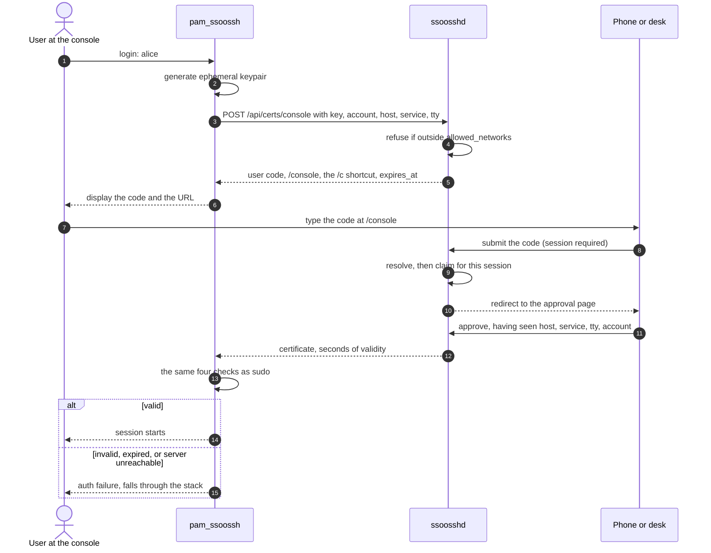

A console has a human in front of it and no browser: a physical tty, a serial
line, a hypervisor or BMC viewer, a VM console. There is nothing on that screen
to copy, so an approval URL is a link nobody can follow. The console flow
prints a short code instead, and the approver carries it to a device that does
have a browser.

## What it looks like

```console
web01 login: alice

Approve this login from a device with a browser.

  Go to:  https://ssoossh.example.com/console
  Code:   K7M4-QP2X

  █████████████████████████████████
  ██ ▄▄▄▄▄ █▄ ▀ ▀▄▄ █▀ █▄█ ▄▄▄▄▄ ██
  ██ █   █ █▄▀ ▀▄▄█▀▀ ▀▄▀█ █   █ ██
  ...
```

The code is Crockford base32 in two groups. The QR code carries the complete
verification URL and is drawn from Unicode half-block characters, so it needs a
terminal font that has them; it is omitted, and the code stands alone, when the
message would not fit.

## When `mode=auto` picks it

`mode=auto` is the default and decides per login, not per host. It runs the
console flow when both of these hold:

- `PAM_RHOST` is empty -- nothing came in over the network; and
- `PAM_TTY` names a physical terminal: a Linux or FreeBSD virtual console, a
  serial line, a hypervisor console, or `/dev/console` itself.

Everything else gets the browser flow, and each exclusion is deliberate:

| Situation | Flow | Why |
| --- | --- | --- |
| A pseudo-terminal (`pts/N`) | Browser | A terminal emulator or an SSH session, where a browser is a keystroke away |
| `PAM_TTY` unset | Browser | A cron job or a script, with no human at all |
| `PAM_RHOST` set | Browser | The person is at their own machine, which has a browser, however console-like the terminal on this end looks |

So the same `pam.d` line does the right thing for a serial console and for an
SSH session. Writing `mode=console` out anyway, as the example below does, is
worth it on a `login` stack: the file then says what it means, and `mode=auto`
would choose the same thing.

Console mode is compiled in on Linux and FreeBSD only. On macOS `mode=console`
is refused with `PAM_NO_MODULE_DATA` and `mode=auto` always uses the browser
flow.

## The flow



Three things in that diagram are load-bearing rather than incidental:

- **Resolving a code requires a session.** An unauthenticated caller never
  learns whether a code is live and never receives a request ID -- and the
  request ID is the credential the certificate is delivered against. That is
  the whole reason the code is safe to display on a screen anyone walking past
  can read.
- **Resolving claims the request**, before either party sees any detail, so
  two people typing the same code is settled at submission rather than at the
  approval page.
- **The code is the consent-phishing control**, not a convenience. Request
  binding stops one user approving another's pending request; it does nothing
  about a user talked into approving a request an attacker created for them.
  The attacker in that case is the one at the console -- the certificate goes
  to the machine that asked for it -- and has to read the code off its screen
  and talk a victim with a browser through typing it. There is no link to
  send, and no code exists without a real console in front of someone.

## The login stanza

```ini
# /etc/pam.d/login
auth    requisite   pam_securetty.so
auth    [success=ignore default=1]  pam_succeed_if.so user != root quiet
auth    sufficient  pam_ssoossh.so server=https://ssoossh.example.com \
                    trusted-ca-file=/etc/ssoossh/ca.pub \
                    principals-map=/etc/ssoossh/principals.yaml \
                    mode=console timeout=120s

# then the distribution's include:
#   Debian, Ubuntu        @include common-auth
#   RHEL, Alma, Rocky     auth substack system-auth
#   Alpine                auth include base-auth
```

Two guards are worth having on a console:

- **`pam_securetty.so` stays first**, exactly as your distribution ships it.
- **`pam_succeed_if.so` skips the module for root.** An account that may become
  root is a decision for the principals map, not for the console. Replace
  `user != root` with `user ingroup ssoossh-console` to allow only members of a
  group instead.

The longer `timeout=120s` is because a console login involves walking to
another device. The line still falls through to the password prompt on a
denial, a timeout, or an unreachable server.

## Per-host policy belongs in the host's stack

[`cert_options.console.require`](/ssoossh/reference/config/cert_options/console/#require)
is one condition for the whole deployment. In a fleet that degenerates:
`web01` is the web team's, `db07` the DBAs', `rack07-bmc` two people in
facilities, and a single server-wide group has to be the union of all of them,
at which point it gates nothing.

The answer is not to send a group to the server. Put the gate in the host's own
stack, above the ssoossh line:

```ini
# /etc/pam.d/login
auth  [success=ignore default=die]  pam_succeed_if.so  user ingroup console-web01 quiet
auth  sufficient                    pam_ssoossh.so  mode=console ...
auth  include                       common-auth
```

That gate is root-owned on the host, cannot be omitted by whoever is at the
keyboard, and fails before any keypair, request row, or network call. A group
field on the wire would be untrusted input from an unauthenticated caller: it
could only ever narrow, so nobody could use it to widen anything, but they
could **omit** it and fall back to the server-wide condition -- a control that
silently stops applying exactly when someone is attacking it, which is worse
than no control at all.

`pam_access` with `/etc/security/access.conf` is the same argument if the gate
should be per-tty or per-origin instead of per-group.

## The server side

Console certificates are their own type, separate from PAM ones: a console
certificate buys a whole interactive session where a PAM one buys a single
local operation, so the two are gated, timed and labelled separately.

```yaml
cert_options:
  console:
    # Who may approve a console login at all. Deployment-wide; the per-host
    # half is in the host's PAM stack, above.
    require:
      group: staff

    # Refuse a request from outside these networks, at creation, before a
    # keypair is certified and before any human is asked.
    allowed_networks:
      - 10.20.0.0/16      # the management VLAN
      - 192.168.50.0/24   # the lab

    # This type's whole budget.
    client_timeout: 2m

    # Validated once by the module and discarded, like the PAM type.
    valid_duration: 30s

http:
  cert_request_rate_limit:
    console: 10           # per second, per source address
  console_code_rate_limit:
    limit: 1              # per second, per session AND per source address
    burst: 5
```

[`cert_options.console.client_timeout`](/ssoossh/reference/config/cert_options/console/#client_timeout)
defaults to `2m` against the global
[`cert_options.client_timeout`](/ssoossh/reference/config/cert_options/#client_timeout)
of `5m`. A type may only shorten the global budget, never extend it: a longer
value is a startup error. Short is the point -- the approval window is the
attacker's working time in the phone-call case above. The human's share is the
budget minus a signing reserve, so `2m` gives the approver 96 seconds rather
than 120. There is a floor, and it is not the technical one: below about 90
seconds a first approval that has to go through an OIDC sign-in starts failing,
people retry, and a flow people habitually retry is a flow they learn to
approve without reading.

[`cert_options.console.allowed_networks`](/ssoossh/reference/config/cert_options/console/#allowed_networks)
gates on the address the server observes, not on the hostname the caller sent:
a host cannot prove its name, which is why there are no host certificates
either. Behind a reverse proxy this only means anything with
[`http.trusted_proxies`](/ssoossh/reference/config/http/#trusted_proxies) set;
without it every request carries the proxy's address and the gate either admits
everything or nothing.

Two pages serve the approver: **`/console`**, where a signed-in user types the
code, and **`/c/<code>`**, the shortcut a QR code encodes so a phone lands
straight on it. Both need a session.
[`http.console_code_rate_limit`](/ssoossh/reference/config/http/#console_code_rate_limit)
bounds code submission, keyed on the submitting session **and** its source
address, so one compromised account cannot grind through the code space from
many addresses and one address cannot do it across many accounts. It defaults
to one submission per second with a burst of five -- small on purpose, since a
human who misreads a code retries once or twice, not ten times.

## Lockout safety

The `sudo` warnings apply with more force here, because the failure is at the
physical console.

:::danger
1. **`sufficient`, never `required` or `requisite`.** An ssoosshd outage must
   fall through to the local stack. A console behind an SSO that needs the
   network is a console that does not work when the network is the thing that
   is broken, and the console is the break-glass path.
2. **Keep a working local credential**, and keep it somewhere physical.
3. **Never edit `/etc/pam.d/login` without a second root session open**, and
   verify from that session before closing it. Test on a spare virtual console
   -- Alt-F3, say -- with a root shell open on another one.
4. **Keep `root` out** unless deliberately enabled. Root console login is the
   recovery path that has to keep working when ssoosshd does not, so routing it
   through ssoosshd is usually a mistake.
5. **Screen lockers are the same stack.** `sddm`, `swaylock`, `xscreensaver`
   and friends authenticate through PAM, so adding a module to a shared
   `common-auth` puts screen unlock behind the network. Wire it per service,
   never into a shared include.
6. **Accounts must already exist.** ssoossh provisions nothing: the account has
   to resolve through NSS before `login` will offer it a PAM stack at all. Pair
   it with a principals map for the identity-to-account mapping.
:::

## What the approver sees, and what it is worth

The approval page shows the account being logged into, the hostname, the PAM
service, the tty, and any reported remote host -- all of it self-reported by an
unauthenticated caller and labelled as such -- plus the source address the
server observed and the time the request was made.

Its value is that it lets a human notice "I am at my desk, why is there a
console login on rack07". A console login that also reports a remote host is
flagged outright, because a real console has nobody connecting to it over the
network.

The certificate names the **approver's** accounts, not the account typed at the
`login:` prompt. Whether those principals authorize that account is the host's
decision, made against its own root-owned principals map. Someone who types
`root` at an unattended console gets a certificate the host refuses unless the
map already says that approver may become root.

What no host-side gate constrains is *who* approved: one person can approve a
console login for another on a host where both accounts are permitted, and
nothing refuses it -- that is also the legitimate case of an operator unlocking
a console for a colleague. The audit trail is the control there.
`cert.code_resolved` records who typed the code and which machine they were
told about, and the decision record carries their subject, username, groups and
source.

## Where this earns its keep

- **A serial console on a switch or a storage head.** No browser, often no
  keyboard layout worth typing a long password on, and the account is shared
  with whoever is on shift. The code is short enough to read aloud and the
  audit trail names the individual who approved.
- **A BMC or KVM viewer.** iDRAC, iLO, IPMI SOL. The person is looking at a
  video stream of a text console, so nothing on the screen can be copied and
  pasted. A QR code they scan with a phone works where a URL does not.
- **A VM console in a hypervisor UI.** The same problem, with the added detail
  that the machine may have no working network of its own -- but the *approver*
  has one, and only the approver needs it.
- **A crash cart in a data centre.** The machine will not boot far enough for
  SSH. Someone is standing in front of it with a phone in their pocket, and
  that phone is the browser.

In all four, the alternative is a shared local password that lives in a
password manager and never rotates.
