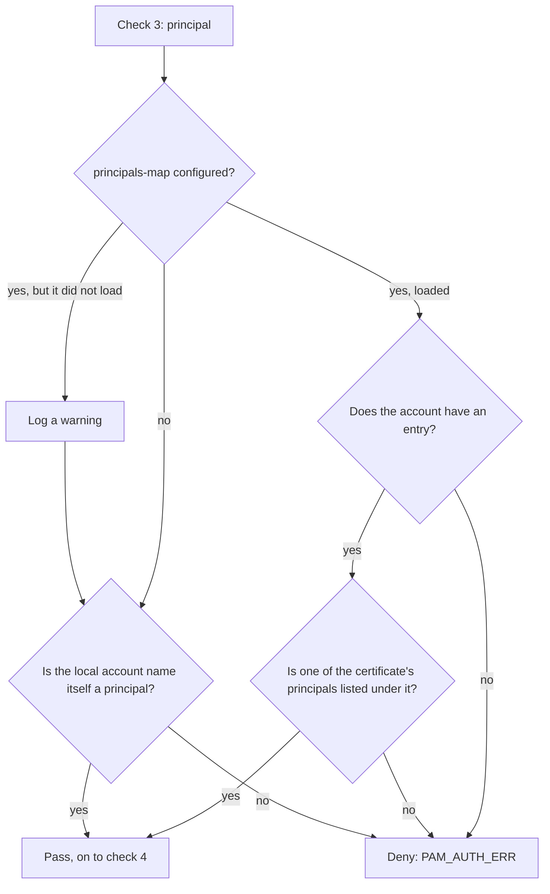

The file named by `pam_ssoossh`'s `principals-map` argument maps each local
account to the certificate principals allowed to authenticate as it. It is
consulted by the third of the module's four checks, it is root-owned on the
host, and it is what makes "this person may become root here" a statement
about this machine rather than about every machine that trusts the CA.

## Why a host needs it

A certificate's principals are set by `ssoosshd` and, for a PAM or console
request, carry the identity of the person who **approved** it -- their username
as the identity provider spells it, and any further accounts the server records
them as holding. They never carry the local account that was asked for: that
value comes from an unauthenticated caller, so the server shows it to the
approver and writes it to the audit record, and nothing else.

So the map is what authorizes the two to match. A host whose local accounts are
not spelled exactly like the identity provider's usernames needs this file for
anyone to log in at all, and a host that wants `alice` to be able to become
`deploy` needs it too. The module treats the file as optional; a deployment
rarely can.

## Format

A fixed subset of YAML, read without a YAML library -- everything the module
links is mapped into `sudo`. What is accepted:

```yaml
# who may become each account
alice:              # a local account, at the start of the line
  - alice           # a principal allowed to assume it
  - admin           # indentation is free; "- " marks an item
bob: [bob, ops]     # a flow sequence on the account's own line
carol:              # no principals: nobody may become carol
dave: ~             # null and ~ mean the same as nothing
```

Comments start with `#` and run to the end of the line. Account names and
principals may be wrapped in matching single or double quotes, which are
stripped.

Escapes are not interpreted: a quoted value containing a backslash, a quote of
the same kind, or -- inside a flow sequence -- a comma, is rejected rather than
guessed at. Anything else YAML allows is a parse error: nested mappings,
anchors, multi-line scalars, multiple documents, a key appearing twice.

Matching is exact and case-sensitive on both sides.

### Limits

Up to 64 principals per account, each up to 127 bytes. Only the entry for the
account being authenticated is kept, but the whole file is parsed and validated
on every attempt, because a malformed line anywhere decides whether the map
loads at all.

## Semantics

| State | Behaviour |
| --- | --- |
| The map loads | Authoritative for every account on the host. A certificate passes check 3 when one of its principals is listed under the account being authenticated. An account with no entry is denied, even when a certificate principal happens to equal its name. |
| No map is configured | The certificate must carry the local account name itself as a principal. |
| Configured but cannot be loaded | Missing, unreadable or malformed: the module logs a warning and behaves as if no map were configured. The login is not failed. |

Three consequences worth stating plainly:

- **Absence from the file is a decision, not an oversight.** Once a map loads,
  list every account that should be able to authenticate through ssoossh, not
  only the ones that need a rename.
- **A failure to load degrades to the stricter policy.** A mistyped path or a
  bad edit means exact-name matching, not open access, so it shows up as denied
  logins rather than as widened access. Grep for the warning if `sudo` starts
  refusing after a config change.
- **That is also why the parser is strict.** A file that parses one way here
  and another way elsewhere would change policy silently.

## How check 3 decides



## Examples

A host where the identity provider's usernames are e-mail local parts and two
people share an operations account:

```yaml
# /etc/ssoossh/principals.yaml
alice:  [alice]
bob:    [bob]
deploy: [alice, bob]
root:              # nobody becomes root through ssoossh
```

### A shared deploy account

```yaml
deploy: [alice, bob]
```

Either of them can approve their own `sudo -u deploy` or `su - deploy`, and the
audit trail names which one did. There is no shared secret to rotate when one
of them leaves; removing them from the identity provider or from this line is
the whole change.

### root with no principals

```yaml
root:
```

An entry with no principals is a deliberate no. Leaving `root` out of the file
entirely means the same thing, once the map loads -- but writing the empty entry
says it on purpose, which is worth more the next time somebody reads the file.

To allow exactly one person:

```yaml
root: [alice]
```

Only root on this host can edit that, which is the point.

### An su target account rule

`su` sets `PAM_USER` to the account being switched **to**, so the entry that
matters is the target's:

```yaml
# alice may `su - deploy`; nobody may `su - root`.
deploy: [alice]
root:
```

The caller's own entry is irrelevant to an `su`. If `alice` should also be able
to `sudo` as herself on this host, she still needs `alice: [alice]` -- the map
is authoritative for every account once it loads.

## Deploying the file

- Owned by root, readable by the users of the services that load the module,
  which for `sudo`, `sshd` and `login` means root alone.
- `/etc/ssoossh/principals.yaml` is the path the shipped examples use. Nothing
  in the module fixes it; it is whatever `principals-map=` names.
- It is read and validated on every attempt, so an edit takes effect on the
  next login. Nothing needs restarting.
- Push it with configuration management like any other root-owned policy file,
  and template the per-host part -- who may become `root` on `db07` is not the
  same list as on `web01`.

:::note
This is not the file `sshd` reads. `sshd` maps principals through
`AuthorizedPrincipalsFile` or `AuthorizedPrincipalsCommand`, and the client's
`ssoossh host mapping` writes a JSON file for the latter. Same kind of question,
two different programs, neither consulting the other's file -- see
[Trusting the CA in sshd](/ssoossh/hosts/sshd-trust/#principals-and-authorizedprincipalsfile).
:::
