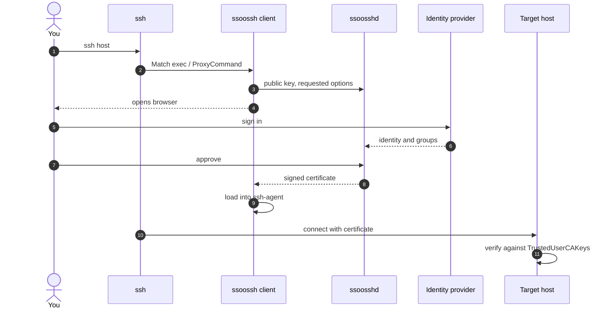

import { Card, CardGrid, LinkCard } from '@astrojs/starlight/components';

## Pick your path

<CardGrid>
	<LinkCard
		title="I log in to servers"
		description="Install the client, wire it into ssh_config, approve once in the browser, and ssh as usual."
		href="/ssoossh/guides/client/"
	/>
	<LinkCard
		title="I run the servers people log in to"
		description="Trust the CA in sshd, and put sudo, su, or console login behind an approval with pam_ssoossh."
		href="/ssoossh/hosts/"
	/>
	<LinkCard
		title="I operate ssoosshd"
		description="Deploy the server: CA key, identity provider, TLS, database, policy, notifications, and multi-instance."
		href="/ssoossh/operations/"
	/>
	<LinkCard
		title="I need the exact key or flag"
		description="Every ssoosshd.yaml key, every ssoossh and ssoosshd command, and the HTTP API, generated from the source."
		href="/ssoossh/reference/config/"
	/>
</CardGrid>

## What it does

<CardGrid stagger>
	<Card title="OIDC-backed" icon="padlock">
		The server authenticates users against your OpenID Connect provider and
		signs their SSH public keys into short-lived certificates. Group
		membership feeds the lifetime decision; it never appears in the
		certificate itself.
	</Card>
	<Card title="Approval workflow" icon="approve-check">
		Certificate requests are approved and confirmed in a web UI, with
		per-user certificate history and admin, SOC, and auditor roles mapped
		from OIDC groups. Every decision lands in an append-only audit log.
	</Card>
	<Card title="sudo, su, and the console" icon="laptop">
		`pam_ssoossh` issues a certificate for a local PAM authentication and
		validates it on the host. A machine with a browser gets a URL; a serial
		console or BMC viewer gets a short code and a QR code instead.
	</Card>
	<Card title="Service accounts" icon="clock">
		Unattended jobs enroll once, are approved by a human, and then reissue
		their own certificates on a schedule without anyone at a keyboard.
	</Card>
	<Card title="Private keys stay put" icon="puzzle">
		The client generates the keypair and loads the result into your
		ssh-agent. The server only ever sees public keys. The CA key can live
		in a PKCS#11 token so it never leaves the hardware.
	</Card>
	<Card title="SQLite or PostgreSQL" icon="database">
		Runs as a single systemd service with SQLite, or as several instances
		against PostgreSQL with NATS carrying signing jobs to a signer that
		holds the CA key alone.
	</Card>
</CardGrid>

## The shape of a login

The [illustrated walkthrough](/ssoossh/concepts/walkthrough/) shows each of
these steps as the user sees them, and the
[flow pages](/ssoossh/concepts/user-certificate/) show what the server and
the host do in between.
