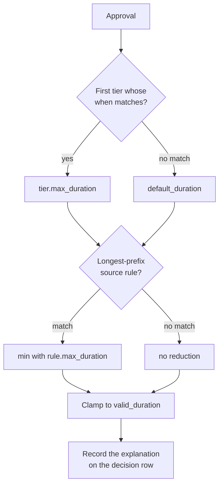

`cert_options.*` is the outer bound on what any certificate may carry.
Lifetime policy is the layer inside it that shapes each individual issuance
from what the approver's identity satisfies and the network the request came
from. It is evaluated during approval and applies to all four certificate
types.

For PAM and console the gate is the axis that matters in practice: duration
tiers against a 30-second, validated-once certificate and extension grants
against an empty ceiling have nothing to do, so the expected configuration for
those types is `require` alone.

## The rule

Policy may only ever **narrow**. Nothing reachable over HTTP can make issuance
more permissive than the config file already allows:

- shorter lifetime, never longer;
- fewer extensions than the type's configured set, which is the outer bound;
- more critical options, on the service path only.

A tier may *grant* extensions, which reads like widening and is not: the grant
is bounded by the type's `extensions` ceiling, and a grant naming anything
outside that ceiling fails startup rather than being silently trimmed.
**Identity grants, network narrows.**

Adding a critical option reads like widening and is the opposite: it can only
prevent uses that would otherwise be allowed.

The final duration is always clamped to the type's `valid_duration` ceiling,
and again by the global
[`max_cert_lifetime`](/ssoossh/reference/config/top-level/#max_cert_lifetime)
(or
[`max_service_cert_lifetime`](/ssoossh/reference/config/top-level/#max_service_cert_lifetime))
defense-in-depth check before signing.

## Configuration

```yaml
authentication:
  fields:
    extra:
      loc: level_of_confidence     # the claim is named once, by the operator

cert_options:
  user:
    valid_duration: 10h            # the ceiling; policy only reduces from here
    extensions:                    # the ceiling for grants
      - permit-pty
      - permit-agent-forwarding

    require:                       # who may approve at all
      all_of:
        - group: "SSH Users"
        - claim: loc
          at_least: 20

    lifetime_policy:
      default_duration: 15m        # required whenever a policy is configured
      default_extensions: []       # grants start from nothing when tiers exist
      tiers:                       # FIRST MATCH WINS; order is yours to get right
        - name: cleared            # names the row in the recorded explanation
          when: { claim: loc, at_least: 40 }
          max_duration: 10h
          grant_extensions: [permit-pty, permit-agent-forwarding]
        - name: engineers
          when: { group: engineers }
          max_duration: 8h
          grant_extensions: [permit-pty]
        - name: contractors
          when: { group: contractors }
          max_duration: 1h         # no grant_extensions, so grants nothing
      source_policy:
        - cidr: 10.0.0.0/8         # office and VPN
          max_duration: 10h
        - cidr: 192.168.0.0/16     # lab
          max_duration: 4h
          removed_extensions: [permit-agent-forwarding]
        - cidr: 0.0.0.0/0          # everywhere else
          max_duration: 15m
```

`require` and `lifetime_policy` are available under all four of
[`cert_options.user`](/ssoossh/reference/config/cert_options/user/),
[`cert_options.service`](/ssoossh/reference/config/cert_options/service/),
[`cert_options.pam`](/ssoossh/reference/config/cert_options/pam/) and
[`cert_options.console`](/ssoossh/reference/config/cert_options/console/).
Service certificates additionally tier the enrollment code's own lifetime with
[`lifetime_policy.default_enrollment_duration`](/ssoossh/reference/config/cert_options/service/#lifetime_policydefault_enrollment_duration)
and a per-tier `max_enrollment_duration`, both clamped by
[`cert_options.service.enrollment_duration`](/ssoossh/reference/config/cert_options/service/#enrollment_duration).

| Key | What it does |
| --- | --- |
| [`lifetime_policy.default_duration`](/ssoossh/reference/config/cert_options/user/#lifetime_policydefault_duration) | the duration when no tier matches. Required whenever any part of a policy is configured |
| [`lifetime_policy.default_extensions`](/ssoossh/reference/config/cert_options/user/#lifetime_policydefault_extensions) | the grant when no tier matches, or when the winning tier states none |
| [`lifetime_policy.on_absent_claim`](/ssoossh/reference/config/cert_options/user/#lifetime_policyon_absent_claim) | states the posture for a missing claim. Accepts only `floor` |
| [`lifetime_policy.tiers`](/ssoossh/reference/config/cert_options/user/#lifetime_policytiers) | `name`, `when`, `max_duration`, `grant_extensions`, and (service only) `max_enrollment_duration` |
| [`lifetime_policy.source_policy`](/ssoossh/reference/config/cert_options/user/#lifetime_policysource_policy) | `cidr`, `max_duration`, `removed_extensions`, `pin_source_address` |

Several mistakes are startup errors rather than runtime surprises: an
unparseable CIDR, a configured `lifetime_policy` with no `default_duration`, a
tier with no `when`, a `grant_extensions` entry outside the type's ceiling, a
`max_enrollment_duration` on a type other than service, and the two retired
keys -- `cert_options.*.require_group` and a source rule's `extensions` (now
`removed_extensions`).

Without a `default_duration`, an identity matching no tier would receive a
zero-second certificate that fails later at signing, several layers from the
line that caused it.

## Conditions

A tier's `when` and a type's `require` take the same closed grammar:

| Form | Meaning |
| --- | --- |
| `group: <name>` | membership in an OIDC group |
| `claim: <name>` with `at_least` / `at_most` | numeric, inclusive bounds |
| `claim: <name>` with `exactly` | numeric equality, desugaring to `at_least` and `at_most` of the same value |
| `claim: <name>` with `equals` / `one_of` | scalar equality, or against a set |
| `claim: <name>` with `contains` | membership in a list-valued claim |
| `all_of: [...]` / `any_of: [...]` | one level of nesting, no deeper |

Exactly one of `group`, `claim`, `all_of` or `any_of` must be set, and a claim
condition takes exactly one comparator family.

Claims are compared as numbers, not strings. That is the whole reason for a
typed accessor: compared as text, `"9"` sorts above `"40"`, which would hand
the longest lifetimes to the lowest scores.

Every claim a condition names must be declared under
[`authentication.fields.extra`](/ssoossh/reference/config/authentication/#fieldsextra),
checked at startup, so a typo fails the process instead of quietly failing the
condition on every evaluation.

:::caution[An absent claim is never neutral]
A claim that was not captured at login, or whose value cannot be used by the
comparator (a word under `at_least`, a list under `equals`, a scalar under
`contains`), fails the condition and is logged. It must never mean "skip this
condition", which is how a missing claim becomes the most generous outcome.
`on_absent_claim` exists to state that posture in config and accepts only
`floor`.
:::

Total denial is the identity provider's job. An identity that should not reach
`ssoosshd` at all is expected never to be issued a token; conditions here
shape what an already-admitted identity receives.

:::note[A score is only as fresh as the last login]
`Extra` is written to the users row at login and read back at approval, so
lowering someone's score takes effect at their next authentication, not
immediately. For service enrollments the freeze is longer and deliberate:
conditions are evaluated once at approval and the code stays redeemable for
its full lifetime, so a withdrawn clearance can keep minting certificates
until the code expires. `max_enrollment_duration` is the lever against that.
:::

## How a duration is chosen



1. **Tier**: the **first** tier whose `when` condition the approver's identity
   satisfies. Order matters here, and it is not validated: numeric thresholds
   are nested by construction, since everyone satisfying `at_least: 40` also
   satisfies `at_least: 30`. Write them in **descending** order. Ascending
   order silently lands every high-score identity in the shortest tier -- no
   error, no warning, and the certificate looks normal. The blast radius is
   bounded by the ceiling, and the natural mistake under-grants, which someone
   complains about rather than nobody noticing. No match means
   `default_duration`.
2. **Source rule**: the **longest-prefix** match against the request's source
   address, as in a routing table. Order does not matter. Ties resolve to the
   stricter rule, so a duplicate can never loosen anything.
3. The result is the minimum of those, clamped to `valid_duration`.

The winning tier, the condition it matched, the source rule, the ceilings and
the effective values are recorded as a structured JSON document on the
approval's decision row (`certificate_request_decisions.policy_explanation`),
so "why did this certificate get fifteen minutes" is answerable from the
record rather than by re-deriving the computation.

:::note
The [flows](/ssoossh/concepts/options-and-lifetime/) view of this step is a
picture of the same computation. There is no default deny here: an identity
matching no tier gets `default_duration`, and a request matching no source
rule gets no reduction at all.
:::

### Extensions

Extensions follow their own algebra, in this order:

```text
granted    = tier.grant_extensions ?? default_extensions   (starts empty)
extensions = requested & type.extensions & granted - source_rule.removed_extensions
```

The grant axis is active only when tiers are configured. Without tiers, the
type's `extensions` ceiling alone bounds a request, exactly as before.

### No source match means no reduction

The type ceiling applies. Rules *are* reductions, so the absence of one is
"nothing to reduce". For a default floor, write explicit `0.0.0.0/0` and
`::/0` rules, the same idiom as a firewall's default rule. The opposite
reading -- unmatched networks get the strictest tier -- is a reasonable guess
and is not what happens.

IPv4 and IPv6 rules never match each other. Addresses are normalized, so an
IPv4-mapped IPv6 form (`::ffff:10.0.0.1`) matches a `10.0.0.0/8` rule instead
of silently missing every rule.

## Which address

The address recorded on the request (`certificate_requests.source_ip`, from
the client IP at create time) -- where the certificate will be *used*. Not the
approver's browser address, which is a different machine on a different
network.

The client-supplied `source_addresses` in a request is unverified and never
feeds policy.

:::danger[Footgun]
Behind a reverse proxy with
[`http.trusted_proxies`](/ssoossh/reference/config/http/#trusted_proxies)
unset, every client appears to come from the proxy's address -- very likely an
internal range, so *everyone* silently lands in the most generous tier, which
is the exact opposite of the feature's purpose. `ssoosshd` warns at startup
when a source policy is configured and `trusted_proxies` is empty. Do not
ignore it. See [TLS and reverse proxies](/ssoossh/operations/tls-and-proxy/).
:::

`X-Forwarded-For` is ignored unless an operator explicitly trusts a proxy
range.

## Source-address pinning

`pin_source_address: true` on a source rule pins the issued certificate to the
address it was requested from, so a stolen one is useless elsewhere.

**Service certificates only.** People move between office, VPN, hotel, and
phone tether; pinning a user certificate turns every network change into a
failed login, for no security gain that a shorter lifetime does not already
provide. Services sit still.

`force-command` is deliberately outside source policy entirely: "which
command" is not a property of a network.

:::caution[Known defect]
`pin_source_address` is a field on the source *lifetime* rule, which conflates
address restriction with lifetime capping, and what gets granted is the
observed address rather than the configured network. This needs rework rather
than a patch, and that rework is a design proposal in the repository, not
shipped behavior.
:::

## Service certificates and retrieval

A service certificate is signed at `retrieve`, potentially long after approval
and possibly from a different address. Policy is evaluated **at enrollment
time and frozen**, never re-derived at retrieve time. An unattended job cannot
silently drop into a stricter tier by being moved, because no human would be
present to see why issuance changed.

## Worked examples

Against the configuration at the top of this page.

**A cleared engineer in the office.** `loc: 55`, in `engineers`, requesting
`permit-pty` and `permit-agent-forwarding` from `10.1.2.3`.

- Tier: `cleared` matches first (`at_least: 40`), so 10h and a grant of both
  extensions.
- Source: `10.0.0.0/8` is the longest prefix that matches, capping at 10h.
- Duration: `min(10h, 10h)` clamped to `valid_duration` 10h, so **10h**.
- Extensions: requested and in the ceiling and granted, nothing removed, so
  **both**.

**The same person on hotel wifi.** `203.0.113.9`.

- Tier: still `cleared`, 10h.
- Source: only `0.0.0.0/0` matches, capping at 15m.
- Duration: `min(10h, 15m)` = **15m**. Same identity, shorter certificate.
- Extensions: **both** -- the `0.0.0.0/0` rule removes nothing.

**A contractor in the lab.** In `contractors`, `loc` absent, from
`192.168.4.10`, requesting `permit-pty` and `permit-agent-forwarding`.

- Tier: `cleared`'s condition fails, because an absent claim fails rather than
  being skipped. `engineers` does not match. `contractors` does, so 1h and no
  grant.
- Source: `192.168.0.0/16`, 4h, removing `permit-agent-forwarding`.
- Duration: `min(1h, 4h)` = **1h**.
- Extensions: the tier granted nothing, so the intersection is **empty** --
  the removal never even applies.

**Someone in `SSH Users` with `loc: 25`, from an address matching no rule.**

- `require` passes (`all_of` is satisfied: in the group, and 25 is at least
  20).
- Tier: no tier matches, so `default_duration` 15m, and
  `default_extensions: []` grants nothing.
- Source: no match, so no reduction.
- Duration: **15m**. Extensions: **none**.

**Nobody in `SSH Users`.** `require` fails, so there is no approval to shape.
Certificate types are gated before any of the above runs.
