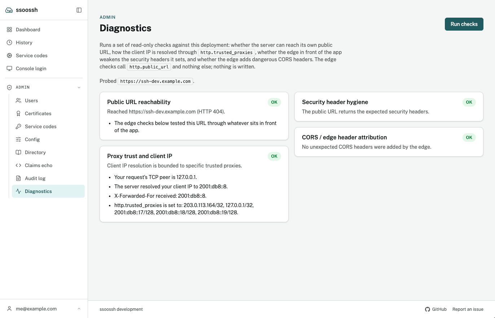

Most of what goes wrong around `ssoosshd` goes wrong in front of it: a
reverse proxy that is not trusted, a public URL the server cannot see, an
edge that rewrites a header. None of these stop the process, and several of
them look like success. **Admin → Diagnostics** runs four read-only checks
against the deployment as it is actually reached, and says which of these
has happened.

A clean run. Each card carries its findings, and a check that is not clean also carries what to change.

## The four checks

| Check | What it tests | What a failure means |
| --- | --- | --- |
| **Public URL reachability** | Whether the server can reach [`http.public_url`](/ssoossh/reference/config/http/#public_url) from where it runs, through whatever sits in front of it | The two edge checks below need this to have worked; if it did not, they are **skipped**, not passed. Often split-horizon DNS or an edge the server cannot dial internally rather than a fault in itself, but a certificate that did not validate is reported as such |
| **Proxy trust and client IP** | How your own request's client IP was resolved: the TCP peer, the `X-Forwarded-For` received, what the server settled on, and what [`http.trusted_proxies`](/ssoossh/reference/config/http/#trusted_proxies) contains | **Critical** if the list trusts every address (`0.0.0.0/0`, `::/0`): any caller can then set `X-Forwarded-For` and be counted as any IP, so per-IP rate limits can be bypassed and the audit log's source addresses cannot be trusted. **Warning** if the list is empty behind a proxy: every request is then the proxy's, and rate limits are shared across all users |
| **Security header hygiene** | Whether the headers the app sets itself -- HSTS, `X-Content-Type-Options`, `X-Frame-Options`, `Referrer-Policy` -- survive the edge unchanged | The edge is overriding or dropping them. Stop it rewriting these headers, and drop any `X-XSS-Protection` it adds |
| **CORS / edge header attribution** | Whether the edge adds CORS headers the app never sets | **Critical** if it reflects an arbitrary `Origin` *and* allows credentials, which makes a credentialed cross-origin read possible. **Warning** if it adds `Access-Control-Allow-Credentials` on its own. The app's own CORS -- `Access-Control-Allow-Origin: *` on the OIDC paths only, never with credentials -- is already correct |

Each check reports one of four statuses: **OK**, **Warning**, **Critical**,
or **Skipped**. Skipped is deliberately not a pass. It says the check could
not run, and the reachability card says why.

## What it will not do

- **It cannot be pointed anywhere else.** The edge checks always target
  `http.public_url`. There is no field to probe an arbitrary host, because a
  server that makes outbound requests to addresses an admin types in is a
  different and worse tool.
- **It writes nothing.** Every check is a read: an outbound request to the
  server's own public URL, and an inspection of the admin's own request.
- **It is admin-only**, CSRF-guarded, and rate-limited, and each run is
  recorded as `admin.diagnostics_run` in the [audit log](/ssoossh/operations/audit-log/)
  with the four results.

## When to run it

- After setting or changing `http.trusted_proxies`, to confirm the real
  client address is recovered. [TLS and reverse proxies](/ssoossh/operations/tls-and-proxy/)
  explains why that address is not cosmetic: it is what lands in key IDs,
  what source policy matches against, and what the console network gate
  reads.
- After changing anything at the edge -- a new proxy, a CDN, a security
  header policy -- since those are exactly the changes that break this
  deployment without stopping it.
- When a login "looks like it hangs": if the reachability check cannot get
  through the edge, the client's event stream may not be getting through
  either. Buffering proxies are covered on the TLS page.
