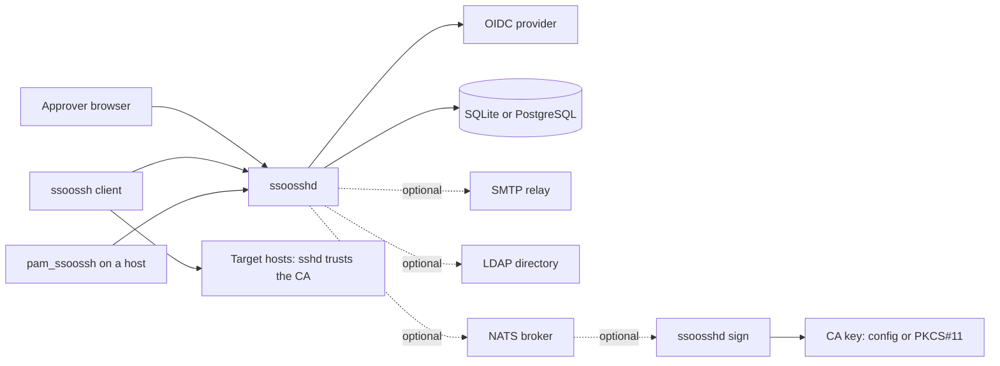

For the person who runs `ssoosshd`. This page is the map: what a deployment
consists of, and the order the rest of this section goes in. Every step below
is a page of its own.

## What a deployment consists of

At minimum, one `ssoosshd` process, one OIDC identity provider, one database,
and the target hosts whose `sshd` trusts the CA public key. Everything else is
optional and adds a capability rather than a requirement.

| Component | Required | What it does |
| --- | --- | --- |
| `ssoosshd` | yes | OIDC login, the approval web UI, policy, and (in full mode) signing |
| OIDC provider | yes | authenticates people and supplies the claims policy is evaluated against |
| Database | yes | requests, decisions, certificate metadata, sessions, audit rows |
| Target hosts | yes | `sshd` with `TrustedUserCAKeys` pointing at the CA public key |
| Reverse proxy | common | terminates TLS in front of `ssoosshd` |
| NATS | optional | carries signing jobs between processes; required for more than one instance |
| `ssoosshd sign` | optional | the signer as its own process, so the CA key never enters the web tier |
| PKCS#11 token | optional | the CA private key stays in hardware |
| SMTP relay | optional | outbound notifications about credentials people hold |
| LDAP directory | optional | extra principals, persisted groups, and auto-disable |

The server never stores an issued certificate, and never sees a private key.
Delivery to the waiting client is the only copy of a certificate.

## Build it in this order

1. [Installing the server](/ssoossh/operations/install/) -- packages, the CA
   key, the systemd unit, the minimum config, and the first health check.
2. [Identity provider](/ssoossh/operations/identity-provider/) -- the OIDC
   client, the one redirect URI, and the claim-to-field mapping.
3. [TLS and reverse proxies](/ssoossh/operations/tls-and-proxy/) -- terminate
   TLS somewhere, and make sure the client's real address survives the hop.
4. [Startup modes](/ssoossh/operations/startup-modes/) -- `serve`,
   `serve api`, and `sign`, and what each process holds.
5. [Multi-instance and NATS](/ssoossh/operations/multi-instance/) -- only if
   you run more than one process, or split the signer out.
6. [Database](/ssoossh/operations/database/) -- SQLite or PostgreSQL, pooling,
   and what is actually stored.
7. [Certificate lifetime policy](/ssoossh/operations/certificate-policy/) --
   how long a certificate lives and which options survive.
8. [Key ID templates](/ssoossh/operations/key-id-templates/) -- what `sshd`
   writes to its auth log for every login.
9. [Roles and containment](/ssoossh/operations/roles/) -- admin, SOC, and
   auditor, and what each may do.
10. [Email notifications](/ssoossh/operations/email-notifications/) -- off by
    default; turn it on by naming a relay and a sender.
11. [LDAP enrichment](/ssoossh/operations/ldap/) -- optional directory data on
    top of the OIDC identity.
12. [Audit log](/ssoossh/operations/audit-log/) -- the shipped archive and the
    bounded table behind the UI.
13. [HSM and PKCS#11](/ssoossh/operations/hsm/) -- sourcing the CA key from a
    token instead of the config file.
14. [Operator FAQ](/ssoossh/operations/faq/) -- the short answers.

Then trust the CA on the machines people log in to:
[Trusting the CA in sshd](/ssoossh/hosts/sshd-trust/).

Complete configurations you can start from are on
[Server configuration examples](/ssoossh/examples/server-configs/), and every
key with its type and default is in the
[configuration reference](/ssoossh/reference/config/).

## Files at a glance

| File | Lives on | Search paths |
| --- | --- | --- |
| `ssoosshd.yaml` | the server | `./ssoosshd.yaml`, `~/.config/ssoosshd.yaml`, `~/.config/ssoossh/ssoosshd.yaml`, `/etc/ssoosshd.yaml`, `/etc/ssoossh/ssoosshd.yaml` |
| `ssoossh.yaml` | each client machine | `/etc/ssoossh/ssoossh.yaml`, `~/.config/ssoossh.yaml`, `./ssoossh.yaml` |
| `ssh_config` | each client machine | standard OpenSSH locations |
| `sshd_config` | each target host | standard OpenSSH locations |
| `/etc/pam.d/sudo`, `/etc/pam.d/su` | hosts using `pam_ssoossh` | fixed |

`--config`/`-c` overrides the search entirely. The first path that exists
wins; the annotated defaults file the package installs at
`/etc/ssoossh/ssoosshd.yaml` is the last of them, so a file you drop in the
working directory takes precedence over it.
