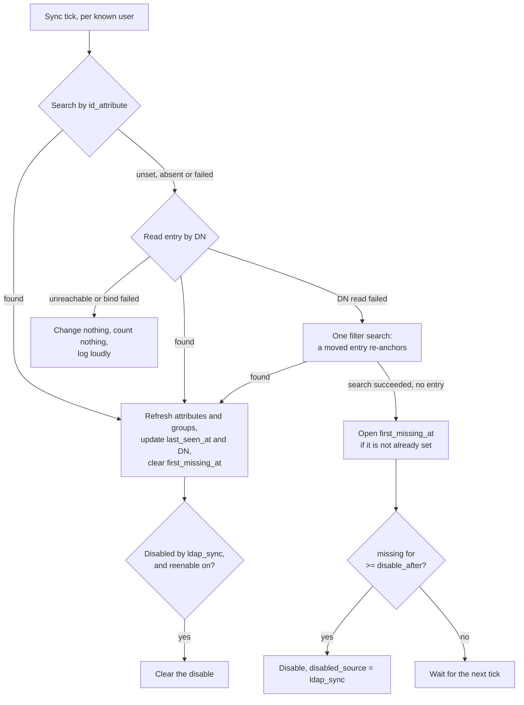

Optional directory data on top of the OIDC identity: extra principals,
persisted groups, and auto-disable when someone leaves the directory. It is
off by default, and enabling it changes what identities carry, not how
authentication works.

:::note[Status]
This is built and wired in. The login callback calls directory enrichment, the
background sync is registered as a scheduled job, and the auto-disable path
records `user.auto_disabled`. Some older prose in the repository still says
the LDAP configuration is parsed but not consumed; that statement is stale.
:::

## Enrichment, never a requirement

If directory data is available a user gets more. If it is not, every basic
operation still works on OIDC claims alone.

Login therefore **fails open**: an LDAP error during the callback logs to the
LDAP destination and proceeds with the OIDC-only identity. There is
deliberately no `required` knob. The consequence to hold onto is that a
misconfigured directory looks exactly like a working one from the outside,
which is why the configuration is validated at startup rather than left to be
discovered.

**Only known users sync.** A user must have logged in at least once to
participate in enrichment refresh, sync, or group capture. The server never
enumerates the directory, which keeps the user set self-selecting and leaves
fan-out building on a bounded, consented population.

### Switching the directory off

Setting `ldap.enabled: false` stops the sync, so everything the directory
wrote is frozen at whatever the last pass read. The server stops acting on all
of it, immediately and everywhere:

- **Certificate principals.** A live session falls back to the OIDC values on
  its very next request -- the per-request identity refresh reads the users
  row and overlays nothing. A principal the directory supplied stops being
  offered without waiting for anyone to log in again.
- **Notification fan-out.** Group resolution counts only the OIDC rows. A
  membership frozen on the day the directory was switched off does not route
  mail.
- **The admin console.** The directory record and the directory-sourced group
  rows are withheld from the user detail page, and the page says why. Frozen
  data shown beside live data with nothing to tell them apart is how someone
  grants access on a principal list that has not been true for months.

Nothing is deleted. Switching the directory back on restores the record
without waiting for a sync pass.

## Configuration

```yaml
ldap:
  enabled: true
  url: "ldaps://ldap.example.net"
  bind_dn: "cn=ssoossh,ou=service,dc=example,dc=net"
  bind_password: "..."
  base_dn: "ou=people,dc=example,dc=net"

  # The entry's unique, immutable identifier. Set this: it is what lets a
  # renamed or relocated entry be found again. See "Surviving a rename".
  id_attribute: entryUUID

  # A Go template over the OIDC identity: {{.Username}}, {{.Email}},
  # {{.Subject}}, {{.Extra.<name>}}. Values are RFC 4515 escaped
  # automatically and the operator cannot opt out.
  user_filter: "(&(objectClass=person)(uid={{.Username}}))"

  fields:
    name: displayName                # the person's human-readable name
    groups: memberOf                 # shorthand for {attribute: memberOf}
    other_accounts:
      attribute: sAMAccountName      # the person's own entry
      searches:
        - name: "admin accounts"
          filter: "(&(objectClass=person)(authorizedUser={{.Username}}))"
          value: uid
    service_accounts:
      searches:
        - name: "owned service accounts"
          filter: "(&(objectClass=account)(owner={{.DN}}))"
          value: uid
    department: departmentNumber     # any other key: an extra template field

  sync:
    interval: 15m          # zero disables the sync job entirely
    disable_after: 45m     # how long an entry may stay missing before disable
    reenable: true         # the sync may clear its own disables
    extra_groups: []       # persisted in addition to config-referenced names

  timeout: 5s
  start_tls: false         # for ldap:// URLs
  tls_ca: ""               # PEM bundle; empty uses the system roots
  tls_insecure_skip_verify: false   # homelab escape hatch, warns at startup

  limits:
    max_values_per_attribute: 1000
    max_entries_per_search: 1000
    max_attributes_bytes: 65536

  logging:
    filename: /var/log/ssoossh/ldap.log
```

| Key | Default | Notes |
| --- | --- | --- |
| [`ldap.enabled`](/ssoossh/reference/config/ldap/#enabled) | `false` | turns on the login-time lookup and the background sync |
| [`ldap.url`](/ssoossh/reference/config/ldap/#url) | empty | e.g. `ldaps://ldap.example.net` |
| [`ldap.bind_dn`](/ssoossh/reference/config/ldap/#bind_dn) / [`bind_password`](/ssoossh/reference/config/ldap/#bind_password) | empty | the implicit "simple" bind mechanism |
| [`ldap.base_dn`](/ssoossh/reference/config/ldap/#base_dn) | empty | the user lookup base, and the default base for field searches that name none |
| [`ldap.id_attribute`](/ssoossh/reference/config/ldap/#id_attribute) | empty | the entry's unique, immutable identifier; see [Surviving a rename](#surviving-a-rename) |
| [`ldap.user_filter`](/ssoossh/reference/config/ldap/#user_filter) | empty | the template above |
| [`ldap.fields`](/ssoossh/reference/config/ldap/#fields) | none | destinations mapped to directory sources; reserved names are `other_accounts`, `service_accounts`, `groups` and `name` |
| [`ldap.group_name_attribute`](/ssoossh/reference/config/ldap/#group_name_attribute) | empty | the attribute a group search reads a name from |
| [`ldap.timeout`](/ssoossh/reference/config/ldap/#timeout) | `5s` | bounds each directory operation, and so bounds the latency enrichment adds to a login |
| [`ldap.start_tls`](/ssoossh/reference/config/ldap/#start_tls) | `false` | upgrades a plain `ldap://` connection; irrelevant for `ldaps://` |
| [`ldap.tls_ca`](/ssoossh/reference/config/ldap/#tls_ca) | empty | PEM bundle; empty uses the system roots |
| [`ldap.tls_insecure_skip_verify`](/ssoossh/reference/config/ldap/#tls_insecure_skip_verify) | `false` | a homelab escape hatch, logged loudly at startup |
| [`ldap.limits.*`](/ssoossh/reference/config/ldap/#limitsmax_values_per_attribute) | 1000 / 1000 / 65536 | caps what one directory can push into the database |

LDAP activity is routed to its own log destination by a `type=ldap` attribute:
[`ldap.logging.level`](/ssoossh/reference/config/ldap/logging/#level) and
friends. Give it a filename to split it into its own rotating file.

### Field mapping

`ldap.fields` mirrors
[`authentication.fields`](/ssoossh/reference/config/authentication/#fieldsextra),
with attribute names instead of claim names. The reserved destinations are
`other_accounts`, `service_accounts`, `groups` and `name`; **any other key is
an extra template field**, on the same contract as `authentication.fields.extra` --
reachable in [key ID templates](/ssoossh/operations/key-id-templates/) as
`{{.Extra.<name>}}`, stored empty when absent, and never a reason for login to
fail. There is no separate `extra:` sub-map, because LDAP enrichment is extra
by definition.

`username`, `email` and `subject` are **rejected** here. The subject keys the
user row, the username is what lookups are keyed *by*, and the OIDC email
claim is the source of truth for the user's email. Configuring one could only
read as an attempt to override identity.

`name` is not in that set, and the directory is usually the better source for
it: `displayName` or `cn` is maintained there even when the identity provider
omits a name claim from the token. It is display only -- shown in the web UI
and offered to [email templates](/ssoossh/operations/email-notifications/),
never a certificate principal, a key ID input, or an authorization input. Only
the first value is taken, since a multi-valued `cn` names the same person
twice and joining them would produce a label no directory holds.

**The merge rule is per field.** A configured LDAP field (any `attribute` or
`searches`) wins over the OIDC value; an unconfigured one leaves the OIDC
value untouched. Override rather than union, because union makes it impossible
to retire a stale principal from only one source.

Groups are the exception. Both sources persist side by side in `user_groups`,
and the session identity's groups stay the OIDC claim.

## Account linking

A person's alternate accounts appear in directories in four shapes, and all
four are expressible:

1. **Forward list on the person's entry.** A multi-valued attribute of account
   names. Covered by `attribute` alone; no search.
2. **Reverse link by username.** The alternate account is its own entry
   carrying the usernames allowed to use it. A `searches` entry whose filter
   references `{{.Username}}`.
3. **Reverse link by another identifier.** Same, but linked by an employee
   number or UUID rather than the username. The filter references
   `{{.Attr.<name>}}`, an attribute of the primary entry -- and the server
   collects every attribute name referenced this way and requests it in the
   primary lookup automatically, so nothing has to be duplicated as an extra
   field.
4. **Reverse links with roles.** The same alternate entries linked by
   different attributes: an ownership link (`owner={{.DN}}`) placed under
   `service_accounts` grants manage-and-enroll, while an authorized-user link
   under `other_accounts` grants a usable principal. Which link means which is
   decided by where the search is placed.

Everything under one field unions and dedupes: its `attribute` plus each of
its `searches`. The per-field override rule then applies to the combined
result.

:::note[Filter injection is not possible]
Every value interpolated into a filter is RFC 4515 escaped during template
execution, and the escaping is injected around every action rather than
offered as a function an author could forget. A `preferred_username`
containing `*` or `)` is escaped, not honored.
:::

## Group storage

`user_groups` holds one row per (user, group, source), where source is `oidc`
or `ldap`. Rows rather than JSON, so "everyone in soc" is one indexed query.

:::danger
`user_groups` is never an authorization input. Authorization -- admin, SOC,
auditor, and the certificate policy gates -- is evaluated from the session
identity only. This table answers "who should this reach", never "may this
caller do this".
:::

**Only group names the configuration references are persisted.** The allowlist
is the union of
[`admin.require_group`](/ssoossh/reference/config/admin/#require_group),
[`admin.soc_group`](/ssoossh/reference/config/admin/#soc_group),
[`admin.auditor_group`](/ssoossh/reference/config/admin/#auditor_group), every
group name appearing in certificate policy (both `require` gates and tier
conditions), plus
[`ldap.sync.extra_groups`](/ssoossh/reference/config/ldap/sync/#extra_groups).
Membership outside that set is discarded at capture time: the server records
the roles it acts on, it does not mirror the directory's group graph.

Adding a name to the configuration self-heals rather than needing a backfill.
LDAP rows repopulate at the next sync tick, OIDC rows at each user's next
login. Until then the new group simply has no members recorded, which fails in
the quiet direction.

`memberOf` yields DNs; the allowlist compares names. A value that parses as a
DN is reduced to its first RDN value (conventionally the CN), and a value that
is already a name is kept as-is.

This table is useful with LDAP disabled: OIDC group capture alone gives
notifications a fan-out target, just a staler one -- per login rather than per
sync.

## The sync

Runs every [`ldap.sync.interval`](/ssoossh/reference/config/ldap/sync/#interval)
over every user with a `user_ldap` row.



The login path walks the same three anchors in the same order, so a login and
a sync pass can never resolve a person differently.

1. Search by [`ldap.id_attribute`](/ssoossh/reference/config/ldap/#id_attribute),
   the only anchor that does not move. Skipped entirely when it is unset or
   nothing has been stored yet.
2. Read the entry **by DN**, which is cheap and distinguishes "entry deleted"
   from "filter no longer matches". A failed DN read falls back to one filter
   search, so a moved entry re-anchors instead of being disabled.
3. **Found:** refresh attributes and LDAP group rows, update `last_seen_at`,
   and clear `first_missing_at` -- the window closes outright, so an absence
   that ended never counts toward a later one. If the user is disabled with
   `disabled_source = ldap_sync` and
   [`sync.reenable`](/ssoossh/reference/config/ldap/sync/#reenable) is on,
   clear it.
4. **Not found** (search succeeded, no entry): set `first_missing_at` if it is
   not already set, leaving it alone on later passes. Once the entry has been
   missing for
   [`sync.disable_after`](/ssoossh/reference/config/ldap/sync/#disable_after),
   disable the user with `disabled_source = ldap_sync`.
5. **Directory unreachable or bind failed:** update nothing, count nothing,
   log loudly.

:::caution[An outage must never disable anyone]
Only a search that *succeeds* and finds no entry is a miss. This is the single
rule the sync design rests on, and it is what step 5 exists for.
:::

### Surviving a rename

Set [`ldap.id_attribute`](/ssoossh/reference/config/ldap/#id_attribute). It is
the single most valuable line in this file, and it is empty by default only
because no value is right for every directory.

Without it there are two anchors, and both move:

- The **DN** changes when someone is moved between OUs, or when their RDN is
  built from a name that changed.
- The **`user_filter`** stops matching the moment they are renamed, if it is
  keyed on `{{.Username}}` -- which is the common case.

So a rename looks exactly like a deletion. The sync finds nothing, opens
`first_missing_at`, and after
[`sync.disable_after`](/ssoossh/reference/config/ldap/sync/#disable_after)
disables an account whose owner is sitting at their desk.

Every directory has an identifier that does not move, and every directory
calls it something else:

| Directory | Attribute | Shape |
| --- | --- | --- |
| OpenLDAP, 389 Directory Server | `entryUUID` | UUID string (RFC 4530) |
| Active Directory | `objectGUID` | 16 raw bytes |
| FreeIPA | `ipaUniqueID` | UUID string |
| 389 DS / Netscape (legacy) | `nsuniqueid` | UUID-like string |

If you do not know which one your directory has, run a probe from
**Admin → Directory** and read the suggestion: the probe requests all of them
by name (they are operational attributes, so `*` does not return them) and
names the one your entry actually carries.


<p class="screen-caption">Admin → Directory. The sync half reports the last pass and lets an admin run one, dry or real; the probe half runs one read-only lookup with the server's own connection and shows what came back.</p>

A binary identifier such as `objectGUID` is stored hex-encoded behind a `0x`
marker, and rendered back into the `\a1\b2...` byte-escape form a directory
matches against. Nothing about that is visible in configuration -- name the
attribute and it is handled.

:::note[Never an authorization input]
The identifier locates a directory entry. Nothing reads it to decide what
anyone may do, and it never appears in a certificate. Authorization is
evaluated from the session identity, exactly as it was before.
:::

### Why the threshold is a duration

`disable_after` measures elapsed absence, not a number of passes. It has to,
because the number of passes is not a property of the user: scheduled jobs are
not leader-elected, so every instance runs every job, and three replicas
produced three increments per interval. A pass count of 3 at a 15-minute
interval therefore meant 45 minutes on one instance and 15 on three -- and any
operator-triggered sync shortened it further.

`consecutive_misses` is still written and still shown, as a report of how many
passes have observed the absence. Nothing decides on it.

A configuration carrying the old spelling is rejected at startup rather than
reinterpreted: a bare `disable_after: 3` would otherwise decode as three
*nanoseconds* and disable an account on its first miss. Write a duration --
`45m`, `24h` -- and anything under a minute is refused by name.

`disabled_source` is what makes auto-re-enable safe: the sync clears only
disables whose source is exactly `ldap_sync`, so an admin or SOC disable is
never undone automatically. The column is nullable and the migration backfills
nothing -- rows predating it carry NULL, which the exact-match rule can never
touch.

An auto-disable is audited like any other containment action, as
`user.auto_disabled` with a generated reason.

**Side effect worth naming:** the sync partially closes the revocation window.
Removing a user from the directory now disables the account within
`disable_after` of the first pass that notices, where previously removal took
effect only at their next login. Losing one linked account rather than the whole entry takes effect
on the person's next request, since account lists are re-read per request.
Group downgrades -- still in the directory, out of a role group -- still ride
out the session, unchanged. See
[Roles and containment](/ssoossh/operations/roles/).

## Running a sync by hand

`/admin/directory` shows the sync settings and the last pass on any instance,
and gives an admin a button. The pass is the **same code path** the scheduler
runs: a manual sync that behaved differently from a scheduled one would be a
diagnostic that lies.

Three rules make the button safe:

- **Dry run is the default.** A dry run reads the directory and changes
  nothing -- no refreshed attributes, no group rows, no miss windows, no
  disables and no re-enables -- and reports the disables and re-enables it
  *would* have performed. It is the version to press during an incident.
- **One at a time.** A pass already in progress makes the request a `409`
  rather than a second pass stacked over the same users.
- **It cannot bring a disable forward.** The threshold is elapsed absence
  (see above), so pressing the button ten times does not disable anyone a
  single scheduled pass would not have disabled at the same moment.

Every pass, scheduled or manual, writes an `ldap_sync_runs` row: when it
started and finished, what triggered it, who pressed the button, which
instance ran it, the counts, and any error that stopped it. That row is what
lets a sync that ran be told from one that never fired -- before it, the only
evidence was a log line on whichever instance happened to run the job. A pass
that could not reach the directory still writes its row, so an outage is
visible as a pass that ran and failed.

A manual sync is audited as `ldap.sync_triggered`, with the counts and
`dry_run`.

## Probing the directory

`/admin/directory` also carries a read-only probe, for the question a log line
cannot answer: *what does the directory actually return for this person, and
what will my configuration make of it*.

It runs the login path's first two stages -- the lookup and the field
resolution -- and stops before the write. Three views of one probe, in the
order the questions come up:

1. **Entry as returned.** Every attribute the directory sent back, not just
   the ones the configuration names, with the configured ones highlighted.
   This is the view that shows you the field you should have mapped.
2. **Field mapping.** What each configured field resolved to, which attribute
   or search it came from, and whether the attribute was on the entry at all
   -- which is what separates "empty" from "misspelled".
3. **Merge and allowlist.** What would have been persisted, and which group
   values would have been discarded for matching no configured name. The
   allowlist is why you cannot otherwise see the group you forgot to
   configure; this is what breaks that circle.

Below them, the config block that would keep whatever is being ignored. A
suggestion, not a decision: it says what would capture a value, not that
capturing it is right.

### Template mode and literal mode

The distinction matters because escaping is not opt-out.

In **template** mode the filter is rendered against the bindings through the
same RFC 4515 escaping the login path uses, and the result is reported. That
is the only way to see what your configured filter really sends:

```
config   (&(objectClass=person)(uid={{.Username}}))
binding  Username = "o'brien)"
sent     (&(objectClass=person)(uid=o'brien9))
```

In **literal** mode the string is sent exactly as typed. Nothing is
interpolated, so nothing is escaped -- escaping a filter you wrote by hand
would corrupt it.

Bindings are your own session or values you type. Typed values are what let
you test someone's entry before that person has ever logged in.

### What the probe cannot do

**It cannot be re-pointed.** The connection is not part of the request: every
probe uses the running
[`ldap.url`](/ssoossh/reference/config/ldap/#url), bind credentials and
[`base_dn`](/ssoossh/reference/config/ldap/#base_dn). Reusing the server's bind
password against an operator-supplied URL would be a credential-exfiltration
primitive, and dialling an arbitrary host would make the server an
outbound-connection one. What an operator varies is the question, not who is
asked.

**It cannot write.** There is no persist call on the path at all: no
`user_ldap` row, no group rows, no miss window, no auto-disable. The response
carries that guarantee and a test asserts it.

It is still admin-only and rate-limited per caller, and every probe is audited
as `ldap.probed` with the filter it sent. If
[`tls_insecure_skip_verify`](/ssoossh/reference/config/ldap/#tls_insecure_skip_verify)
is on, the result says so -- a probe that succeeds only because verification
was off is not the same as one that verified.

### From the command line

`ssoosshd ldap probe` runs the same lookup against a config file, with no
server up and no HTTP surface at all:

```bash
ssoosshd -c /etc/ssoossh/ssoosshd.yaml ldap probe --username alice
ssoosshd ldap probe --literal --filter '(&(objectClass=person)(uid=alice))'
ssoosshd ldap probe --username alice --json
```

Useful before the first start, since building the service parses every filter
template: a bad one fails here with the message the next restart would have
produced. It never opens the database. Whoever can run it can already read the
config file, and so already has the bind password.

## Cost and freshness

The login lookup adds one directory round trip, bounded by
[`ldap.timeout`](/ssoossh/reference/config/ldap/#timeout), and only when
enabled. If it fails, enrichment falls back to the attributes stored by the
last successful read, so an outage degrades to slightly stale data rather than
a thinner certificate.

The sync costs (users with a `user_ldap` row) x (1 + configured field
searches) directory operations per tick. Per-user results are small; the
multiplier is what to choose the interval against.

Refresh semantics mid-session: the account-list fields and the extra fields
are re-read on every authenticated request, merged the way a login merges them
-- the OIDC values from the users row, then the directory values from
`user_ldap.attributes` over the top. A sync that removes a shared account
therefore takes that principal away from live sessions on their next request,
not at their next login, and the account page shows what the person can
actually mint with.

Group membership is the deliberate exception: roles are read at login and
never re-read, so the session lifetime stays the revocation window for a role
(see [Roles and containment](/ssoossh/operations/roles/)).

## Notifications fan-out

With `user_groups` in place, a group-targeted notification is a recipient
resolver rather than a new subsystem: a group name resolves to the enabled
users with an email address.

Accepted limitation: fan-out reaches only users who have logged in at least
once, because only they have rows. The sync does not create shadow users for
directory members who have never authenticated; enumerating a directory to
email strangers is a different feature with different consent implications.

With `ldap.enabled: false`, only the OIDC rows resolve -- see
[Switching the directory off](#switching-the-directory-off).

## Out of scope

- **Authorization from persisted groups.** See the invariant above.
- **Directory enumeration** and shadow users.
- **LDAP as an authentication source.** OIDC authenticates; LDAP only ever
  enriches.
- **Kerberos GSSAPI bind.** Tracked separately as a design proposal. The flat
  `bind_dn` / `bind_password` keys ship as the implicit "simple" mechanism, so
  a `bind.mechanism` block can slot in later without breaking existing
  configs.
