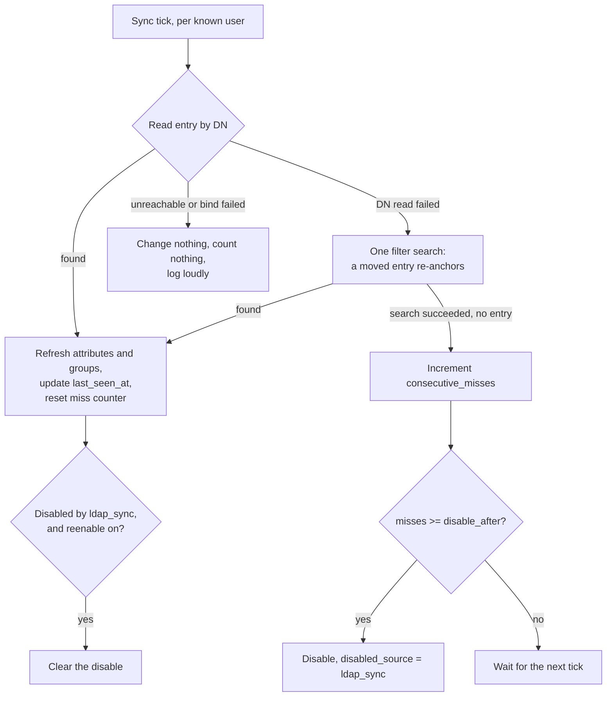

Optional directory data on top of the OIDC identity: extra principals,
persisted groups, and auto-disable when someone leaves the directory. It is
off by default, and enabling it changes what identities carry, not how
authentication works.

:::note[Status]
This is built and wired in. The login callback calls directory enrichment, the
background sync is registered as a scheduled job, and the auto-disable path
records `user.auto_disabled`. Some older prose in the repository still says
the LDAP configuration is parsed but not consumed; that statement is stale.
:::

## Enrichment, never a requirement

If directory data is available a user gets more. If it is not, every basic
operation still works on OIDC claims alone.

Login therefore **fails open**: an LDAP error during the callback logs to the
LDAP destination and proceeds with the OIDC-only identity. There is
deliberately no `required` knob. The consequence to hold onto is that a
misconfigured directory looks exactly like a working one from the outside,
which is why the configuration is validated at startup rather than left to be
discovered.

**Only known users sync.** A user must have logged in at least once to
participate in enrichment refresh, sync, or group capture. The server never
enumerates the directory, which keeps the user set self-selecting and leaves
fan-out building on a bounded, consented population.

## Configuration

```yaml
ldap:
  enabled: true
  url: "ldaps://ldap.example.net"
  bind_dn: "cn=ssoossh,ou=service,dc=example,dc=net"
  bind_password: "..."
  base_dn: "ou=people,dc=example,dc=net"

  # A Go template over the OIDC identity: {{.Username}}, {{.Email}},
  # {{.Subject}}, {{.Extra.<name>}}. Values are RFC 4515 escaped
  # automatically and the operator cannot opt out.
  user_filter: "(&(objectClass=person)(uid={{.Username}}))"

  fields:
    groups: memberOf                 # shorthand for {attribute: memberOf}
    other_accounts:
      attribute: sAMAccountName      # the person's own entry
      searches:
        - name: "admin accounts"
          filter: "(&(objectClass=person)(authorizedUser={{.Username}}))"
          value: uid
    service_accounts:
      searches:
        - name: "owned service accounts"
          filter: "(&(objectClass=account)(owner={{.DN}}))"
          value: uid
    department: departmentNumber     # any other key: an extra template field

  sync:
    interval: 15m          # zero disables the sync job entirely
    disable_after: 3       # consecutive successful-search misses before disable
    reenable: true         # the sync may clear its own disables
    extra_groups: []       # persisted in addition to config-referenced names

  timeout: 5s
  start_tls: false         # for ldap:// URLs
  tls_ca: ""               # PEM bundle; empty uses the system roots
  tls_insecure_skip_verify: false   # homelab escape hatch, warns at startup

  limits:
    max_values_per_attribute: 1000
    max_entries_per_search: 1000
    max_attributes_bytes: 65536

  logging:
    filename: /var/log/ssoossh/ldap.log
```

| Key | Default | Notes |
| --- | --- | --- |
| [`ldap.enabled`](/ssoossh/reference/config/ldap/#enabled) | `false` | turns on the login-time lookup and the background sync |
| [`ldap.url`](/ssoossh/reference/config/ldap/#url) | empty | e.g. `ldaps://ldap.example.net` |
| [`ldap.bind_dn`](/ssoossh/reference/config/ldap/#bind_dn) / [`bind_password`](/ssoossh/reference/config/ldap/#bind_password) | empty | the implicit "simple" bind mechanism |
| [`ldap.base_dn`](/ssoossh/reference/config/ldap/#base_dn) | empty | the user lookup base, and the default base for field searches that name none |
| [`ldap.user_filter`](/ssoossh/reference/config/ldap/#user_filter) | empty | the template above |
| [`ldap.fields`](/ssoossh/reference/config/ldap/#fields) | none | destinations mapped to directory sources |
| [`ldap.group_name_attribute`](/ssoossh/reference/config/ldap/#group_name_attribute) | empty | the attribute a group search reads a name from |
| [`ldap.timeout`](/ssoossh/reference/config/ldap/#timeout) | `5s` | bounds each directory operation, and so bounds the latency enrichment adds to a login |
| [`ldap.start_tls`](/ssoossh/reference/config/ldap/#start_tls) | `false` | upgrades a plain `ldap://` connection; irrelevant for `ldaps://` |
| [`ldap.tls_ca`](/ssoossh/reference/config/ldap/#tls_ca) | empty | PEM bundle; empty uses the system roots |
| [`ldap.tls_insecure_skip_verify`](/ssoossh/reference/config/ldap/#tls_insecure_skip_verify) | `false` | a homelab escape hatch, logged loudly at startup |
| [`ldap.limits.*`](/ssoossh/reference/config/ldap/#limitsmax_values_per_attribute) | 1000 / 1000 / 65536 | caps what one directory can push into the database |

LDAP activity is routed to its own log destination by a `type=ldap` attribute:
[`ldap.logging.level`](/ssoossh/reference/config/ldap/logging/#level) and
friends. Give it a filename to split it into its own rotating file.

### Field mapping

`ldap.fields` mirrors
[`authentication.fields`](/ssoossh/reference/config/authentication/#fieldsextra),
with attribute names instead of claim names. The reserved destinations are
`other_accounts`, `service_accounts` and `groups`; **any other key is an extra
template field**, on the same contract as `authentication.fields.extra` --
reachable in [key ID templates](/ssoossh/operations/key-id-templates/) as
`{{.Extra.<name>}}`, stored empty when absent, and never a reason for login to
fail. There is no separate `extra:` sub-map, because LDAP enrichment is extra
by definition.

`username`, `email` and `subject` are **rejected** here. The subject keys the
user row, the username is what lookups are keyed *by*, and the OIDC email
claim is the source of truth for the user's email. Configuring one could only
read as an attempt to override identity.

**The merge rule is per field.** A configured LDAP field (any `attribute` or
`searches`) wins over the OIDC value; an unconfigured one leaves the OIDC
value untouched. Override rather than union, because union makes it impossible
to retire a stale principal from only one source.

Groups are the exception. Both sources persist side by side in `user_groups`,
and the session identity's groups stay the OIDC claim.

## Account linking

A person's alternate accounts appear in directories in four shapes, and all
four are expressible:

1. **Forward list on the person's entry.** A multi-valued attribute of account
   names. Covered by `attribute` alone; no search.
2. **Reverse link by username.** The alternate account is its own entry
   carrying the usernames allowed to use it. A `searches` entry whose filter
   references `{{.Username}}`.
3. **Reverse link by another identifier.** Same, but linked by an employee
   number or UUID rather than the username. The filter references
   `{{.Attr.<name>}}`, an attribute of the primary entry -- and the server
   collects every attribute name referenced this way and requests it in the
   primary lookup automatically, so nothing has to be duplicated as an extra
   field.
4. **Reverse links with roles.** The same alternate entries linked by
   different attributes: an ownership link (`owner={{.DN}}`) placed under
   `service_accounts` grants manage-and-enroll, while an authorized-user link
   under `other_accounts` grants a usable principal. Which link means which is
   decided by where the search is placed.

Everything under one field unions and dedupes: its `attribute` plus each of
its `searches`. The per-field override rule then applies to the combined
result.

:::note[Filter injection is not possible]
Every value interpolated into a filter is RFC 4515 escaped during template
execution, and the escaping is injected around every action rather than
offered as a function an author could forget. A `preferred_username`
containing `*` or `)` is escaped, not honored.
:::

## Group storage

`user_groups` holds one row per (user, group, source), where source is `oidc`
or `ldap`. Rows rather than JSON, so "everyone in soc" is one indexed query.

:::danger
`user_groups` is never an authorization input. Authorization -- admin, SOC,
auditor, and the certificate policy gates -- is evaluated from the session
identity only. This table answers "who should this reach", never "may this
caller do this".
:::

**Only group names the configuration references are persisted.** The allowlist
is the union of
[`admin.require_group`](/ssoossh/reference/config/admin/#require_group),
[`admin.soc_group`](/ssoossh/reference/config/admin/#soc_group),
[`admin.auditor_group`](/ssoossh/reference/config/admin/#auditor_group), every
group name appearing in certificate policy (both `require` gates and tier
conditions), plus
[`ldap.sync.extra_groups`](/ssoossh/reference/config/ldap/sync/#extra_groups).
Membership outside that set is discarded at capture time: the server records
the roles it acts on, it does not mirror the directory's group graph.

Adding a name to the configuration self-heals rather than needing a backfill.
LDAP rows repopulate at the next sync tick, OIDC rows at each user's next
login. Until then the new group simply has no members recorded, which fails in
the quiet direction.

`memberOf` yields DNs; the allowlist compares names. A value that parses as a
DN is reduced to its first RDN value (conventionally the CN), and a value that
is already a name is kept as-is.

This table is useful with LDAP disabled: OIDC group capture alone gives
notifications a fan-out target, just a staler one -- per login rather than per
sync.

## The sync

Runs every [`ldap.sync.interval`](/ssoossh/reference/config/ldap/sync/#interval)
over every user with a `user_ldap` row.



1. Read the entry **by DN**, which is cheaper than a search and distinguishes
   "entry deleted" from "filter no longer matches". A failed DN read falls
   back to one filter search, so a moved entry re-anchors instead of being
   disabled.
2. **Found:** refresh attributes and LDAP group rows, update `last_seen_at`,
   reset the miss counter. If the user is disabled with
   `disabled_source = ldap_sync` and
   [`sync.reenable`](/ssoossh/reference/config/ldap/sync/#reenable) is on,
   clear it.
3. **Not found** (search succeeded, no entry): increment
   `consecutive_misses`. At
   [`sync.disable_after`](/ssoossh/reference/config/ldap/sync/#disable_after),
   disable the user with `disabled_source = ldap_sync`.
4. **Directory unreachable or bind failed:** update nothing, count nothing,
   log loudly.

:::caution[An outage must never disable anyone]
Only a search that *succeeds* and finds no entry is a miss. This is the single
rule the sync design rests on, and it is what step 4 exists for.
:::

`disabled_source` is what makes auto-re-enable safe: the sync clears only
disables whose source is exactly `ldap_sync`, so an admin or SOC disable is
never undone automatically. The column is nullable and the migration backfills
nothing -- rows predating it carry NULL, which the exact-match rule can never
touch.

An auto-disable is audited like any other containment action, as
`user.auto_disabled` with a generated reason.

**Side effect worth naming:** the sync partially closes the revocation window.
Removing a user from the directory now disables the account within
`interval * disable_after`, where previously removal took effect only at their
next login. Group downgrades -- still in the directory, out of a role group --
still ride out the session, unchanged. See
[Roles and containment](/ssoossh/operations/roles/).

## Cost and freshness

The login lookup adds one directory round trip, bounded by
[`ldap.timeout`](/ssoossh/reference/config/ldap/#timeout), and only when
enabled. If it fails, enrichment falls back to the attributes stored by the
last successful read, so an outage degrades to slightly stale data rather than
a thinner certificate.

The sync costs (users with a `user_ldap` row) x (1 + configured field
searches) directory operations per tick. Per-user results are small; the
multiplier is what to choose the interval against.

Refresh semantics mid-session: extra fields are re-hydrated from the users row
at approval time, so extra-field refreshes take effect for key ID templates
and claim conditions without a re-login. The account-list fields ride the
session, so refreshed principals take effect at the next login.

## Notifications fan-out

With `user_groups` in place, a group-targeted notification is a recipient
resolver rather than a new subsystem: a group name resolves to the enabled
users with an email address.

Accepted limitation: fan-out reaches only users who have logged in at least
once, because only they have rows. The sync does not create shadow users for
directory members who have never authenticated; enumerating a directory to
email strangers is a different feature with different consent implications.

## Out of scope

- **Authorization from persisted groups.** See the invariant above.
- **Directory enumeration** and shadow users.
- **LDAP as an authentication source.** OIDC authenticates; LDAP only ever
  enriches.
- **Kerberos GSSAPI bind.** Tracked separately as a design proposal. The flat
  `bind_dn` / `bind_password` keys ship as the implicit "simple" mechanism, so
  a `bind.mechanism` block can slot in later without breaking existing
  configs.
