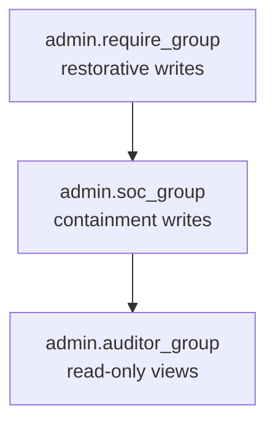

`ssoosshd` has three privileged roles, each an OIDC group named in config.
There is no database flag that makes someone an admin, and no screen that
grants the role: the identity provider stays authoritative, which is the whole
point of the design.

## Configuration

```yaml
admin:
  # Restorative writes: re-enabling a user. Plus everything SOC and
  # auditor can do.
  require_group: "ssh-admins"

  # Containment writes: disabling a user, expiring an enrollment.
  soc_group: "security-ops"

  # Read-only: effective configuration, cross-user certificate history,
  # the user directory, the audit feed.
  auditor_group: "ssh-auditors"

  # Shown on the account-disabled page.
  contact_email: "ssh-help@example.com"
  disabled_message: "Contact the security team with your ticket number."
```

All three group names are optional, and every one of them
[`fails closed`](/ssoossh/reference/config/admin/#require_group): no identity,
no group membership, or no configured group all deny.

| Key | Empty means |
| --- | --- |
| [`admin.require_group`](/ssoossh/reference/config/admin/#require_group) | admin operations are disabled entirely |
| [`admin.soc_group`](/ssoossh/reference/config/admin/#soc_group) | SOC operations narrow to admins, rather than being disabled |
| [`admin.auditor_group`](/ssoossh/reference/config/admin/#auditor_group) | auditor operations narrow to admins and SOC, rather than being disabled |

The roles nest. SOC is a child role of admin, and auditor is a child of both,
so admins hold everything and SOC members hold the auditor views -- they need
the directory and the enrollment lists to find what to contain.



The direction that deliberately does not exist is upward: a SOC analyst can
contain an incident but cannot quietly undo a containment, because re-enabling
a user is admin-only.

## What each role may do

| Operation | Admin | SOC | Auditor |
| --- | --- | --- | --- |
| Re-enable a user | yes | no | no |
| Disable a user | yes | yes | no |
| Expire an enrollment early | yes | yes | no |
| Effective configuration | yes | yes | yes |
| User directory and per-user detail | yes | yes | yes |
| Certificate history across all users | yes | yes | yes |
| Service code directory and detail | yes | yes | yes |
| Audit feed, and one user's timeline | yes | yes | yes |

What no role may do, at all:

- **Approve someone else's request.** Approval is bound to the requester.
- **Raise a ceiling.** The config file is the outer bound; nothing reachable
  over HTTP can make issuance more permissive than the loaded configuration
  allows.
- **Grant a role.** Membership comes from the identity provider.
- **Touch the audit trail.** It is append-only, and the shipped log is the
  archive.

A compromised web tier, or a rogue admin, can deny service. It cannot
escalate.

### What auditors see of the configuration

The effective-configuration screen renders the server's whole configuration,
grouped by section in the same order as the file it describes, with every
field tagged as a secret redacted rather than shown. That covers the CA
private key, the OIDC client secret, the session cookie key, the database
connection string, the LDAP bind password, the SMTP password, and the HSM PIN.
A redacted value still tells an auditor whether the setting is configured,
which keeps "is the client secret set?" answerable without disclosing it.

Prefer the file-based spellings for secrets --
[`mail.smtp.password_file`](/ssoossh/reference/config/mail/smtp/#password_file),
[`hsm.pin_file`](/ssoossh/reference/config/hsm/#pin_file) -- so the secret is
not config text at all.

## Disabling a user

Disabling is the containment action. It is fail-closed at login: a transient
database error during the check denies rather than admits. The person lands on
a page carrying [`admin.contact_email`](/ssoossh/reference/config/admin/#contact_email)
and [`admin.disabled_message`](/ssoossh/reference/config/admin/#disabled_message)
if those are set.

It does exactly that and no more. Service enrollments the person approved
belong to their **service accounts**, not to them, so unattended jobs keep
running and the account's other holders keep control. If the intent is to stop
a credential too, expire the enrollment as a separate, recorded action.

The current state lives in denormalized columns on the user row --
`disabled_at`, `disabled_by_user_id`, `disabled_reason`, `disabled_source` --
which render the directory and the re-enable flow without touching the audit
table, and survive audit pruning. The audit trail is the history; those
columns are the present.

`disabled_source` is what makes the LDAP sync's auto-disable safe to combine
with a human one. The sync clears only disables whose source is exactly
`ldap_sync`, so an admin or SOC disable is never undone automatically. An
auto-disable is audited like any other containment action, as
`user.auto_disabled`, with a generated reason and no actor. See
[LDAP enrichment](/ssoossh/operations/ldap/).

## Enrollments cannot be reassigned

There is no transfer operation, and this is the one place an older
configuration example may still say otherwise. An enrollment is owned by its
service account: every holder of the account sees its codes and can act on
them, whoever approved them. That removed the need for a transfer, so the
operation went away with it.

The consequences worth knowing:

- The `enrollment.reassigned` audit action stays *defined* so events recorded
  before the change still read back with a name, but nothing emits it.
- The `enrollment_reassignments` table is frozen and still read: its rows
  record transfers that really happened.
- What an admin or SOC member can do to an enrollment is expire it early,
  which is idempotent.

## Required reasons

A reason is **required and server-validated** -- non-empty after trimming,
capped at 1000 characters -- on the containment and restorative actions:

| Action | Why the reason matters |
| --- | --- |
| `user.disabled` | the motivating case: the next person deciding whether to re-enable has to be able to see why |
| `user.enabled` | "cleared with security, SEC-1234" is as valuable to the person after that one |
| `enrollment.expired` | the credential is gone and something unattended will start failing |

The API refuses the action rather than recording one that says nothing, and
the web UI keeps the confirm button disabled until a reason is typed. Optional
reason fields do not get filled; required ones cost seconds at action time and
are the whole point later.

System-initiated events generate their own reason text, since no human is
present to supply one. View events carry none.

## The session lifetime is the revocation window

Authorization is evaluated from the session identity, and group membership is
read at login. So removing someone from an admin group in the identity
provider takes effect **at their next login**, not immediately.

That window is bounded by the session settings:

| Key | Default | Meaning |
| --- | --- | --- |
| [`http.cookie_max_age`](/ssoossh/reference/config/http/#cookie_max_age) | `9h` | the absolute cap, measured from login. Activity never extends it |
| [`http.cookie_idle_timeout`](/ssoossh/reference/config/http/#cookie_idle_timeout) | `30m` | how long a session survives without a request. Slides on activity, so an actively used session ends only at `cookie_max_age` |

Shorten `cookie_max_age` if that window is too long for your threat model.
The idle timeout must not exceed the absolute cap -- an idle window longer
than the cap could never be reached.

To take access away right now, disable the person: that check runs at login
and is fail-closed, and it is the containment action the audit trail is built
around. Certificates they already hold expire on their own, which is why there
is no revocation list to maintain.

A full roles block is on
[Server configuration examples](/ssoossh/examples/server-configs/), and every
recorded action is listed on [Audit log](/ssoossh/operations/audit-log/).
