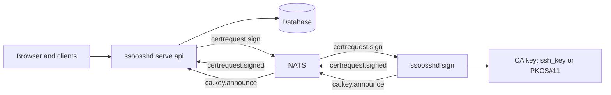

`ssoosshd` is one binary with three shapes, selected by subcommand. Which one
you want is a question about where the CA private key lives and how many
processes share the work.

## The three modes

| Command | Runs | Requires |
| --- | --- | --- |
| `ssoosshd serve` (or `serve full`) | HTTP server, listener/resolver, in-process signer | nothing extra |
| `ssoosshd serve api` | HTTP server and listener; publishes signing jobs | [`pubsub.backend: nats`](/ssoossh/reference/config/pubsub/#backend) |
| `ssoosshd sign` | the signer only | `pubsub.backend: nats` and a CA key |

**Full mode** is the default and the answer for single-instance deployments,
development, and testing. All components live in one process, and
[`pubsub.backend`](/ssoossh/reference/config/pubsub/#backend) stays at
`gochannel`, an in-process transport that needs no setup. This process holds
the CA key.

**API mode** runs everything except the signer. Signing jobs are published to
NATS for a signer elsewhere to pick up. It needs no CA key and does no
signing, which is the point: the web tier -- the part with an attack surface
-- holds no private key at all. Leave
[`ssh_key`](/ssoossh/reference/config/top-level/#ssh_key) and
[`hsm`](/ssoossh/reference/config/hsm/) out of an API instance's config
entirely, so the key is not on those machines to begin with.

**Signer mode** is only the signing component: a NATS connection and the CA
key. It consumes signing jobs, publishes signed certificates, and announces
its CA public key so the web tier can serve it. It needs no database, no HTTP
listener, and no OIDC or LDAP configuration, so it runs happily on a machine
with restricted network access -- or the machine the HSM is attached to.

```ini
# systemd drop-in for an API instance
[Service]
ExecStart=/usr/local/sbin/ssoosshd serve api
```

```ini
# systemd drop-in for a signer
[Service]
ExecStart=/usr/local/sbin/ssoosshd sign
```

## Splitting the signer is worth it on one instance too

You do not need multiple instances to split the signer. One
`ssoosshd serve api` plus one `ssoosshd sign`, both connected to NATS, keeps
the CA key out of the web tier's memory, and the signer can live on a separate
machine.



The web tier learns the CA public key from the signer's announcement rather
than from a key it holds: signers publish their public keys to a registry, and
`GET /api/ca` serves whatever the registry holds. Several signers may announce
at once, and several distinct keys may be active, which is what makes key
rotation and independent signers with different keys work -- clients and
`pam_ssoossh` accept a certificate signed by any of them.

## Both split modes refuse the in-process broker

`gochannel` is in-process. A signing job published to it inside an API
instance would go nowhere, and a signer subscribing to it would never hear
anything. Rather than start and silently do nothing, both modes fail at
startup:

```text
api mode publishes signing jobs to the pub/sub broker; gochannel is
in-process only — set pubsub.backend to 'nats' or use full mode with an
in-process signer
```

```text
sign mode receives signing jobs from the pub/sub broker; gochannel is
in-process only — set pubsub.backend to 'nats' to run the signer as a
separate process, or use full mode with an in-process signer
```

The fix is the same either way: set
[`pubsub.backend`](/ssoossh/reference/config/pubsub/#backend) to `nats` and
give it a URL and mTLS credentials, or go back to `ssoosshd serve`.

Two neighbouring startup failures look similar and are not the same thing:

- `pubsub.backend: nats` with any of
  [`nats.cert_file`](/ssoossh/reference/config/pubsub/#natscert_file),
  [`nats.key_file`](/ssoossh/reference/config/pubsub/#natskey_file), or
  [`nats.ca_file`](/ssoossh/reference/config/pubsub/#natsca_file) unset or
  unreadable.
- [`multi_instance: true`](/ssoossh/reference/config/top-level/#multi_instance)
  with no explicit
  [`http.cookie_key`](/ssoossh/reference/config/http/#cookie_key).

Both are covered in
[Multi-instance and NATS](/ssoossh/operations/multi-instance/).

## Choosing

| You want | Run |
| --- | --- |
| the simplest thing that works | `ssoosshd serve` |
| the CA key out of the web tier | `ssoosshd serve api` + `ssoosshd sign` |
| the CA key in an HSM on a specific machine | `ssoosshd sign` on that machine, API elsewhere |
| more than one web instance behind a load balancer | several `serve api` + one or more `sign` |

Multi-instance needs more than the mode change -- PostgreSQL, a shared cookie
key, and NATS authorization. That is
[the next page](/ssoossh/operations/multi-instance/).
